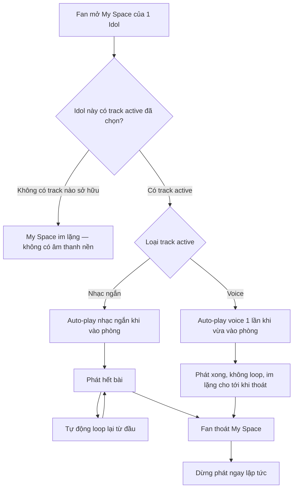
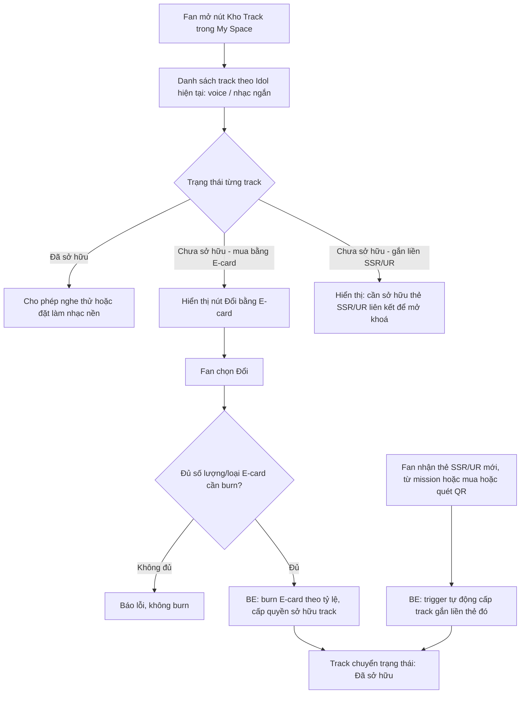
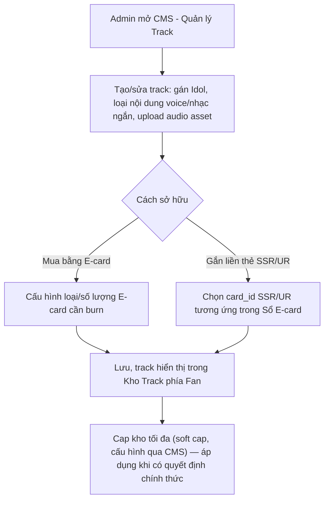

# FSD — CR1: Âm Thanh Nền My Space (Kho "Track")

> **Loại tài liệu:** Functional Specification Document (FSD)
> **CR liên quan:** CR1
> **Nguồn tham chiếu:** `CR1_Feature_Breakdown.md` (mục 8), `Fanation_BRD_Analysis.md` (Epic 3 — Your Space/Studio), `context.md`, `ba.md`/`pd.md` (tech stack, ranh giới Star Economy)
> **Tech stack:** React Native (FE) · NestJS (BE) · PostgreSQL (DB)
> **Trạng thái:** Đã chốt phần lớn flow — còn 2 điểm treo cần stakeholder xác nhận trước khi lock schema (xem mục 8)

---

## 1. Tổng quan

Tính năng cho phép Fan phát **âm thanh nền** (nhạc ngắn hoặc voice của Idol) khi ở trong **My Space/Your Space** (= Studio riêng theo từng Idol, xem BRD Epic 3 — F3.1). Âm thanh được quản lý qua một kho vật phẩm mới gọi là **Kho "Track"**, cùng cấu trúc với các kho vật phẩm khác đã có trong Studio (Loa, Stage, Skin...).

**Điểm quan trọng nhất cần hiểu đúng phạm vi:**
- Track gồm **2 loại nội dung**: (1) **voice** — đoạn thu âm của Idol, và (2) **đoạn nhạc ngắn** (<30 giây, dạng tương tự sound trên IG Stories) — không phải bài hát đầy đủ.
- **Không có track miễn phí mặc định.** Toàn bộ track phải sở hữu qua 1 trong 2 đường: mua bằng E-card Idol (burn), hoặc tự động đi kèm khi sở hữu thẻ SSR/UR (định dạng video/motion có sẵn âm thanh — xem `FSD` mục 6 Sổ E-card).
- Track được sở hữu **riêng theo từng Idol** — không dùng chung giữa các My Space của các Idol khác nhau.

---

## 2. Phạm vi (Scope)

### Trong phạm vi
- Kho "Track" trong My Space: xem danh sách track theo Idol, phân loại voice/nhạc ngắn
- Auto-play track nhạc nền khi Fan vào My Space; auto-loop khi hết bài; dừng phát khi thoát My Space
- Voice: chỉ phát 1 lần khi vừa vào phòng (không loop)
- Sở hữu track qua **burn E-card Idol** (đổi vật phẩm)
- Sở hữu track **tự động** khi Fan sở hữu thẻ SSR/UR tương ứng (trigger ngay lúc nhận thẻ, không qua flow mua riêng)
- Lưu trữ/CDN cho audio asset theo từng Idol

### Ngoài phạm vi
- Bán track trực tiếp bằng Star hoặc tiền thật (chỉ có 2 đường sở hữu đã nêu ở trên)
- Track dùng chung xuyên Idol (mỗi track luôn gắn với 1 Idol cụ thể)

---

## 3. Actors

Track có 2 nguồn sở hữu độc lập (burn E-card vs. bundled theo thẻ SSR/UR) — actor liên quan khác nhau theo từng nguồn:

| Actor | Vai trò | Gắn với nguồn sở hữu nào |
|---|---|---|
| **Fan** | Vào My Space nghe track nhạc nền/voice, mở Kho Track, chủ động đổi E-card lấy track | Chủ động — nguồn 1 (burn E-card) |
| **Fan** | Tự động nhận track khi sở hữu thẻ SSR/UR — không có thao tác thủ công | Bị động — nguồn 2 (bundled SSR/UR) |
| **Admin CMS** | Tạo track, gán Idol/loại nội dung, cấu hình tỷ lệ E-card cần burn | Cấu hình nguồn 1 |
| **Admin CMS / RnD** | Gán track liên kết với card_id SSR/UR cụ thể trong reward pool Sổ E-card | Cấu hình nguồn 2 — cần đồng bộ với thời điểm phát hành thẻ SSR/UR mới |

---

## 4. User Stories

**US-1 (Fan)**
> Là một Fan, khi tôi vào My Space của Idol tôi theo dõi, tôi muốn nghe được âm thanh nền (nhạc ngắn hoặc voice) tự động phát, để trải nghiệm không gian sống động và gắn kết hơn với Idol.

**US-2 (Fan)**
> Là một Fan, tôi muốn track nhạc nền tự động lặp lại khi hết bài, và dừng lại khi tôi thoát My Space, để tôi không cần thao tác thủ công.

**US-3 (Fan)**
> Là một Fan, tôi muốn mở Kho "Track" để xem tất cả track tôi đã sở hữu, đã mua bằng E-card, hoặc chưa sở hữu, để biết mình cần làm gì để mở khoá thêm.

**US-4 (Fan)**
> Là một Fan, tôi muốn đổi E-card của Idol để lấy 1 track mới, để chủ động sở hữu âm thanh nền mà không cần chờ may mắn từ thẻ hiếm.

**US-5 (Fan)**
> Là một Fan, khi tôi nhận được thẻ SSR/UR (vốn đã có định dạng video/motion kèm âm thanh), tôi muốn tự động sở hữu luôn track gắn liền với thẻ đó mà không cần mua thêm, để phần thưởng hiếm có giá trị tương xứng.

---

## 5. Sơ đồ luồng (Diagrams)

### 5.1 Luồng Fan — vào My Space, phát âm thanh nền

### 5.2 Luồng Fan — mở Kho Track & sở hữu track

### 5.3 Luồng Admin CMS — cấu hình track

---

## 6. Yêu cầu chức năng chi tiết

### 6.1 FE — My Space (phát âm thanh nền)
- Auto-play track nhạc nền mặc định ngay khi Fan vào My Space (nếu có track active đã sở hữu)
- Track nhạc ngắn: tự động loop liên tục khi hết bài
- Track voice: chỉ phát đúng 1 lần khi vừa vào phòng, không loop
- Dừng phát ngay khi Fan thoát My Space (không phát ngầm nền/background audio)
- Không có track nào sở hữu → My Space không phát âm thanh, không hiển thị lỗi

### 6.2 FE — Kho "Track"
- Nút mở Kho "Track" trong My Space, cùng nhóm UI với các kho vật phẩm khác (Loa, Stage, Skin...)
- Danh sách track lọc theo Idol hiện tại, phân loại rõ voice / nhạc ngắn
- Mỗi track hiển thị trạng thái: **Đã sở hữu** / **Mua bằng E-card** (kèm số lượng/loại cần) / **Đi kèm thẻ SSR-UR [tên]**
- Track đã sở hữu: cho phép nghe thử và đặt làm track active (nhạc nền hiện tại của My Space)
- Track chưa sở hữu qua E-card: nút "Đổi", disable nếu Fan không đủ E-card cần thiết kèm message rõ ràng

### 6.3 BE — Sở hữu & phát track
- API lấy danh sách track theo Idol + trạng thái sở hữu của Fan hiện tại
- API burn E-card đổi lấy track (validate đủ loại/số lượng E-card, atomic transaction burn + cấp quyền sở hữu)
- Trigger tự động cấp quyền sở hữu track khi Fan nhận thẻ SSR/UR có gắn track tương ứng (hook vào event "nhận thẻ" ở Sổ E-card, không qua API mua riêng)
- API set track active cho My Space của 1 Idol (1 track active tại 1 thời điểm cho mỗi My Space)
- Lưu sở hữu track theo cặp (user_id, idol_id, track_id) — tách biệt hoàn toàn giữa các My Space khác nhau

### 6.4 CMS — Quản lý Track
- CRUD track: gán Idol, loại nội dung (voice/nhạc ngắn), upload/gán audio asset
- Cấu hình cách sở hữu: (a) tỷ lệ/loại E-card cần burn, hoặc (b) gắn liền card_id SSR/UR cụ thể trong Sổ E-card
- Cấu hình **cap kho tối đa** theo track/idol (soft cap, để field cấu hình — không hardcode) khi có quyết định chính thức

---

## 7. Edge Cases

| # | Tình huống | Xử lý đề xuất |
|---|---|---|
| 1 | Fan chưa sở hữu track nào của Idol này | My Space phát im lặng, không lỗi; Kho Track hiển thị toàn bộ ở trạng thái chưa sở hữu |
| 2 | Fan sở hữu nhiều track nhưng chưa từng set active | Mặc định lấy track sở hữu gần nhất làm active, hoặc để Fan tự chọn lần đầu vào Kho Track — **cần Design xác nhận default behavior** |
| 3 | Fan burn E-card đúng lúc số dư thay đổi (race condition — vd đổi 2 lần liên tiếp nhanh) | BE xử lý atomic transaction, lock số dư E-card trong lúc burn |
| 4 | Fan sở hữu thẻ SSR/UR nhưng track gắn liền chưa được Admin cấu hình `linked_card_id` | Không tự cấp track — cần validate dữ liệu CMS đầy đủ trước khi phát hành thẻ mới; log cảnh báo nếu thẻ SSR/UR không có track liên kết |
| 5 | Audio asset lỗi/không load được khi vào My Space | Fail silent — không phát, không crash UI, có thể retry ngầm 1 lần |
| 6 | Kho Track đạt cap tối đa (khi cap được áp dụng chính thức) | Chặn nhận thêm track mới (kể cả từ SSR/UR), hoặc yêu cầu Fan chủ động xoá bớt — **cơ chế xử lý khi đầy kho cần chốt cùng lúc với số cap** |

---

## 8. Open Questions (chưa có câu trả lời từ stakeholder)

| # | Câu hỏi | Ảnh hưởng | Đề xuất PD (tạm thời, chờ confirm) |
|---|---|---|---|
| 1 | Số lượng track tối đa được lưu trữ mỗi Idol/mỗi user — chưa có quyết định chính thức | Ảnh hưởng thiết kế bảng lưu trữ, CDN cost, UI Kho Track (có cần phân trang/xoá bớt không) | Cap mềm 10-15 track/idol, cấu hình qua CMS — vì track SSR/UR vốn tỷ lệ ra thẻ thấp và nội dung phát hành còn giới hạn trong 1-2 tháng đầu |
| 2 | Tỷ lệ/loại E-card cần burn để đổi 1 track thường (voice/nhạc ngắn không đi kèm thẻ) | Chặn code hoá API burn E-card — cùng nhóm vướng mắc với file "Poin Star Card" (xem `CR1_Feature_Breakdown.md` mục 6) | Không có — chờ số liệu chính thức, không tự suy đoán |
| 3 | Cơ chế chọn/đổi track active có màn hình riêng "đặt làm nhạc nền" tường minh hay tự động lấy track sở hữu gần nhất | Ảnh hưởng UX Kho Track (mục 6.2, Edge case #2) | Đề xuất có nút tường minh "Đặt làm nhạc nền" trên từng track đã sở hữu — cần Design xác nhận |

> **Lưu ý:** Câu hỏi #1 và #2 là 2 điểm treo duy nhất chặn việc code hoá đầy đủ tính năng này theo `CR1_Feature_Breakdown.md` mục 8. Câu hỏi #3 là gap phát hiện thêm trong lúc viết FSD, không nằm trong breakdown gốc — cần bổ sung xác nhận trước khi FE thiết kế màn Kho Track.
