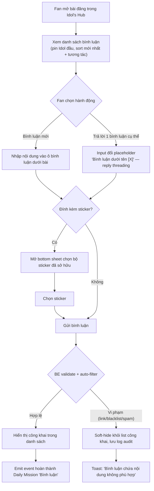
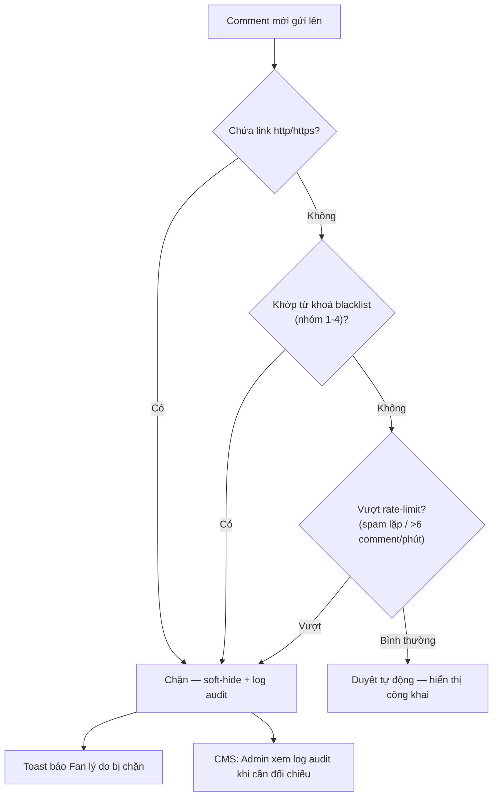

# FSD — MVP2: Bình luận (Comment)

---

## 1. Tổng quan

Bình luận cho phép Fan để lại phản hồi dưới bài đăng của Idol/Nghệ sĩ, và cho phép Fan khác reaction & phản hồi (reply) lên bình luận đó. Đây là **free action** — không tiêu Star, không gắn bất kỳ giao dịch nào, và là 1 trong các hành động được tính hoàn thành Daily Mission "Bình luận".

Ngoài bình luận dạng text thuần, Fan có thể **trả lời đích danh 1 bình luận cụ thể** (reply threading) và **đính kèm sticker** từ bộ sticker đã sở hữu (dùng chung cơ chế sở hữu với FSD Sticker) khi gửi bình luận.

Vì không có bước kiểm duyệt thủ công, hệ thống dùng **bộ lọc tự động (auto-filter)** theo từ khoá blacklist để chặn/ẩn nội dung vi phạm trước khi hiển thị công khai.

---

## 2. Phạm vi (Scope)

### Trong phạm vi
- Vị trí: **Idol's Hub → Bài viết**, xuất hiện ngay dưới mỗi bài đăng — gồm ô nhập bình luận + danh sách bình luận của Fan khác, sort theo thời gian kết hợp mức độ tương tác
- Giới hạn bình luận tối đa **1000 ký tự**, không cho phép dán link
- Trả lời đích danh 1 bình luận cụ thể (reply threading)
- Đính kèm sticker (từ bộ sticker Fan đã sở hữu) vào nội dung bình luận trước khi gửi
- 4 loại reaction trên mỗi bình luận (icon chính thức chờ confirm design)
- Bình luận của Idol luôn ghim (pin) đầu danh sách; Idol/Admin có thể ghim thêm bình luận nổi bật
- Sort mặc định: pin trước → mới nhất + mức độ tương tác
- Fan xoá bình luận của chính mình (không có sửa); Idol/Admin xoá/ẩn bình luận trên bài đăng của họ
- Auto-filter chặn theo 5 nhóm từ khoá blacklist (CMS cấu hình) — soft-hide khỏi danh sách công khai, vẫn lưu log audit
- Toast thông báo rõ cho Fan khi bình luận bị chặn (tránh Fan tưởng lỗi app rồi report nhầm bug)
- Bình luận hợp lệ được tính hoàn thành Daily Mission "Bình luận" (chi tiết thưởng thuộc phạm vi FSD Daily Mission)

---

## 3. Actors

| Actor | Vai trò |
|---|---|
| **Fan** | Bình luận, trả lời (reply), thả reaction, đính sticker, xoá bình luận của chính mình |
| **Idol** | Bình luận (tự động pin đầu), ghim thêm bình luận nổi bật, xoá/ẩn bình luận vi phạm trên bài đăng của mình |
| **Admin (CMS)** | Cấu hình bộ từ khoá blacklist theo nhóm, xoá/ẩn bình luận vi phạm trên toàn hệ thống, xem log audit |
| **BE System (Comment/Filter Engine)** | Validate độ dài & link, auto-filter theo blacklist, rate-limit spam, tính sort, emit event hoàn thành mission |

---

## 4. User Stories

**US-1 (Fan)**
> Là một Fan, tôi muốn bình luận dưới bài đăng của Idol tôi theo dõi, để thể hiện sự ủng hộ và tương tác.

**US-2 (Fan)**
> Là một Fan, tôi muốn trả lời đích danh 1 bình luận cụ thể của Fan khác, để cuộc trò chuyện đi đúng ngữ cảnh.

**US-3 (Fan)**
> Là một Fan, tôi muốn thả reaction lên bình luận của người khác, để bày tỏ cảm xúc nhanh mà không cần gõ chữ.

**US-4 (Fan)**
> Là một Fan, tôi muốn đính sticker từ bộ tôi đã sở hữu vào bình luận, để bình luận sinh động hơn.

**US-5 (Fan)**
> Là một Fan, tôi muốn được thông báo rõ ràng khi bình luận của tôi bị chặn do vi phạm nội dung, để tôi hiểu lý do thay vì nghĩ app bị lỗi.

**US-6 (Idol)**
> Là Idol, tôi muốn bình luận của tôi luôn được ghim đầu danh sách dưới bài đăng của mình, để Fan dễ thấy phản hồi từ tôi.

**US-7 (Idol/Admin)**
> Là Idol/Admin, tôi muốn ghim thêm bình luận nổi bật hoặc xoá/ẩn bình luận vi phạm trên bài đăng của mình, để kiểm soát chất lượng thảo luận.

**US-8 (Admin)**
> Là Admin, tôi muốn cấu hình bộ từ khoá blacklist theo từng nhóm (spam link, cờ bạc/lừa đảo, tục tĩu, kỳ thị, spam lặp) trên CMS, để hệ thống tự động chặn nội dung xấu mà không cần duyệt thủ công.

**US-9 (Fan)**
> Là một Fan, khi bình luận hợp lệ, tôi muốn được tính hoàn thành Daily Mission "Bình luận", để nhận thưởng tương ứng.

---

## 5. Sơ đồ luồng (Diagrams)

### 5.1 Luồng Fan — Bình luận, trả lời & đính sticker

### 5.2 Luồng Auto-filter & Moderation (BE)

---

## 6. Yêu cầu chức năng chi tiết

### 6.1 CMS
- CRUD bộ từ khoá blacklist theo **5 nhóm**: (1) Quảng cáo/spam link, (2) Cờ bạc/lừa đảo tài chính, (3) Ngôn từ tục tĩu/thô tục, (4) Phân biệt/kỳ thị/thù ghét, (5) Spam lặp/flood — Admin thêm/sửa/xoá từ khoá theo từng nhóm
- Cấu hình ngưỡng rate-limit spam lặp (vd >6 comment/phút — nên để config được, không hardcode)
- Xem log audit các bình luận bị auto-filter chặn (đối chiếu khi cần, không hiển thị công khai)
- Admin xoá/ẩn bình luận vi phạm trên bất kỳ bài đăng nào (quyền toàn hệ thống, khác Idol chỉ giới hạn trên bài của mình)

### 6.2 FE
- Ô nhập bình luận dưới mỗi bài viết (Idol's Hub → Bài viết), đếm ký tự, chặn gửi khi vượt 1000
- Danh sách bình luận: avatar (kèm khung nếu có), tên, nội dung, thời gian, đếm reaction theo từng loại
- Nút "Trả lời" trên mỗi bình luận → input đổi placeholder dạng "Bình luận dưới tên [X]" (reply threading)
- Icon sticker cạnh ô nhập → mở bottom sheet chọn bộ sticker Fan đã sở hữu (dùng lại UI/data từ FSD Sticker), đính vào bình luận trước khi gửi
- Bình luận Idol hiển thị ghim đầu danh sách; nút Pin/Unpin chỉ hiện cho role Idol/Admin
- 4 nút/icon reaction (placeholder đến khi có xác nhận icon chính thức từ design)
- Menu xoá bình luận (chỉ hiện cho chủ bình luận hoặc Idol/Admin trên bài của họ) — không có nút sửa
- Toast khi bình luận bị chặn: "Bình luận chứa nội dung không phù hợp"
- Validate chặn dán link ngay trên client (kèm BE validate lại)
- Hiển thị tiến độ mission "Bình luận" trong daily mission tracker

### 6.3 BE
- API tạo bình luận: validate max 1000 ký tự, chặn nội dung chứa link, hỗ trợ reply threading (`parent_comment_id`) và đính kèm sticker (`sticker_id`)
- Auto-filter engine theo 5 nhóm từ khoá (spam link / cờ bạc / tục tĩu / kỳ thị / spam lặp — rate limit vd >6 comment/phút), chạy tại thời điểm tạo bình luận, trước khi hiển thị công khai
- CMS CRUD danh sách từ khoá blacklist theo nhóm
- Soft-hide bình luận bị chặn (ẩn khỏi public list, giữ log audit riêng, không xoá vĩnh viễn)
- API xoá bình luận (owner hoặc Idol/Admin trên bài của họ; Admin CMS xoá toàn hệ thống), API pin/unpin
- Bảng `CommentReaction` (comment_id, user_id, reaction_type) — multi-type
- Thuật toán sort: pin trước → mới nhất + engagement score (nếu cần trọng số phức tạp, handoff RnD định nghĩa công thức)
- Emit event hoàn thành mission "Bình luận" khi bình luận hợp lệ (không bị filter chặn) được tạo — liên kết Daily Mission Engine
- Rate limit theo user ở tầng BE (chống spam ngoài auto-filter)
- Bình luận là **free action** — không có transaction Star gắn với API tạo/gửi bình luận
