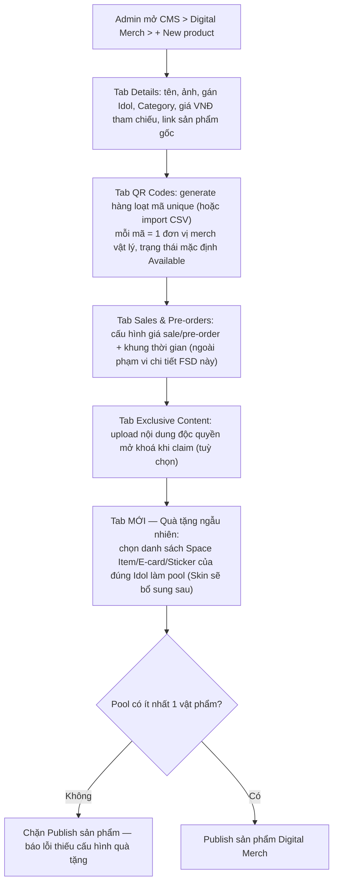
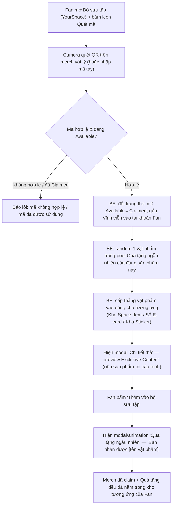

# FSD — MVP2: Digital Merch — Quét QR & Quà Tặng Ngẫu Nhiên

---

## 1. Tổng quan

**Digital Merch** là cơ chế "Quét vật phẩm offline → online" (BRD F4.1): Fan sở hữu 1 merch vật lý có in mã QR (mua qua kênh bán hàng ngoài app — vzone.bandina.vn, hoặc nhận kèm vé/sự kiện) → quét mã trong app → mở khoá nội dung số gắn với đúng sản phẩm đó.

Bổ sung cho luồng quét QR hiện có: ngoài việc mở khoá **Exclusive Content** (nếu sản phẩm có cấu hình), Fan quét thành công còn nhận thêm **1 Quà tặng ngẫu nhiên** (Space Item / E-card / Sticker) — cấp **miễn phí**, không thu tiền, không trừ Star. Đây là 1 quyền lợi đi kèm khi sở hữu merch vật lý, **tách biệt hoàn toàn** với luồng mua Space Item/E-card/Sticker bằng tiền thật qua tab "Cửa hàng" (IAP/MoMo) — Fan không trả thêm gì để nhận quà này, quà đến từ việc đã mua/sở hữu merch thật ngoài đời.

Loại quà tặng ngẫu nhiên phụ thuộc **loại merch vật lý (category)** của sản phẩm vừa quét, theo bảng ánh xạ ở mục 6.1.

**Skin làm tạm hoãn:** merch loại Trang phục vốn dự kiến trả thưởng bằng Skin, nhưng **Skin sẽ làm ở giai đoạn sau** — chưa thuộc phạm vi build của FSD này. Tạm thời category Trang phục dùng chung cơ chế quà tặng như các category khác (Space Item/E-card/Sticker), xem mục 6.1.

---

## 2. Phạm vi (Scope)

### Trong phạm vi
- CMS — Digital Merch, tạo/sửa 1 sản phẩm gắn 1 Idol cụ thể, gồm các tab:
  - **Details** — tên, ảnh, Idol, Category (Album/TShirt/Lightstick/Photocard/Merch nhỏ/Limited edition/Vé concert...), giá VNĐ tham chiếu, link sản phẩm gốc ngoài app
  - **QR Codes** — generate hàng loạt mã unique hoặc import CSV, mỗi mã ứng 1 đơn vị merch vật lý sẽ in ra, trạng thái **Available/Claimed**. **Đã chốt: mọi loại merch đều bắt buộc gắn mã QR, kể cả Merch nhỏ (keyring, badge...) — không có ngoại lệ**
  - **Sales & Pre-orders** — cấu hình giá sale/pre-order + khung thời gian on/off (lớp thương mại hoá riêng, không thuộc chi tiết build ở FSD này, chỉ note để đủ bức tranh màn hình)
  - **Exclusive Content** — nội dung độc quyền (ảnh/video) mở khoá khi Fan claim
  - **MỚI — Quà tặng ngẫu nhiên** — cấu hình pool vật phẩm (Space Item/E-card/Sticker) sẽ random cấp cho Fan khi quét thành công sản phẩm này
- Fan quét QR trên mobile (icon Quét mã trong Bộ sưu tập/YourSpace) → validate mã → đổi trạng thái Available→Claimed → cấp Exclusive Content (nếu có) + random và cấp thẳng 1 Quà tặng ngẫu nhiên từ pool
- Modal/thông báo cho Fan biết rõ vừa nhận được gì (cả Exclusive Content lẫn Quà tặng ngẫu nhiên)
- BE: cơ chế random chọn 1 vật phẩm trong pool đúng sản phẩm vừa quét, cấp thẳng vào đúng kho tương ứng loại vật phẩm (Kho Space Item, Sổ E-card, Kho Sticker)

### Ngoài phạm vi (thuộc FSD khác, giai đoạn sau, hoặc ngoài app)
- **Skin làm quà tặng ngẫu nhiên (cho merch loại Trang phục)** — tạm hoãn, sẽ làm ở giai đoạn sau; không thuộc phạm vi build của FSD này (xem mục 6.1)
- Luồng mua merch vật lý qua vzone.bandina.vn — ngoài app, chỉ redirect
- Chi tiết cấu hình giá sale/pre-order (Sales & Pre-orders tab) — lớp thương mại riêng
- Luồng mua Space Item/E-card/Sticker bằng tiền thật qua tab Cửa hàng (IAP/MoMo) — thuộc FSD riêng từng loại vật phẩm (`FSD_mvp2_Ecard_Collect_Burn.md`, `FSD_mvp2_Sticker.md`); FSD này chỉ **tiêu thụ** các kho đó làm nơi cấp quà, không định nghĩa lại cơ chế mua
- Hệ thống "Nhân vật" (character mặc Skin) — còn là câu hỏi mở, xem mục 8 OQ-1; không chặn phạm vi FSD này vì Skin đã tạm hoãn
- Tính điểm EXP/FPP khi nhận quà — thuộc `FSD_mvp2_Ranking_Point_System.md` / `FSD_mvp2_FPP_Leaderboard.md`, FSD này chỉ nêu tác động liên quan ở mục 6.4

---

## 3. Actors

| Actor | Vai trò |
|---|---|
| **Fan** | Quét QR trên merch vật lý, nhận Exclusive Content + Quà tặng ngẫu nhiên |
| **Admin (CMS)** | Tạo/sửa sản phẩm Digital Merch (Details/QR Codes/Sales & Pre-orders/Exclusive Content), cấu hình pool Quà tặng ngẫu nhiên theo từng sản phẩm |
| **BE System (Merch/QR Engine)** | Validate mã QR, đổi trạng thái Available→Claimed, gắn vĩnh viễn vào tài khoản Fan |
| **BE System (Reward Engine)** | Random 1 vật phẩm trong pool, cấp thẳng vào đúng kho tương ứng (Kho Space Item/Sổ E-card/Kho Sticker) |
| **Idol/Content team** | Cung cấp asset vật phẩm trang trí/E-card/Sticker dùng làm quà (asset Skin sẽ bổ sung khi tính năng Skin triển khai ở giai đoạn sau) |

---

## 4. User Stories

**US-1 (Fan)**
> Là một Fan, tôi muốn quét mã QR in trên merch vật lý tôi đã mua/nhận, để mở khoá nội dung số gắn với đúng sản phẩm đó.

**US-2 (Fan)**
> Là một Fan, sau khi quét thành công, tôi muốn nhận thêm 1 quà tặng ngẫu nhiên miễn phí trên nền tảng, để cảm thấy việc sở hữu merch vật lý có thêm giá trị trong app.

**US-3 (Fan)**
> Là một Fan, tôi muốn thấy rõ ràng mình vừa nhận được quà gì (loại vật phẩm, tên) qua modal/thông báo riêng, để không bỏ lỡ hoặc nhầm lẫn với nội dung Exclusive Content của merch.

**US-4 (Admin)**
> Là Admin, tôi muốn cấu hình pool Quà tặng ngẫu nhiên (chọn Space Item/E-card/Sticker cụ thể của đúng Idol) ngay trên CMS khi tạo sản phẩm Digital Merch, để không cần Tech deploy lại code mỗi khi ra mắt merch mới.

> **Skin làm sau:** US riêng cho việc cấu hình Skin (mặc định + theo chủ đề trang phục) làm quà tặng ngẫu nhiên sẽ bổ sung khi tính năng Skin triển khai ở giai đoạn sau — không thuộc phạm vi FSD này.

---

## 5. Sơ đồ luồng (Diagrams)

### 5.1 Luồng Admin — Tạo sản phẩm Digital Merch + cấu hình Quà tặng ngẫu nhiên

### 5.2 Luồng Fan — Quét QR nhận merch + Quà tặng ngẫu nhiên

---

## 6. Yêu cầu chức năng chi tiết

### 6.1 Bảng ánh xạ — Loại merch → Loại quà tặng ngẫu nhiên

| Loại merch (offline) | Loại quà tặng gợi ý | Ghi chú |
|---|---|---|
| **Trang phục** (hoodie, tee...) | ~~Skin~~ → tạm dùng Vật phẩm trang trí (Space Item) hoặc E-card | **Skin tạm hoãn, sẽ làm ở giai đoạn sau** — đích đến cuối cùng của category này vẫn là Skin (mặc định + theo chủ đề trang phục), nhưng trong giai đoạn hiện tại dùng chung cơ chế với các category khác cho tới khi Skin sẵn sàng |
| **Album** | Vật phẩm trang trí (Space Item) hoặc E-card | |
| **Lightstick** | Vật phẩm trang trí (Space Item) hoặc E-card | |
| **Photocard** | Vật phẩm trang trí (Space Item) hoặc E-card | |
| **Merch nhỏ** (keyring, badge...) | Vật phẩm trang trí (Space Item) hoặc E-card | |
| **Merch giới hạn / Limited edition** | Vật phẩm trang trí (Space Item) hoặc E-card | |
| **Vé concert / fanmeeting** | Vật phẩm trang trí (Space Item) hoặc E-card | |

Bảng trên là **gợi ý loại quà mặc định theo Category** để giữ nhất quán trải nghiệm, không phải giới hạn cứng ở tầng hệ thống — Admin vẫn tự do chọn bất kỳ loại vật phẩm nào (Space Item/E-card/Sticker) vào pool của 1 sản phẩm cụ thể khi cần linh hoạt hơn. Khi Skin triển khai ở giai đoạn sau, category Trang phục sẽ chuyển sang dùng Skin theo đúng thiết kế gốc.

### 6.2 CMS
- Tab mới **"Quà tặng ngẫu nhiên"** trong màn tạo/sửa sản phẩm Digital Merch (cùng cấp Details/QR Codes/Sales & Pre-orders/Exclusive Content). **Đã chốt: mỗi sản phẩm merch có 1 pool riêng** — không dùng chung 1 pool cho nhiều sản phẩm cùng Category/Idol
- Admin chọn danh sách vật phẩm cụ thể (Space Item/E-card/Sticker) thuộc đúng Idol của sản phẩm merch đó, làm pool random — **Skin chưa khả dụng trong pool ở giai đoạn này**, sẽ bổ sung khi tính năng Skin triển khai
- Category của sản phẩm (Details tab) gợi ý sẵn loại vật phẩm phù hợp (mục 6.1) khi Admin thao tác ở tab Quà tặng ngẫu nhiên, giúp thao tác nhanh hơn
- Bắt buộc pool có ít nhất 1 vật phẩm mới cho phép Publish sản phẩm (edge case #1) — áp dụng cho mọi category, kể cả Trang phục (tạm dùng Space Item/E-card thay Skin)
- Sửa pool sau khi đã publish và đã có Fan quét: chỉ áp dụng cho lượt quét **sau** thời điểm lưu, không hồi tố các lượt đã random trước đó

### 6.3 FE (Mobile)
- Icon "Quét mã" trong Bộ sưu tập (YourSpace): mở camera quét QR, có tuỳ chọn nhập mã tay
- Popup trạng thái: đang xử lý / thành công / thất bại (mã không hợp lệ, đã được sử dụng)
- Khi thành công: modal "Chi tiết thẻ" preview Exclusive Content (nếu sản phẩm có) → Fan bấm "Thêm vào bộ sưu tập" → tiếp nối modal/animation riêng "Quà tặng ngẫu nhiên" công bố vật phẩm vừa nhận, có nút điều hướng thẳng tới kho chứa vật phẩm đó (Kho Space Item/Sổ E-card/Kho Sticker)
- Tách 2 modal (Exclusive Content trước, Quà tặng ngẫu nhiên sau) thay vì gộp chung 1 màn — đề xuất PD/BA nhằm tránh dồn quá nhiều thông tin cùng lúc, **cần Design xác nhận** trước khi triển khai chi tiết UI/animation

### 6.4 Yêu cầu nghiệp vụ cần đảm bảo
- Random vật phẩm trong pool + cấp thẳng vào kho tương ứng phải nằm cùng 1 atomic transaction với việc đổi trạng thái mã QR Available→Claimed — không được để xảy ra trường hợp mã đã Claimed nhưng Fan không nhận được quà, hoặc ngược lại
- Random chọn 1 vật phẩm trong pool theo tỷ lệ **đồng đều (uniform)** cho mọi vật phẩm — không có tỷ lệ/weight riêng theo từng vật phẩm (đã chốt, nhất quán với cơ chế quà rank-up ở `FSD_mvp2_Ranking_Point_System.md` mục 6.3)
- Vật phẩm đã sở hữu (dạng sở hữu 1 lần — Space Item/Sticker) bị loại trừ khỏi tập random cho đúng Fan đó, tránh cấp trùng lãng phí 1 lượt quà (đã chốt, xem edge case #4)
- Quà tặng ngẫu nhiên **miễn phí hoàn toàn** — không trừ tiền, không trừ Star, không đi qua luồng thanh toán IAP/MoMo của tab Cửa hàng
- Vật phẩm nhận được ghi nhận đúng theo cơ chế sở hữu vốn có của loại kho đó (không định nghĩa lại ở đây): E-card cộng dồn số lượng theo `FSD_mvp2_Ecard_Collect_Burn.md`; Space Item/Sticker theo cơ chế ownership của kho tương ứng
- Nếu quà tặng ngẫu nhiên là **E-card**: tồn kho E-card của Fan thay đổi → FPP theo đúng Idol đó cũng thay đổi tương ứng, tự động theo `FSD_mvp2_FPP_Leaderboard.md` mục 6.1 (engine FPP lắng nghe thay đổi tồn kho, không cần xử lý gì thêm ở FSD này); nhận quà **không** cộng EXP (không phải hành động "Gộp E-card")
- Pool tại thời điểm Fan quét thành công phải lấy đúng cấu hình mới nhất trên CMS ngay lúc BE xử lý, không dùng cấu hình cache cũ

---

## 7. Edge Cases

| # | Tình huống | Xử lý đề xuất |
|---|---|---|
| 1 | Sản phẩm Digital Merch chưa cấu hình pool Quà tặng ngẫu nhiên (pool rỗng) | Chặn Publish sản phẩm — validate ngay ở bước Admin tạo/sửa sản phẩm |
| 2 | Sản phẩm không có Exclusive Content (tab để trống) | Vẫn cấp Quà tặng ngẫu nhiên bình thường — 2 luồng độc lập, Exclusive Content là tuỳ chọn |
| 3 | Fan quét 2 mã QR gần như đồng thời (race condition) | BE xử lý atomic transaction cho từng mã, khoá theo `qr_code` và `user_id` |
| 4 | Random trúng vật phẩm dạng sở hữu-1-lần (Space Item/Sticker) mà Fan đã sở hữu sẵn | **Đã chốt:** loại trừ vật phẩm đã sở hữu khỏi tập random cho đúng Fan đó, tránh lãng phí 1 lượt quà |
| 5 | Sản phẩm Digital Merch category Trang phục được tạo/publish trước khi tính năng Skin triển khai | Admin cấu hình pool tạm thời bằng Space Item/E-card như các category khác (mục 6.1) — không chặn việc ra mắt merch Trang phục chỉ vì Skin chưa sẵn sàng; khi Skin triển khai, Admin cập nhật lại pool sang Skin cho các sản phẩm Trang phục |
| 6 | Admin sửa pool giữa lúc nhiều Fan đang quét mã cùng sản phẩm | Áp dụng cấu hình tại đúng thời điểm BE xử lý random, không dùng cấu hình đã cache trên FE trước đó |
| 7 | Mã QR không hợp lệ hoặc đã ở trạng thái Claimed | Báo lỗi rõ ràng, không trigger random, không đổi trạng thái mã |

---

## 8. Open Questions (chưa có câu trả lời từ stakeholder)

| # | Câu hỏi | Ảnh hưởng | Ghi chú |
|---|---|---|---|
| **OQ-1** | Hệ thống "Nhân vật" (character mặc Skin) — là sub-system mới hoàn toàn hay dùng lại avatar sẵn có? | Ảnh hưởng scope/effort khi triển khai Skin ở giai đoạn sau | **Không chặn phạm vi FSD này** (Skin đã tạm hoãn khỏi mục 6.1) — cần trả lời trước khi bắt tay triển khai Skin ở giai đoạn sau. Kế thừa từ `mvp2_Feature_Breakdown.md` mục 7 |
