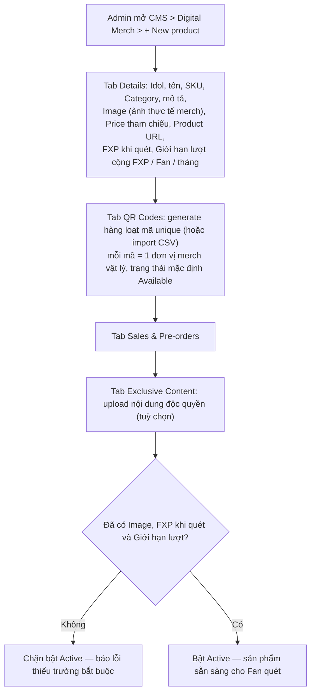
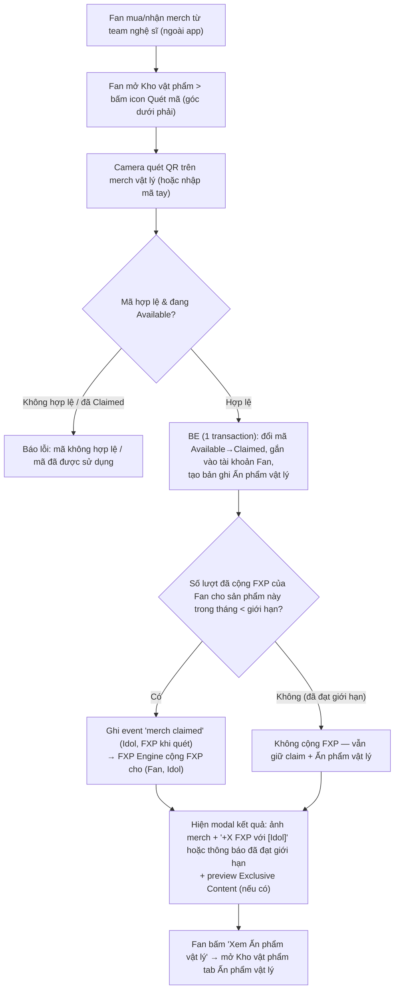

# FSD — MVP2: Digital Merch — Quét QR, tích FXP & Ấn phẩm vật lý

---

## 1. Tổng quan

**Digital Merch** là cơ chế "Quét vật phẩm offline → online" (BRD F4.1). **App không bán merch** — merch vật lý do **team nghệ sĩ bán trước đó** qua kênh riêng của họ (vd vzone.bandina.vn, bán tại sự kiện, tặng kèm vé...). Sau khi mua/nhận merch, Fan dùng app quét mã QR in trên merch → hệ thống ghi nhận Fan sở hữu merch đó.

Quét thành công mang lại cho Fan 3 thứ:
1. **Điểm FXP** với đúng Idol của sản phẩm — mức điểm cố định Admin cấu hình cho từng sản phẩm. **Đây là loại điểm duy nhất nhận được khi quét**: không cộng EXP, không cộng Star.
2. **Ấn phẩm vật lý**: hình ảnh thực tế của merch (lấy từ trường **Image** ở tab Details trên CMS) tự động xuất hiện trong **Kho vật phẩm → tab "Ấn phẩm vật lý"**, như 1 "bằng chứng sở hữu" hiển thị trong app. Đây chỉ là hình ảnh, **không phải** vật phẩm ảo dùng được (không trang trí, không gộp, không tặng).
3. **Exclusive Content** (nếu sản phẩm có cấu hình).

Quét merch **không cấp vật phẩm ảo** nào (Space Item / E-card / Sticker / Avatar Frame / Skin). Các vật phẩm này chỉ có được qua kênh riêng của từng loại (Cửa hàng, Mission, quà rank-up...).

---

## 2. Phạm vi (Scope)

### Trong phạm vi
- CMS — Digital Merch, tạo/sửa 1 sản phẩm gắn 1 Idol cụ thể, gồm các tab:
  - **Details** — Idol, tên, SKU, Category, mô tả, **Image** (bắt buộc — dùng làm ảnh Ấn phẩm vật lý), Price (₫) (giá bán tham chiếu tại kênh của team nghệ sĩ — chỉ để hiển thị), Product URL, Featured/Limited/Active, **FXP khi quét**, **Giới hạn lượt cộng FXP / Fan / tháng** (mục 6.3)
  - **QR Codes** — generate hàng loạt mã unique hoặc import CSV, mỗi mã ứng 1 đơn vị merch vật lý, trạng thái **Available/Claimed**. Mọi loại merch đều bắt buộc gắn mã QR, kể cả Merch nhỏ (keyring, badge...)
  - **Sales & Pre-orders** — thông tin sale/pre-order tại kênh bán của team nghệ sĩ (không phát sinh giao dịch trong app)
  - **Exclusive Content** — nội dung độc quyền (ảnh/video) mở khoá khi Fan claim
- Fan quét QR trên mobile → validate mã → đổi trạng thái Available→Claimed → cộng FXP + lưu Ấn phẩm vật lý + mở khoá Exclusive Content (nếu có)
- FE: tab **"Ấn phẩm vật lý"** trong màn **Kho vật phẩm** (cùng hàng với E-card / Vật phẩm / Quà Donate)
- Modal kết quả quét cho Fan biết rõ: số FXP vừa nhận + Ấn phẩm vật lý vừa lưu (+ Exclusive Content nếu có)
- BE: phát event "merch claimed" kèm số FXP cấu hình của sản phẩm để FXP Engine cộng điểm

### Ngoài phạm vi
- Cấp vật phẩm ảo khi quét merch (Space Item/E-card/Sticker/Avatar Frame/Skin)
- **Bán merch trong app** — việc bán/thanh toán merch do team nghệ sĩ thực hiện ngoài app, app chỉ redirect qua Product URL (nếu có)
- Công thức luỹ tiến & bảng bậc FXP (`FSD_mvp2_FXP_Leaderboard.md` mục 6.2) — **không áp dụng** cho nguồn merch
- EXP / Level — quét merch **không** cộng EXP (`FSD_mvp2_Ranking_Point_System.md`)

---

## 3. Actors

| Actor | Vai trò |
|---|---|
| **Fan** | Mua/nhận merch từ team nghệ sĩ (ngoài app), quét QR trong app, nhận FXP + Ấn phẩm vật lý (+ Exclusive Content nếu có) |
| **Team nghệ sĩ** | Bán/phát hành merch vật lý có in mã QR qua kênh riêng (ngoài app) |
| **Admin (CMS)** | Tạo/sửa sản phẩm Digital Merch; upload ảnh thực tế của merch, cấu hình FXP khi quét và giới hạn lượt cộng FXP |
| **BE System (Merch/QR Engine)** | Validate mã QR, đổi trạng thái Available→Claimed, gắn vĩnh viễn vào tài khoản Fan, tạo bản ghi Ấn phẩm vật lý, kiểm tra giới hạn, phát event cho FXP Engine |
| **BE System (FXP Engine)** | Nhận event merch claimed, cộng FXP cho `(Fan, Idol)` |

---

## 4. User Stories

**US-1 (Fan)**
> Là một Fan, tôi muốn quét mã QR in trên merch vật lý tôi đã mua/nhận từ team nghệ sĩ, để app ghi nhận tôi sở hữu merch đó.

**US-2 (Fan)**
> Là một Fan, khi quét merch thành công, tôi muốn được cộng FXP với đúng Idol đó, để việc ủng hộ merch của Idol được phản ánh trên BXH FXP.

**US-3 (Fan)**
> Là một Fan, tôi muốn thấy hình ảnh thực tế của những merch tôi đã quét trong tab "Ấn phẩm vật lý" của Kho vật phẩm, để xem lại bộ sưu tập merch thật của mình ngay trong app.

**US-4 (Admin)**
> Là Admin, tôi chỉ cần upload ảnh merch, nhập số FXP khi quét và giới hạn lượt ở tab Details, để hệ thống tự hiển thị Ấn phẩm vật lý và tự cộng FXP.

---

## 5. Sơ đồ luồng (Diagrams)

### 5.1 Luồng Admin — Tạo sản phẩm Digital Merch

### 5.2 Luồng Fan — Quét QR nhận FXP + Ấn phẩm vật lý

---

## 6. Yêu cầu chức năng chi tiết

### 6.1 Tích điểm FXP khi quét merch

- Quét merch vật lý là 1 **nguồn FXP**: "Sở hữu merch vật lý (quét QR)" — cần có trong bảng nguồn earn FXP ở `FSD_mvp2_FXP_Leaderboard.md` mục 6.1.
- **Chỉ cộng FXP** — không cộng EXP, không cộng Star, không cấp vật phẩm ảo.
- FXP gán cho đúng Idol của sản phẩm (trường **Idol Profile** ở tab Details).
- **Cách tính:** mỗi lượt quét hợp lệ cộng **đúng số "FXP khi quét"** Admin cấu hình cho sản phẩm đó (mục 6.3).
  - Vì app không bán merch (không có giao dịch/thanh toán trong app), nguồn này **không** đi qua công thức luỹ tiến ở `FSD_mvp2_FXP_Leaderboard.md` mục 6.2 và **không** cộng vào tổng luỹ kế Donate + mua vật phẩm. FXP merch được cộng thẳng vào FXP của `(Fan, Idol)` trong kỳ.
  - Price (₫) trên Details chỉ là giá tham chiếu để hiển thị, **không** dùng làm căn cứ tính FXP.
  - Ví dụ: Album "Thinker Tell" cấu hình FXP khi quét = 450 → mỗi lượt quét hợp lệ +450 FXP với Chi Xê.
- Kỳ tính FXP = **thời điểm quét thành công** (không phải lúc mua merch ngoài app). Nếu có BXH sự kiện đang chạy của Idol đó thì cộng song song vào cả BXH tháng lẫn BXH sự kiện, giống các nguồn FXP khác.
- FXP từ merch là **cộng 1 lần theo lượt quét**, **không** tính lại theo tồn kho như E-card — Ấn phẩm vật lý không bị mất nên không có kịch bản trừ điểm.
- Mỗi mã QR chỉ cộng FXP đúng 1 lần (mã đã Claimed không quét lại được).
- **Giới hạn lượt cộng FXP** (chống gom mã QR để leo BXH): mỗi Fan chỉ được cộng FXP tối đa **N lượt quét / 1 sản phẩm / 1 kỳ BXH tháng**, N cấu hình trên CMS theo từng sản phẩm (mục 6.3).
  - Đếm theo `(user_id, product_id, kỳ tháng)`; sang tháng mới đếm lại từ 0.
  - Vượt giới hạn **vẫn cho claim** mã QR, vẫn lưu Ấn phẩm vật lý (tăng ×N) và mở Exclusive Content — **chỉ không cộng FXP** cho lượt đó, để Fan mua nhiều đơn vị thật vẫn được ghi nhận đủ sở hữu.
  - BXH sự kiện dùng chung bộ đếm của kỳ tháng (không có hạn mức riêng cho sự kiện).

### 6.2 Ấn phẩm vật lý (Kho vật phẩm → tab "Ấn phẩm vật lý")

**Bản chất:** Ấn phẩm vật lý **chỉ là hình ảnh** thực tế của merch Fan đã quét (lấy từ trường Image của sản phẩm trên CMS). **Không phải vật phẩm ảo** — không dùng để trang trí My Space, không gộp, không tặng, không bán, không tính vào tồn kho E-card/Space Item/Sticker.

**Cách lưu:**
- Quét thành công → BE tự tạo 1 bản ghi Ấn phẩm vật lý `(user_id, product_id, qr_code, claimed_at)` — Fan không cần thao tác thêm.
- Ảnh hiển thị = **ảnh của sản phẩm trên CMS**, lấy tại thời điểm hiển thị (tham chiếu theo `product_id`, không copy file). Admin sửa ảnh sản phẩm thì Ấn phẩm vật lý của mọi Fan cập nhật theo.
- Fan quét nhiều đơn vị của cùng 1 sản phẩm (vd mua 2 album giống nhau): hiển thị **gộp 1 ô theo sản phẩm, kèm số lượng ×N**; màn chi tiết liệt kê từng lần quét (thời gian claim). Mỗi lần quét cộng FXP riêng, trong phạm vi giới hạn lượt (mục 6.1).

**UI tab "Ấn phẩm vật lý" (Kho vật phẩm):**
- Tab thứ 4 **"Ấn phẩm vật lý"** cạnh các tab E-card / Vật phẩm / Quà Donate.
- Dạng lưới, mỗi ô: ảnh merch + tên sản phẩm + tên Idol + badge ×N (nếu N > 1).
- Lọc theo Idol (khi Fan follow nhiều Idol); sắp xếp mặc định theo thời gian quét mới nhất.
- Bấm vào 1 ô → màn chi tiết: ảnh lớn, tên, Category, Idol, ngày quét (các lần quét nếu ×N), link mở Exclusive Content (nếu sản phẩm có), link Product URL tới kênh bán của team nghệ sĩ (tuỳ chọn).
- Empty state: "Chưa có ấn phẩm vật lý — quét mã QR trên merch chính hãng để lưu ấn phẩm" + nút mở Quét mã.

### 6.3 CMS

Tab Details:
- **Image**: bắt buộc trước khi bật **Active**. Đây là ảnh thực tế của merch hiển thị làm Ấn phẩm vật lý → Admin dùng ảnh chụp sản phẩm thật, nền sạch, tỉ lệ vuông (≥ 800×800).
- **Price (₫)**: giá bán tham chiếu tại kênh của team nghệ sĩ, chỉ để hiển thị — **không bắt buộc**, **không** dùng tính FXP.
- **FXP khi quét** (số nguyên ≥ 0, bắt buộc): số FXP cộng cho Fan mỗi lượt quét hợp lệ.
  - Nhập 0 = sản phẩm chỉ lưu Ấn phẩm vật lý, không cộng FXP (vd merch tặng kèm vé/sự kiện nếu không muốn tính FXP).
  - Gợi ý cho Admin: tham chiếu baseline "1.000đ = 1 FXP" theo giá bán thực tế để cân bằng với các nguồn FXP khác; Admin toàn quyền điều chỉnh.
- **Giới hạn lượt cộng FXP / Fan / tháng** (số nguyên ≥ 1, bắt buộc, mặc định **2**): số lượt quét tối đa của 1 Fan với sản phẩm này được cộng FXP trong 1 kỳ tháng. Album/Photocard có thể nâng lên cho Fan mua nhiều bản; Limited edition/Lightstick nên để 1.

Sửa "FXP khi quét" hoặc giới hạn lượt sau khi đã có Fan quét: chỉ áp dụng cho các lượt quét **sau** thời điểm lưu, không tính lại FXP đã cộng.

### 6.4 FE (Mobile)

- Icon "Quét mã" (nút QR góc dưới phải màn Kho vật phẩm): mở camera quét QR, có tuỳ chọn nhập mã tay.
- Popup trạng thái: đang xử lý / thành công / thất bại (mã không hợp lệ, đã được sử dụng).
- Khi thành công: **1 modal kết quả** gồm:
  - Ảnh merch (Ấn phẩm vật lý vừa lưu) + tên sản phẩm
  - "+X FXP với [Tên Idol]" — nếu đã vượt giới hạn: "Đã lưu ấn phẩm. Bạn đã đạt tối đa lượt cộng FXP cho sản phẩm này trong tháng"; nếu sản phẩm cấu hình FXP = 0: chỉ hiện "Đã lưu ấn phẩm"
  - Preview Exclusive Content (nếu sản phẩm có)
  - Nút **"Xem Ấn phẩm vật lý"** (điều hướng tới tab Ấn phẩm vật lý) và nút **Đóng**

### 6.5 Yêu cầu nghiệp vụ cần đảm bảo

- Đổi trạng thái mã Available→Claimed + tạo bản ghi Ấn phẩm vật lý + kiểm tra/tăng bộ đếm giới hạn + ghi event FXP phải nằm **cùng 1 transaction** (event FXP ghi dạng outbox để FXP Engine xử lý). Không được xảy ra trường hợp mã đã Claimed mà Fan không có Ấn phẩm vật lý / không được cộng FXP (khi còn lượt), hoặc ngược lại.
- FXP Engine xử lý event merch claimed **idempotent** theo `qr_code` — retry không cộng trùng.
- Số "FXP khi quét" dùng để cộng là giá trị **tại thời điểm BE xử lý claim** (snapshot vào event), không dùng giá trị cache trên FE.
- Quét merch **miễn phí** — không trừ tiền/Star, không phát sinh giao dịch thanh toán trong app.

---

## 7. Edge Cases

| # | Tình huống | Xử lý |
|---|---|---|
| 1 | Sản phẩm chưa có Image / chưa nhập "FXP khi quét" / chưa nhập giới hạn lượt | Chặn bật Active trên CMS; mã QR của sản phẩm Inactive trả lỗi "sản phẩm chưa phát hành" khi quét |
| 2 | Sản phẩm không có Exclusive Content | Vẫn cộng FXP + lưu Ấn phẩm vật lý bình thường — Exclusive Content là tuỳ chọn |
| 3 | Fan quét 2 mã QR gần như đồng thời / bấm quét 2 lần 1 mã (race condition) | BE khoá theo `qr_code`; chỉ 1 request claim thành công, request còn lại nhận lỗi "mã đã được sử dụng"; FXP idempotent theo `qr_code` |
| 4 | Fan quét merch của Idol mình chưa follow | Vẫn cho claim + lưu Ấn phẩm vật lý; FXP vẫn ghi nhận cho `(Fan, Idol)` nhưng ẩn khỏi BXH công khai cho tới khi Fan follow — nhất quán edge case #1 của `FSD_mvp2_FXP_Leaderboard.md` |
| 5 | Admin đổi ảnh sản phẩm sau khi Fan đã quét | Ấn phẩm vật lý của mọi Fan hiển thị ảnh mới (tham chiếu theo product) |
| 6 | Admin xoá / tắt Active sản phẩm sau khi Fan đã quét | Ấn phẩm vật lý **vẫn giữ** trong kho của Fan (soft-delete sản phẩm, không xoá ảnh); FXP đã cộng không bị trừ |
| 7 | Admin sửa "FXP khi quét" / giới hạn lượt sau khi đã có Fan quét | Chỉ áp dụng cho lượt quét sau; không hồi tố FXP |
| 8 | Mã QR không hợp lệ hoặc đã Claimed | Báo lỗi rõ ràng, không đổi trạng thái mã, không cộng FXP, không tạo Ấn phẩm vật lý |
| 9 | Quét merch đúng lúc chuyển tháng (BXH reset) | FXP và bộ đếm giới hạn tính vào kỳ theo `claimed_at` do BE ghi nhận |
| 10 | Fan quét vượt giới hạn lượt cộng FXP của 1 sản phẩm trong tháng | Vẫn claim thành công + lưu Ấn phẩm vật lý (×N) + mở Exclusive Content; không cộng FXP; modal báo rõ đã đạt giới hạn |
| 11 | Fan quét đồng thời nhiều mã của cùng 1 sản phẩm khi chỉ còn 1 lượt cộng FXP | Kiểm tra + tăng bộ đếm trong cùng transaction claim (khoá theo `user_id + product_id`), đảm bảo không vượt giới hạn |
| 12 | Sản phẩm cấu hình "FXP khi quét" = 0 | Vẫn claim + lưu Ấn phẩm vật lý + mở Exclusive Content; không ghi event FXP, không tăng bộ đếm giới hạn |
