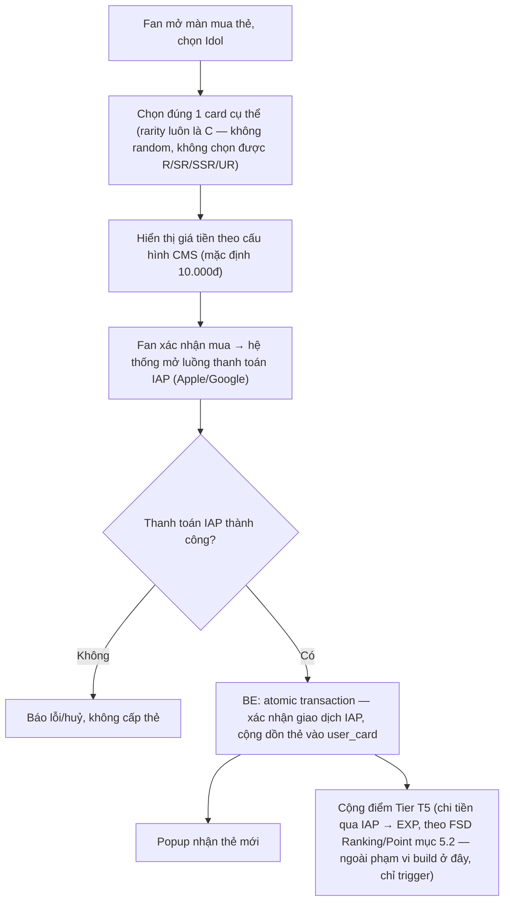
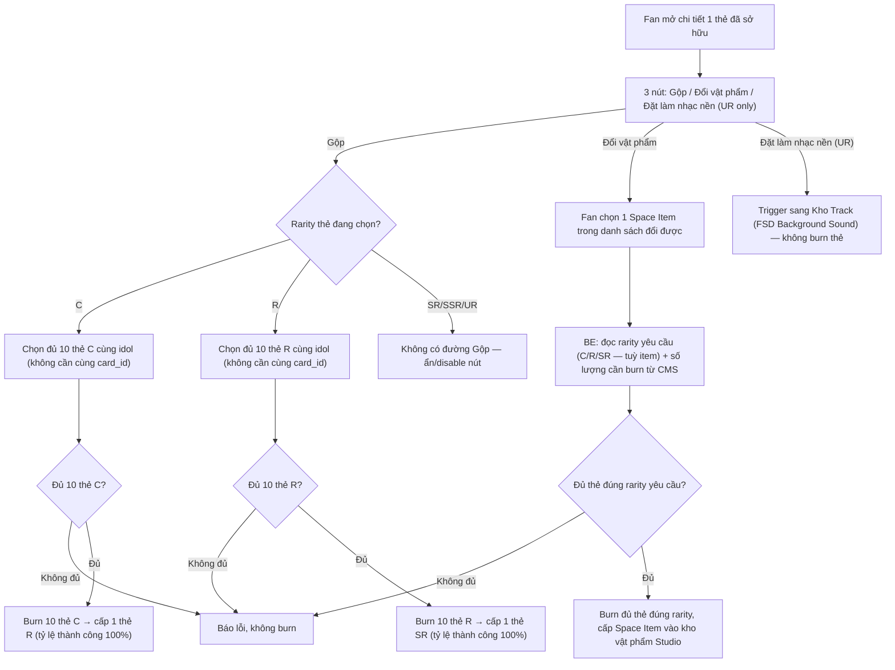

# FSD — MVP2: Sổ E-card (Collect & Burn)

> **Nguồn tham chiếu:** `Fanation - Mechanic of Ranking - Mission - Point Star Card.docx` (mục 1 — công thức Gộp), `mvp2_revise_1.docx` (mục II — đổi cơ chế Earn sang mua bằng tiền, lý do license Game — 15/08/2026)

---

## 1. Tổng quan

"Sổ E-card" là màn sưu tập thẻ Idol của Fan, lưu trữ tại **Kho "E-card"** — 1 Kho vật phẩm **riêng, mới**, trong My Space (cùng cấu trúc các Kho vật phẩm khác đã có như Kho Track/Loa/Stage/Skin). Mỗi thẻ gắn với đúng 1 Idol cụ thể, có 5 cấp độ hiếm (rarity) tương ứng 5 định dạng hiển thị khác nhau:

| Rarity | Định dạng hiển thị |
|---|---|
| **C** | Ảnh tĩnh |
| **R** | Ảnh tĩnh |
| **SR** | Motion (ảnh động) |
| **SSR** | Live photo 2 giây |
| **UR** | Video 5-10 giây, có âm thanh |

Tính năng gồm 2 nhánh độc lập:

1. **COLLECT (sở hữu thẻ)** — 2 nguồn: (a) thưởng mission thường → thẻ C; mission sự kiện/campaign → SR/SSR/UR (xem `FSD_mvp2_Ranking_Point_System.md` Tier T4), (b) mua trực tiếp thẻ **C** bằng tiền qua IAP (giá cố định 10.000đ/thẻ, chọn đúng idol + card cụ thể — không random). Thẻ **R** không bán trực tiếp, chỉ ra từ Gộp 10 thẻ C. Thẻ **SR** ngoài mission sự kiện/campaign còn có thêm nguồn Gộp 10 thẻ R.
2. **BURN (dùng thẻ đã có)** — dùng thẻ sở hữu để (a) **Gộp** nâng hạng lên rarity cao hơn: burn 10 thẻ **cùng rarity, cùng idol** (không cần cùng 1 card cụ thể — bất kỳ 10 thẻ nào cùng rarity của idol đó đều gộp chung được) → 1 thẻ rarity kế tiếp, mẫu card cụ thể ra ngẫu nhiên trong pool của idol đó. C→R và R→SR đều **100% chắc chắn thành công** (rủi ro chỉ nằm ở việc random đúng mẫu card nào, không phải có ra thẻ hay không — đây là điều kiện để cơ chế Gộp hợp lệ theo giấy phép Game, không phải giấy phép TMĐT). **SR không có đường gộp lên SSR/UR** — 2 hạng này chỉ ra từ mission sự kiện/campaign. Hoặc (b) **Đổi vật phẩm** lấy đồ trang trí Studio (Space Item) — **không chỉ dùng thẻ C**: mỗi Space Item được Admin gán 1 rarity yêu cầu riêng (C, R, hoặc SR) + số lượng cần burn của đúng rarity đó trên CMS (mục 6.4), nguồn chưa có công thức cụ thể cho phần này.

Thẻ rarity **UR** có thêm 1 hiệu ứng phụ: tự động cấp kèm 1 Track âm thanh nền cho My Space khi Fan sở hữu (xem `FSD_mvp2_MySpace_Background_Sound.md` mục 5.2 — hook vào event "nhận thẻ", không thuộc phạm vi build của FSD này, chỉ cross-reference).

E-card thuộc giấy phép Game (không phải TMĐT) — mua bằng tiền thật trực tiếp, không quy đổi qua Star, không đổi ngược lại thành Star hay vật phẩm ngoài phạm vi đã định nghĩa (Space Item, Track).

---

## 2. Phạm vi (Scope)

### Trong phạm vi
- Thẻ sở hữu theo `(user_id, idol_id, card_id, rarity)`, cộng dồn số lượng, **không giới hạn kho** (đã chốt)
- Kho "E-card" trong My Space (Kho riêng, không nằm trong Bộ Sưu Tập): lưới thẻ theo level hoặc trạng thái mua, hiển thị số lượng mỗi thẻ
- Màn chi tiết thẻ: hiển thị đúng định dạng theo rarity (ảnh tĩnh/motion/live photo/video)
- Mua trực tiếp thẻ **C** bằng tiền qua IAP — chọn đúng idol + card cụ thể, giá cố định 10.000đ/thẻ (không random)
- Nhận thẻ qua Mission Service (mission thường → C; mission sự kiện/campaign → SR/SSR/UR) — cập nhật reward type = E-card trong Mission Service
- Popup thông báo khi nhận thẻ mới: "Bạn nhận được thẻ [hạng] – [idol]"
- Nút "Đặt làm nhạc nền" trên thẻ UR — chỉ **trigger** sang flow của Kho Track, không xử lý logic audio ở đây (thuộc FSD Background Sound)
- **Gộp:** burn 10 thẻ cùng rarity + cùng idol (không cần cùng card_id, đề xuất PD/BA) để đổi lấy 1 thẻ rarity kế tiếp — C→R và R→SR đều 100% thành công; SR không gộp lên SSR/UR được (mục 5.3)
- **Đổi vật phẩm:** burn đủ số lượng thẻ theo yêu cầu của từng Space Item — **không cố định 1 rarity**: mỗi item có thể yêu cầu thẻ C, thẻ R, hoặc thẻ SR tuỳ Admin cấu hình trên CMS (nguồn chưa có công thức)
- **Claim quà rank-up:** nút nhận quà chủ động khi Fan lên Level — cơ chế nhận đã chốt (Fan claim, không tự động cấp); mặc định **1 thẻ R** cho mọi Level (đề xuất PD/BA theo nguồn mục 5.3), Admin có thể sửa riêng từng Level qua CMS nếu cần khác biệt. **Idol nào cấp thẻ khi EXP giờ tính global — chưa xác định, xem OQ mục 8**
- CMS: CRUD catalog thẻ (gán idol, rarity, giá tiền nếu bán trực tiếp thẻ C, upload asset theo định dạng), cấu hình tỷ lệ quy đổi Gộp + giá Đổi vật phẩm + quà rank-up theo Level

### Ngoài phạm vi (thuộc FSD khác)
- Logic phát audio Track gắn kèm thẻ UR — thuộc `FSD_mvp2_MySpace_Background_Sound.md`

---

## 3. Actors

| Actor | Vai trò |
|---|---|
| **Fan** | Sở hữu thẻ qua mission/mua bằng tiền (IAP), xem Kho E-card, gộp thẻ, đổi vật phẩm, claim quà rank-up |
| **Admin (CMS) / RnD (Mission Config)** | Tạo/sửa catalog thẻ: gán idol, rarity, giá tiền (nếu bán trực tiếp thẻ C), upload asset theo định dạng; cấu hình số lượng thẻ cho Gộp (mặc định theo nguồn: C→R 10 thẻ, R→SR 10 thẻ, cả 2 đều 100% thành công); cấu hình rarity yêu cầu (C/R/SR) + số lượng cho từng Space Item ở Đổi vật phẩm; quà rank-up theo Level (mặc định 1 thẻ R/Level, đề xuất PD/BA); gán loại thẻ (C hay SR/SSR/UR) vào reward pool của từng mission/campaign |
| **BE System (Card/Inventory Engine)** | Cộng dồn số lượng thẻ, xử lý giao dịch mua qua IAP, báo cho các hệ thống liên quan (Kho Track, Point Tier T4) khi Fan vừa nhận thẻ để họ tự xử lý phần của mình |
| **Idol/Content team** | Cung cấp asset ảnh tĩnh/motion/live photo/video theo đúng rarity cho từng thẻ |

---

## 4. User Stories

**US-1 (Fan)**
> Là một Fan, tôi muốn xem toàn bộ thẻ tôi đã sở hữu của 1 Idol trong Kho E-card, kèm số lượng từng loại, để theo dõi tiến độ sưu tầm của mình.

**US-2 (Fan)**
> Là một Fan, khi nhận được thẻ mới (qua mission hoặc mua), tôi muốn có popup thông báo rõ hạng và idol của thẻ đó, để biết ngay mình vừa nhận được gì.

**US-3 (Fan)**
> Là một Fan, tôi muốn mua trực tiếp thẻ C của đúng idol/card tôi muốn bằng tiền qua IAP, để chủ động sở hữu thay vì chỉ chờ may mắn từ mission.

**US-4 (Fan)**
> Là một Fan, khi xem chi tiết 1 thẻ, tôi muốn thấy đúng định dạng tương ứng hạng của thẻ (ảnh tĩnh/motion/live photo/video có âm thanh), để cảm nhận được giá trị tăng dần theo độ hiếm.

**US-5 (Fan)**
> Là một Fan sở hữu thẻ UR, tôi muốn đặt thẻ đó làm nhạc nền My Space, để không gian riêng của tôi gắn liền với khoảnh khắc hiếm tôi sưu tầm được.

**US-6 (Fan)**
> Là một Fan, tôi muốn gộp 10 thẻ cùng rarity để đổi lấy 1 thẻ cấp cao hơn (C→R và R→SR đều chắc chắn thành công), để có động lực cày thẻ trùng thay vì chỉ tích trữ vô nghĩa.

**US-7 (Fan)**
> Là một Fan, tôi muốn đổi thẻ dư thừa (C, R, hoặc SR tuỳ item) lấy vật phẩm trang trí Studio (Space Item), để tận dụng thẻ trùng thay vì để không dùng.

**US-8 (Fan)**
> Là một Fan, khi lên Level, tôi muốn chủ động bấm nhận quà rank-up (thẻ E-card), để tôi biết chắc mình đã nhận được phần thưởng đó, giống cơ chế claim Khung theo Rank đã có.

**US-9 (Admin)**
> Là Admin, tôi muốn cấu hình catalog thẻ (idol, rarity, giá tiền, asset) VÀ tỷ lệ quy đổi Gộp/Đổi vật phẩm/quà rank-up ngay trên CMS, để cân bằng kinh tế E-card mà không cần Tech deploy lại code.

---

## 5. Sơ đồ luồng (Diagrams)

### 5.1 Luồng Fan — nhận thẻ (2 nguồn Collect)

```mermaid
flowchart TD
    subgraph SRC["2 nguồn nhận thẻ (Collect)"]
        A1["Hoàn thành mission (thường hoặc sự kiện/campaign)"]
        A2["Mua trực tiếp thẻ C bằng tiền qua IAP"]
    end

    A1 --> B["BE: xác định rarity theo loại mission (thường→C, sự kiện/campaign→SR/SSR/UR)"]
    A2 --> C["BE: xử lý giao dịch IAP, xác định card_id Fan chọn (rarity luôn là C)"]

    B --> E["Cấp/cộng dồn thẻ vào Kho E-card — user_card (user_id, idol_id, card_id, rarity)"]
    C --> E

    E --> F["Popup: 'Bạn nhận được thẻ [hạng] – [idol]'"]
    E --> G{"Rarity = UR?"}
    G -- Có --> H["Báo cho hệ thống Kho Track: Fan vừa nhận thẻ UR → tự động cấp Track kèm theo (chi tiết ở FSD Background Sound, ngoài phạm vi build ở đây)"]
    G -- Không --> I["Kết thúc"]
    H --> I
    E --> J["Báo cho hệ thống Point: cập nhật tiến độ mốc 'Thu thập đủ X thẻ C/R' (chi tiết ở FSD Ranking/Point mục 6.3, ngoài phạm vi build ở đây)"]
```

### 5.2 Luồng Fan — mua trực tiếp thẻ C bằng tiền qua IAP

### 5.3 Luồng Fan — Burn: Gộp & Đổi vật phẩm

**Gộp — công thức đã CHỐT (nguồn `Fanation - Mechanic of Ranking - Mission - Point Star Card.docx` mục 1):**

| Gộp | Số lượng cần | Tỷ lệ thành công | Ghi chú |
|---|---|---|---|
| C → R | 10 thẻ C cùng idol | **100%** (chắc chắn) | Mẫu card R nhận được ngẫu nhiên trong pool của idol đó |
| R → SR | 10 thẻ R cùng idol | **100%** (chắc chắn) | Mẫu card SR nhận được ngẫu nhiên trong pool của idol đó |
| SR → SSR | — | — | **Không tồn tại đường Gộp** — SSR chỉ ra từ mission sự kiện/campaign |
| SSR → UR | — | — | **Không tồn tại đường Gộp** — UR chỉ ra từ mission sự kiện/campaign |

Số lượng cần (10) nên lưu dạng **config trên CMS** (không hard-code), dùng đúng giá trị mặc định theo bảng trên — nhất quán với nguyên tắc "mọi hằng số đều cấu hình qua CMS" đã áp dụng xuyên suốt các FSD khác.

**1 điểm nguồn chưa nói rõ, được PD/BA đề xuất làm giá trị mặc định (cần PO xác nhận chính thức trước go-live):**
1. **Phạm vi thẻ đầu vào:** 10 thẻ chỉ cần cùng rarity + cùng idol, **không cần cùng 1 card cụ thể (card_id)**. Nếu bắt buộc cùng card_id, Fan gần như không thể gom đủ 10 thẻ giống hệt nhau — đi ngược mục tiêu tạo động lực cày thẻ trùng (US-6).

**Đổi vật phẩm:** nguồn không có công thức cụ thể — mỗi Space Item cần Admin cấu hình riêng "cần đổi bao nhiêu thẻ, rarity nào" trên CMS (mục 6.4), không có mô hình tính sẵn. **Không giới hạn chỉ dùng thẻ C:** Admin có thể gán bất kỳ Space Item nào yêu cầu thẻ **C, R, hoặc SR** — vd item phổ biến cần X thẻ C, item hiếm hơn cần X thẻ R, item cao cấp cần X thẻ SR. Mỗi item chỉ gắn 1 rarity yêu cầu duy nhất (không phối trộn nhiều rarity trong cùng 1 lượt đổi).

---

## 6. Yêu cầu chức năng chi tiết

### 6.1 Bối cảnh — Rarity & định dạng hiển thị

| Rarity | Định dạng | Nguồn sở hữu |
|---|---|---|
| C | Ảnh tĩnh | Mission thường, mua trực tiếp bằng tiền qua IAP |
| R | Ảnh tĩnh | Gộp 10 thẻ C (100%, chắc chắn) — không bán trực tiếp |
| SR | Motion | Mission sự kiện/campaign, hoặc Gộp 10 thẻ R (100%, chắc chắn) |
| SSR | Live photo 2s | Chỉ mission sự kiện/campaign — **không có đường Gộp** |
| UR | Video 5-10s, có âm thanh | Chỉ mission sự kiện/campaign — **không có đường Gộp** — **kèm tự động cấp Track** (xem `FSD_mvp2_MySpace_Background_Sound.md`) |

Chỉ rarity **C** bán trực tiếp bằng tiền; R/SR/SSR/UR không bán trực tiếp — chỉ ra từ mission hoặc Gộp theo bảng trên.

### 6.2 FE
- Kho "E-card" (nút mở riêng trong My Space, cùng nhóm UI với các Kho vật phẩm khác — Track/Loa/Stage/Skin, **không** nằm trong tab Bộ Sưu Tập): lưới thẻ theo level hoặc trạng thái mua, mỗi ô hiển thị ảnh đại diện + số lượng sở hữu; thẻ chưa sở hữu hiển thị mờ/khoá
- Màn chi tiết thẻ: render đúng định dạng theo rarity (ảnh tĩnh/motion/live photo/video có âm thanh) + 3 nút Gộp / Đổi vật phẩm / Đặt làm nhạc nền (UR only)
- Nút Gộp: chỉ hiện cho thẻ rarity C hoặc R (SR/SSR/UR ẩn/disable vì không có đường Gộp); màn chọn đủ 10 thẻ cùng rarity cùng idol (Fan có thể chọn lẫn nhiều card khác nhau, không cần cùng 1 card cụ thể), hiển thị tỷ lệ thành công 100% trước khi Fan xác nhận
- Màn Đổi vật phẩm: danh sách Space Item đổi được, mỗi item hiển thị rõ rarity yêu cầu (C/R/SR) + số lượng thẻ cần burn đọc từ CMS, disable item nếu Fan không đủ thẻ đúng rarity
- Nút "Nhận quà" (claim) hiển thị khi Fan có quà rank-up đang chờ nhận sau khi lên Level — Fan bấm để nhận thẻ E-card, mặc định **1 thẻ R** (đọc từ cấu hình CMS theo từng Level, có thể khác 1 thẻ R nếu Admin đổi)
- Popup nhận thẻ mới, hiển thị ngay sau khi hành động (mission hoàn thành / mua thành công / gộp / đổi vật phẩm / claim quà rank-up)
- Màn mua thẻ C bằng tiền: chọn idol → chọn card cụ thể → hiển thị giá tiền → xác nhận mua qua IAP

### 6.3 Yêu cầu nghiệp vụ cần đảm bảo
- Thẻ trùng (cùng idol + card + rarity) phải cộng dồn số lượng, không tách thành nhiều bản ghi riêng cho cùng 1 loại thẻ
- Kho E-card **không giới hạn dung lượng** (đã chốt) — không cần thiết kế cơ chế cap hay xoá bớt khi đầy
- Mua thẻ C bằng tiền qua IAP: xác nhận thanh toán và cấp thẻ phải là 1 thao tác trọn vẹn — không được để xảy ra trường hợp Fan bị trừ tiền mà không nhận thẻ, hoặc ngược lại
- Giá thẻ C áp dụng đúng theo cấu hình tại thời điểm Fan xác nhận mua — nếu Admin vừa đổi giá, không dùng giá cũ đã hiển thị trước đó trên máy Fan
- Khi Fan nhận thẻ rarity UR: cần có cách báo cho hệ thống Kho Track (FSD Background Sound) biết để tự động cấp Track tương ứng — Sổ E-card không cần tự xử lý phần audio
- Khi Fan thu thập đủ số thẻ theo mốc của catalog Tier T4 (FSD Ranking/Point): cần có cách báo cho hệ thống Point biết để cộng điểm tương ứng — mốc đề xuất **mỗi 10 thẻ C/R thu thập được** (đề xuất PD/BA, tái dùng đúng con số 10 đã CHỐT ở công thức Gộp để nhất quán, thay vì phát sinh tham số cân bằng mới; số liệu chính thức "xxx" vẫn cần PO xác nhận qua `FSD_mvp2_Ranking_Point_System.md` mục 8)
- Gộp: input 10 thẻ chỉ cần cùng rarity + cùng idol, không yêu cầu cùng card_id cụ thể (đề xuất PD/BA)
- Gộp / Đổi vật phẩm / Claim quà rank-up: số lượng thẻ cần luôn phải lấy từ cấu hình mới nhất trên CMS tại đúng thời điểm Fan thực hiện, không hard-code trong code hoặc dùng giá trị cũ đã lưu tạm
- Quà rank-up "đang chờ nhận" phải được giữ nguyên cho tới khi Fan chủ động claim — không tự mất, không bị ghi đè nếu Fan lên nhiều Level liên tiếp trước khi claim (xem Edge case #6). Mặc định cấp **1 thẻ R** (đề xuất PD/BA) — **idol nào cấp: chưa xác định, xem OQ mục 8**

### 6.4 CMS — Quản lý catalog thẻ & quy đổi Burn
- CRUD thẻ: gán idol, rarity, upload/gán asset đúng định dạng theo rarity
- Cấu hình giá tiền (VNĐ) cho thẻ rarity C — rarity duy nhất bán trực tiếp, mặc định 10.000đ/thẻ theo nguồn
- Gán card_id vào reward pool của từng mission/campaign (phối hợp RnD Mission Config)
- **Cấu hình Gộp:** số lượng thẻ cần cho từng cặp rarity — mặc định theo nguồn: C→R (10 thẻ, 100%), R→SR (10 thẻ, 100%); SR/SSR/UR không có dòng cấu hình Gộp vì không tồn tại đường này. Input chỉ cần đúng rarity + đúng idol (không cần cùng card_id); hệ thống burn thẻ input khi Gộp thành công (luôn thành công, xem mục 5.3)
- **Cấu hình Đổi vật phẩm:** với mỗi Space Item tham gia cơ chế đổi, Admin chọn **1 rarity yêu cầu (C, R, hoặc SR)** + số lượng thẻ cần burn của đúng rarity đó — không cố định phải luôn là thẻ C; item khác nhau có thể yêu cầu rarity khác nhau tuỳ độ hiếm của item. Cần định nghĩa danh sách Space Item nào tham gia cơ chế đổi (nguồn chưa có số liệu, Admin/Content tự cân bằng)
- **Cấu hình quà rank-up theo từng Level** — gán loại/rarity thẻ E-card cấp khi Fan claim ở mỗi Level, mặc định **1 thẻ R** cho mọi Level (đề xuất PD/BA theo nguồn mục 5.3), Admin có thể sửa riêng từng Level nếu cần khác biệt
- **Cấu hình mốc thưởng "thu thập đủ thẻ"** cho Tier T4 (FSD Ranking/Point): mặc định **mỗi 10 thẻ C** và **mỗi 10 thẻ R** (đề xuất PD/BA, khớp con số Gộp), điểm thưởng cụ thể vẫn chờ PO điền theo `FSD_mvp2_Ranking_Point_System.md` mục 8
- Màn quản lý Fan trong CMS nên hiển thị được số lượng thẻ sở hữu theo rarity (nhất quán với yêu cầu hiển thị Star/EXP/Level đã có ở `FSD_mvp2_Ranking_Point_System.md` mục 6.3)

---

## 7. Edge Cases

| # | Tình huống | Xử lý đề xuất |
|---|---|---|
| 1 | Fan bấm mua thẻ 2 lần liên tiếp gần như đồng thời trước khi giao dịch IAP đầu tiên xử lý xong | BE xử lý atomic transaction, chặn xử lý trùng lặp cùng 1 giao dịch IAP (idempotency theo transaction/receipt ID) |
| 2 | Fan nhận thẻ trùng (đã sở hữu ≥1 thẻ cùng idol/card/rarity) | Cộng dồn số lượng, không tạo dòng mới — Kho E-card không giới hạn dung lượng (đã chốt), không cần xử lý trường hợp đầy kho |
| 3 | Admin đổi giá thẻ C giữa lúc Fan đang ở màn xác nhận mua | Giá áp dụng tại thời điểm Fan bấm xác nhận (đọc lại giá mới nhất từ CMS ngay lúc submit), không dùng giá đã cache trên FE |
| 4 | Mission cấp thẻ nhưng asset của rarity đó chưa được Admin upload lên CMS | Chặn publish mission gắn card chưa đủ asset — validate ở bước Admin gán card vào mission, không để trường hợp Fan nhận thẻ mà chi tiết thẻ không có gì hiển thị |
| 5 | Fan bấm "Đặt làm nhạc nền" trên thẻ UR nhưng chưa có Track liên kết được cấu hình (thiếu đồng bộ CMS giữa Sổ E-card và Kho Track) | Disable nút, hiển thị trạng thái "Đang cập nhật" — nhất quán với edge case #4 của `FSD_mvp2_MySpace_Background_Sound.md` |
| 6 | Fan thao tác Gộp/Đổi vật phẩm cho thẻ/item mà Admin chưa cấu hình trên CMS | FE disable, hiển thị "Đang cập nhật" (xem mục 6.2); BE cũng validate lại, chặn burn nếu thiếu config |
| 7 | Fan lên nhiều Level liên tiếp mà chưa claim quà rank-up của (các) Level trước | Giữ lại toàn bộ quà đang chờ theo từng Level, không ghi đè/mất — Fan claim lần lượt hoặc claim dồn (UX cụ thể do Design quyết định) |
| 8 | Fan có ≥10 thẻ C nhưng thuộc nhiều card khác nhau (card_id khác nhau) của cùng 1 idol | Vẫn gộp chung được — chỉ cần cùng rarity + cùng idol, không cần cùng card_id cụ thể (đề xuất PD/BA) |

---

## 8. Open Questions (chưa có câu trả lời từ stakeholder)

| # | Câu hỏi | Ảnh hưởng | Ghi chú |
|---|---|---|---|
| ~~1~~ | ~~Kho "E-card" có giới hạn dung lượng (cap) không, hay lưu vô hạn~~ | — | **✅ Đã chốt: KHÔNG giới hạn** — số lượng thẻ phát hành + tốc độ sưu tầm thực tế khiến Fan khó lấp đầy kho, không cần đặt cap nhân tạo |
| 2 | Quà rank-up khi lên Level cấp thẻ E-card của idol nào — EXP giờ tính global (không còn per-idol), nên "lên Level" không còn tự nhiên gắn với 1 idol cụ thể | Chặn thiết kế CMS cấu hình quà rank-up + UX claim | User chủ động defer câu này (2026-08-15) — không tự default, xem thêm `FSD_mvp2_Ranking_Point_System.md` mục 8 |
| 3 | Cơ chế mua thẻ C qua "cửa hàng" — nguồn (`mvp2_revise_1.docx`) tự nhận đang bế tắc vì cửa hàng chỉ bán thẻ đồng giá 10.000đ "bị kỳ" (thiếu chiều sâu/đa dạng giá), cần cân nhắc thêm | Ảnh hưởng thiết kế màn mua thẻ (mục 5.2, 6.2) và chiến lược giá catalog | Chưa có đề xuất — đây là điểm PD/Content cần tiếp tục xử lý, không phải gap kỹ thuật đơn thuần |

**Lưu ý:** Các điểm nguồn chưa nói rõ (quà rank-up số lượng, phạm vi cùng idol/card_id, mốc thu thập thẻ Tier T4) đã được **PD/BA đề xuất giá trị làm việc (working default)** trực tiếp trong nội dung tài liệu (mục 1, 5.3, 6.3-6.4, Edge Cases) — tất cả đều gắn nhãn **"đề xuất PD/BA"** và vẫn cần **PO/Content xác nhận chính thức trước go-live**, đặc biệt là số liệu "xxx" ở `FSD_mvp2_Ranking_Point_System.md` mục 8.
