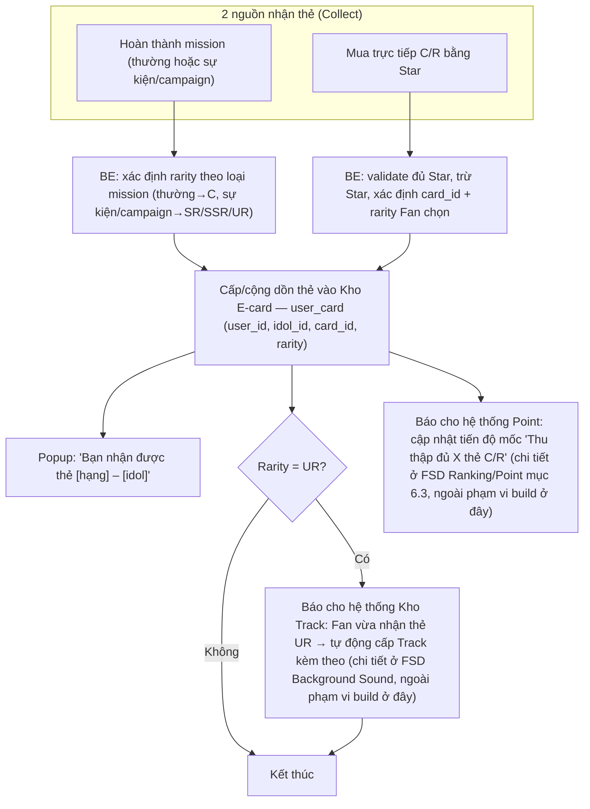
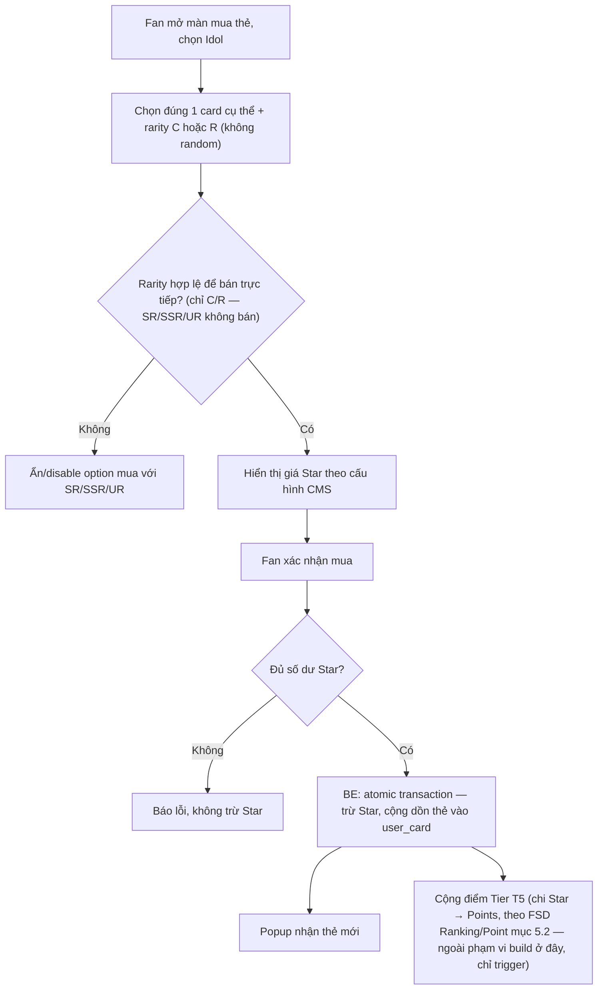
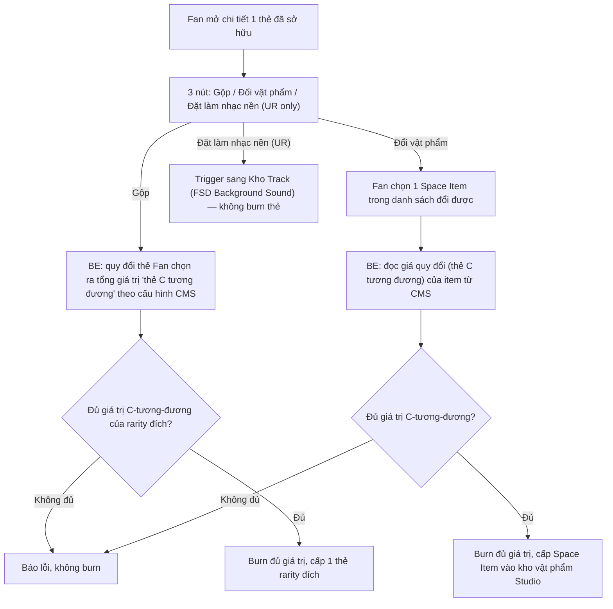

# FSD — MVP2: Sổ E-card (Collect & Burn)

> **Loại tài liệu:** Functional Specification Document (FSD)
> **CR liên quan:** MVP2
> **Nguồn tham chiếu:** `mvp2_Feature_Breakdown.md` (mục 6), `FSD_mvp2_Ranking_Point_System.md` (mục 6.1 — bối cảnh 3 loại tiền tệ, mục 6.3 Tier T4 — điểm thưởng "Lên hạng" và "Thu thập đủ thẻ C/R", mục 8 OQ-5 — quà rank-up có cần claim), `FSD_mvp2_MySpace_Background_Sound.md` (mục 5.2 — Track tự động cấp kèm thẻ SSR/UR), `ba.md`/`pd.md` (tech stack, ranh giới Star Economy)
> **Tech stack:** React Native (FE) · NestJS (BE) · PostgreSQL (DB)
> **Trạng thái:** Draft — nhánh **Collect** đã đủ dữ liệu để dev bắt tay ngay. Nhánh **Burn** (Gộp + Đổi vật phẩm) **không còn chặn về cơ chế**: tỷ lệ quy đổi (rarity → thẻ C tương đương, Space Item → thẻ C tương đương) do **Admin cấu hình trực tiếp trên CMS** (mục 5.3, 6.3, 6.4), không cần chờ file "Poin Star Card" ngoài — chỉ còn thiếu **số liệu cụ thể** (Content/Admin điền trước go-live, không phải gap thiết kế). Quà rank-up: cơ chế nhận **đã CHỐT — Fan chủ động claim**; loại/rarity thẻ cụ thể vẫn chờ trả lời (mục 8)

---

## 1. Tổng quan

"Sổ E-card" là màn sưu tập thẻ Idol của Fan, lưu trữ tại **Kho "E-card"** — 1 Kho vật phẩm **riêng, mới**, trong My Space (cùng cấu trúc các Kho vật phẩm khác đã có như Kho Track/Loa/Stage/Skin). Mỗi thẻ gắn với đúng 1 Idol cụ thể, có 5 cấp độ hiếm (rarity) tương ứng 5 định dạng hiển thị khác nhau:

| Rarity | Định dạng hiển thị |
|---|---|
| **C** | Ảnh tĩnh |
| **R** | Ảnh tĩnh |
| **SR** | Motion (ảnh động) |
| **SSR** | Live photo 2 giây |
| **UR** | Video 5-10 giây, có âm thanh |

Tính năng gồm 2 nhánh độc lập:

1. **COLLECT (sở hữu thẻ)** — 2 nguồn: (a) thưởng mission (mission thường → thẻ C; mission sự kiện/campaign → SR/SSR/UR — xem `FSD_mvp2_Ranking_Point_System.md` Tier T4), (b) mua trực tiếp thẻ C/R bằng Star (fixed price, chọn đúng idol + card cụ thể).
2. **BURN (dùng thẻ đã có)** — dùng thẻ sở hữu để (a) **Gộp** nâng hạng lên rarity cao hơn, hoặc (b) **Đổi vật phẩm** lấy đồ trang trí Studio (Space Item). Cả 2 dùng chung 1 cơ chế: mọi rarity thẻ và mọi Space Item đổi được đều quy đổi ra **"thẻ C tương đương"** (mục 5.3), do **Admin cấu hình trực tiếp trên CMS** — không cần chờ file "Poin Star Card" ngoài. Số liệu cụ thể (tỷ lệ từng rarity, giá quy đổi từng Space Item) do Content/Admin nhập khi go-live, không phải gap thiết kế.

Thẻ rarity **UR** có thêm 1 hiệu ứng phụ: tự động cấp kèm 1 Track âm thanh nền cho My Space khi Fan sở hữu (xem `FSD_mvp2_MySpace_Background_Sound.md` mục 5.2 — hook vào event "nhận thẻ", không thuộc phạm vi build của FSD này, chỉ cross-reference).

---

## 2. Phạm vi (Scope)

### Trong phạm vi
- Thẻ sở hữu theo `(user_id, idol_id, card_id, rarity)`, cộng dồn số lượng, **không giới hạn kho** (đã chốt)
- Kho "E-card" trong My Space (Kho riêng, không nằm trong Bộ Sưu Tập): lưới thẻ theo level hoặc trạng thái mua, hiển thị số lượng mỗi thẻ
- Màn chi tiết thẻ: hiển thị đúng định dạng theo rarity (ảnh tĩnh/motion/live photo/video)
- Mua trực tiếp thẻ C/R bằng Star — chọn đúng idol + card cụ thể, giá cố định (không random)
- Nhận thẻ qua Mission Service (mission thường → C; mission sự kiện/campaign → SR/SSR/UR) — cập nhật reward type = E-card trong Mission Service
- Popup thông báo khi nhận thẻ mới: "Bạn nhận được thẻ [hạng] – [idol]"
- Nút "Đặt làm nhạc nền" trên thẻ UR — chỉ **trigger** sang flow của Kho Track, không xử lý logic audio ở đây (thuộc FSD Background Sound)
- **Gộp:** quy đổi thẻ ra "giá trị thẻ C tương đương" theo cấu hình CMS (rarity → C tương đương), burn đủ giá trị để nhận 1 thẻ rarity đích (mục 5.3)
- **Đổi vật phẩm:** burn đủ giá trị "thẻ C tương đương" để đổi lấy 1 Space Item, giá quy đổi từng item do Admin cấu hình trên CMS
- **Claim quà rank-up:** nút nhận quà chủ động khi Fan lên Level — cơ chế nhận đã chốt (Fan claim, không tự động cấp); loại/rarity thẻ cụ thể cấu hình theo Level trên CMS (chờ Content điền số liệu)
- CMS: CRUD catalog thẻ (gán idol, rarity, giá Star nếu bán trực tiếp C/R, upload asset theo định dạng), cấu hình tỷ lệ quy đổi Gộp + giá Đổi vật phẩm + quà rank-up theo Level

### Ngoài phạm vi (thuộc FSD khác)
- Logic phát audio Track gắn kèm thẻ UR — thuộc `FSD_mvp2_MySpace_Background_Sound.md`

---

## 3. Actors

| Actor | Vai trò |
|---|---|
| **Fan** | Sở hữu thẻ qua mission/mua Star, xem Kho E-card, gộp thẻ, đổi vật phẩm, claim quà rank-up |
| **Admin (CMS)** | Tạo/sửa catalog thẻ: gán idol, rarity, giá Star (nếu bán trực tiếp C/R), upload asset theo định dạng; cấu hình tỷ lệ quy đổi Gộp, giá Đổi vật phẩm, và quà rank-up theo Level (đều bằng "thẻ C tương đương") |
| **RnD (Mission Config)** | Gán loại thẻ (C hay SR/SSR/UR) vào reward pool của từng mission/campaign |
| **BE System (Card/Inventory Engine)** | Cộng dồn số lượng thẻ, xử lý giao dịch mua bằng Star, báo cho các hệ thống liên quan (Kho Track, Point Tier T4) khi Fan vừa nhận thẻ để họ tự xử lý phần của mình |
| **Idol/Content team** | Cung cấp asset ảnh tĩnh/motion/live photo/video theo đúng rarity cho từng thẻ |

---

## 4. User Stories

**US-1 (Fan)**
> Là một Fan, tôi muốn xem toàn bộ thẻ tôi đã sở hữu của 1 Idol trong Kho E-card, kèm số lượng từng loại, để theo dõi tiến độ sưu tầm của mình.

**US-2 (Fan)**
> Là một Fan, khi nhận được thẻ mới (qua mission hoặc mua), tôi muốn có popup thông báo rõ hạng và idol của thẻ đó, để biết ngay mình vừa nhận được gì.

**US-3 (Fan)**
> Là một Fan, tôi muốn mua trực tiếp thẻ C hoặc R của đúng idol/card tôi muốn bằng Star, để chủ động sở hữu thay vì chỉ chờ may mắn từ mission.

**US-4 (Fan)**
> Là một Fan, khi xem chi tiết 1 thẻ, tôi muốn thấy đúng định dạng tương ứng hạng của thẻ (ảnh tĩnh/motion/live photo/video có âm thanh), để cảm nhận được giá trị tăng dần theo độ hiếm.

**US-5 (Fan)**
> Là một Fan sở hữu thẻ UR, tôi muốn đặt thẻ đó làm nhạc nền My Space, để không gian riêng của tôi gắn liền với khoảnh khắc hiếm tôi sưu tầm được.

**US-6 (Fan)**
> Là một Fan, tôi muốn gộp nhiều thẻ (quy đổi theo giá trị "thẻ C tương đương") để đổi lấy 1 thẻ cấp cao hơn, để có động lực cày thẻ trùng thay vì chỉ tích trữ vô nghĩa.

**US-7 (Fan)**
> Là một Fan, tôi muốn đổi thẻ dư thừa lấy vật phẩm trang trí Studio (Space Item), để tận dụng thẻ trùng thay vì để không dùng.

**US-8 (Fan)**
> Là một Fan, khi lên Level, tôi muốn chủ động bấm nhận quà rank-up (thẻ E-card), để tôi biết chắc mình đã nhận được phần thưởng đó, giống cơ chế claim Khung theo Rank đã có.

**US-9 (Admin)**
> Là Admin, tôi muốn cấu hình catalog thẻ (idol, rarity, giá Star, asset) VÀ tỷ lệ quy đổi Gộp/Đổi vật phẩm/quà rank-up ngay trên CMS, để cân bằng kinh tế E-card mà không cần Tech deploy lại code.

---

## 5. Sơ đồ luồng (Diagrams)

### 5.1 Luồng Fan — nhận thẻ (2 nguồn Collect)

### 5.2 Luồng Fan — mua trực tiếp thẻ C/R bằng Star

### 5.3 Luồng Fan — Burn: Gộp & Đổi vật phẩm (quy đổi theo cấu hình CMS)

> Cơ chế quy đổi (rarity → thẻ C tương đương, Space Item → thẻ C tương đương) do **Admin cấu hình trên CMS**, không hard-code — xem mục 6.4. Số liệu ban đầu (bảng giá cụ thể) cần Content/Admin nhập trước go-live; đây là công việc nhập liệu vận hành, không còn là gap thiết kế.

**Mô hình quy đổi "thẻ C tương đương":** mọi rarity thẻ và mọi Space Item đổi được đều quy về 1 đơn vị chung là **"giá trị thẻ C tương đương"**. Gộp = burn đủ tổng giá trị C-tương-đương (không nhất thiết cùng rarity đầu vào) để đổi lấy 1 thẻ ở rarity đích. Đổi vật phẩm = burn đủ giá trị C-tương-đương để đổi lấy 1 Space Item cụ thể.

**Đề xuất PD (tạm thời — số liệu khởi điểm cho tỷ lệ rarity, chờ Content/stakeholder xác nhận trước go-live):**

| Rarity | Quy đổi ra thẻ C | Căn cứ đề xuất |
|---|---|---|
| C | 1 | Đơn vị gốc |
| R | 10 | **Duy nhất có số liệu xác nhận:** khớp tỷ lệ giá bán trực tiếp đã chốt (R 100⭐ / C 10⭐ = 10x) |
| SR | 30 | Ước tính ~3x R — SR/SSR/UR không bán trực tiếp nên không có giá Star đối chiếu, chỉ suy luận theo độ khó sản xuất asset (ảnh tĩnh → motion) |
| SSR | 90 | Ước tính ~3x SR — độ khó sản xuất tăng thêm (live photo 2s) |
| UR | 270 | Ước tính ~3x SSR — độ khó sản xuất cao nhất (video 5-10s có âm thanh), đồng thời là rarity duy nhất kèm Track |

**Vì sao không tiếp tục hệ số 10x như C→R:** nếu giữ nguyên 10x cho mọi bậc, UR sẽ = 10.000 thẻ C — không khả thi để cày, đi ngược nguyên tắc game cân bằng. Hạ hệ số escalation xuống ~3x sau bậc R giữ mục tiêu Gộp trong tầm khả thi, cùng logic PD đã dùng để đề xuất cap Track 10-15/idol ở `FSD_mvp2_MySpace_Background_Sound.md`. Giá quy đổi từng Space Item (Đổi vật phẩm) chưa có đề xuất cụ thể — phụ thuộc catalog Space Item hiện có, để Admin/Content tự cân bằng khi nhập liệu trên CMS. **Bảng trên chỉ là điểm khởi đầu trao đổi — Admin có thể sửa trực tiếp trên CMS bất kỳ lúc nào, không cần chờ file Poin Star Card.**

---

## 6. Yêu cầu chức năng chi tiết

### 6.1 Bối cảnh — Rarity & định dạng hiển thị

| Rarity | Định dạng | Nguồn sở hữu |
|---|---|---|
| C | Ảnh tĩnh | Mission thường, mua trực tiếp bằng Star |
| R | Ảnh tĩnh | Mission thường, mua trực tiếp bằng Star |
| SR | Motion | Mission sự kiện/campaign |
| SSR | Live photo 2s | Mission sự kiện/campaign |
| UR | Video 5-10s, có âm thanh | Mission sự kiện/campaign — **kèm tự động cấp Track** (xem `FSD_mvp2_MySpace_Background_Sound.md`) |

SR/SSR/UR **không bán trực tiếp** bằng Star — chỉ ra từ reward pool mission (đã chốt).

### 6.2 FE
- Kho "E-card" (nút mở riêng trong My Space, cùng nhóm UI với các Kho vật phẩm khác — Track/Loa/Stage/Skin, **không** nằm trong tab Bộ Sưu Tập): lưới thẻ theo level hoặc trạng thái mua, mỗi ô hiển thị ảnh đại diện + số lượng sở hữu; thẻ chưa sở hữu hiển thị mờ/khoá
- Màn chi tiết thẻ: render đúng định dạng theo rarity (ảnh tĩnh/motion/live photo/video có âm thanh) + 3 nút Gộp / Đổi vật phẩm / Đặt làm nhạc nền (UR only) — Gộp/Đổi vật phẩm đọc tỷ lệ quy đổi từ CMS, disable + tooltip "Đang cập nhật" nếu CMS chưa có cấu hình cho thẻ/item đó
- Màn Đổi vật phẩm: danh sách Space Item đổi được + giá quy đổi (thẻ C tương đương) đọc từ CMS, disable item nếu Fan không đủ giá trị
- Nút "Nhận quà" (claim) hiển thị khi Fan có quà rank-up đang chờ nhận sau khi lên Level — Fan bấm để nhận thẻ E-card (loại/rarity cụ thể đọc từ cấu hình CMS theo từng Level)
- Popup nhận thẻ mới, hiển thị ngay sau khi hành động (mission hoàn thành / mua thành công / gộp / đổi vật phẩm / claim quà rank-up)
- Màn mua thẻ C/R bằng Star: chọn idol → chọn card cụ thể → hiển thị giá Star → xác nhận mua

### 6.3 Yêu cầu nghiệp vụ cần đảm bảo
- Thẻ trùng (cùng idol + card + rarity) phải cộng dồn số lượng, không tách thành nhiều bản ghi riêng cho cùng 1 loại thẻ
- Kho E-card **không giới hạn dung lượng** (đã chốt) — không cần thiết kế cơ chế cap hay xoá bớt khi đầy
- Mua thẻ bằng Star: trừ Star và cấp thẻ phải là 1 thao tác trọn vẹn — không được để xảy ra trường hợp chỉ 1 trong 2 việc thành công (mất Star mà không có thẻ, hoặc ngược lại)
- Giá Star của thẻ C/R áp dụng đúng theo cấu hình tại thời điểm Fan xác nhận mua — nếu Admin vừa đổi giá, không dùng giá cũ đã hiển thị trước đó trên máy Fan
- Khi Fan nhận thẻ rarity UR: cần có cách báo cho hệ thống Kho Track (FSD Background Sound) biết để tự động cấp Track tương ứng — Sổ E-card không cần tự xử lý phần audio
- Khi Fan thu thập đủ số thẻ theo mốc của catalog Tier T4 (FSD Ranking/Point): cần có cách báo cho hệ thống Point biết để cộng điểm tương ứng
- Gộp / Đổi vật phẩm / Claim quà rank-up: tỷ lệ quy đổi luôn phải lấy từ cấu hình mới nhất trên CMS tại đúng thời điểm Fan thực hiện, không hard-code trong code hoặc dùng giá trị cũ đã lưu tạm
- Quà rank-up "đang chờ nhận" phải được giữ nguyên cho tới khi Fan chủ động claim — không tự mất, không bị ghi đè nếu Fan lên nhiều Level liên tiếp trước khi claim (xem Edge case #7)

### 6.4 CMS — Quản lý catalog thẻ & quy đổi Burn
- CRUD thẻ: gán idol, rarity, upload/gán asset đúng định dạng theo rarity
- Cấu hình giá Star cho thẻ rarity C/R (chỉ áp dụng rarity bán trực tiếp)
- Gán card_id vào reward pool của từng mission/campaign (phối hợp RnD Mission Config)
- **Cấu hình tỷ lệ quy đổi rarity → thẻ C tương đương** (dùng cho Gộp) — mỗi rarity 1 giá trị, Admin sửa trực tiếp
- **Cấu hình giá quy đổi (thẻ C tương đương) cho từng Space Item** đổi được (dùng cho Đổi vật phẩm) — cần định nghĩa danh sách Space Item nào tham gia cơ chế đổi
- **Cấu hình quà rank-up theo từng Level** — gán loại/rarity thẻ E-card cấp khi Fan claim ở mỗi Level
- Màn quản lý Fan trong CMS nên hiển thị được số lượng thẻ sở hữu theo rarity (nhất quán với yêu cầu hiển thị Star/Point/Level đã có ở `FSD_mvp2_Ranking_Point_System.md` mục 6.3)

---

## 7. Edge Cases

| # | Tình huống | Xử lý đề xuất |
|---|---|---|
| 1 | Fan mua thẻ 2 lần liên tiếp gần như đồng thời (race condition số dư Star) | BE xử lý atomic transaction, lock số dư Star trong lúc trừ + cộng thẻ |
| 2 | Fan nhận thẻ trùng (đã sở hữu ≥1 thẻ cùng idol/card/rarity) | Cộng dồn số lượng, không tạo dòng mới — Kho E-card không giới hạn dung lượng (đã chốt), không cần xử lý trường hợp đầy kho |
| 3 | Admin đổi giá Star của thẻ C/R giữa lúc Fan đang ở màn xác nhận mua | Giá áp dụng tại thời điểm Fan bấm xác nhận (đọc lại giá mới nhất từ CMS ngay lúc submit), không dùng giá đã cache trên FE |
| 4 | Mission cấp thẻ nhưng asset của rarity đó chưa được Admin upload lên CMS | Chặn publish mission gắn card chưa đủ asset — validate ở bước Admin gán card vào mission, không để trường hợp Fan nhận thẻ mà chi tiết thẻ không có gì hiển thị |
| 5 | Fan bấm "Đặt làm nhạc nền" trên thẻ UR nhưng chưa có Track liên kết được cấu hình (thiếu đồng bộ CMS giữa Sổ E-card và Kho Track) | Disable nút, hiển thị trạng thái "Đang cập nhật" — nhất quán với edge case #4 của `FSD_mvp2_MySpace_Background_Sound.md` |
| 6 | Fan thao tác Gộp/Đổi vật phẩm cho thẻ/item mà Admin chưa cấu hình tỷ lệ quy đổi trên CMS | FE disable, hiển thị "Đang cập nhật" (xem mục 6.2); BE cũng validate lại, chặn burn nếu thiếu config |
| 7 | Fan lên nhiều Level liên tiếp mà chưa claim quà rank-up của (các) Level trước | Giữ lại toàn bộ quà đang chờ theo từng Level, không ghi đè/mất — Fan claim lần lượt hoặc claim dồn (UX cụ thể do Design quyết định) |

---

## 8. Open Questions (chưa có câu trả lời từ stakeholder)

| # | Câu hỏi | Ảnh hưởng | Ghi chú |
|---|---|---|---|
| 1 | Quà rank-up cụ thể khi Fan lên Level — loại/rarity thẻ nào, có cố định theo mỗi Level không | Ảnh hưởng cấu hình CMS phần "quà rank-up theo Level" (mục 6.4) | Vẫn chưa có câu trả lời — nhưng không chặn code, vì cơ chế claim đã chốt và field cấu hình CMS có thể để trống chờ Content điền sau |
| 2 | Số lượng thẻ C/R cần thu thập cho mốc điểm thưởng Tier T4 "Thu thập đủ **xxx** thẻ C / **xxx** thẻ R" | Không chặn phần Collect của FSD này, nhưng chặn hoàn thiện catalog Tier T4 | Cùng nhóm giá trị "xxx" chưa điền, xem `FSD_mvp2_Ranking_Point_System.md` mục 8 OQ-4 |
| ~~3~~ | ~~Kho "E-card" có giới hạn dung lượng (cap) không, hay lưu vô hạn~~ | — | **✅ Đã chốt 2026-07-20: KHÔNG giới hạn** — số lượng thẻ phát hành + tốc độ sưu tầm thực tế khiến Fan khó lấp đầy kho, không cần đặt cap nhân tạo |
