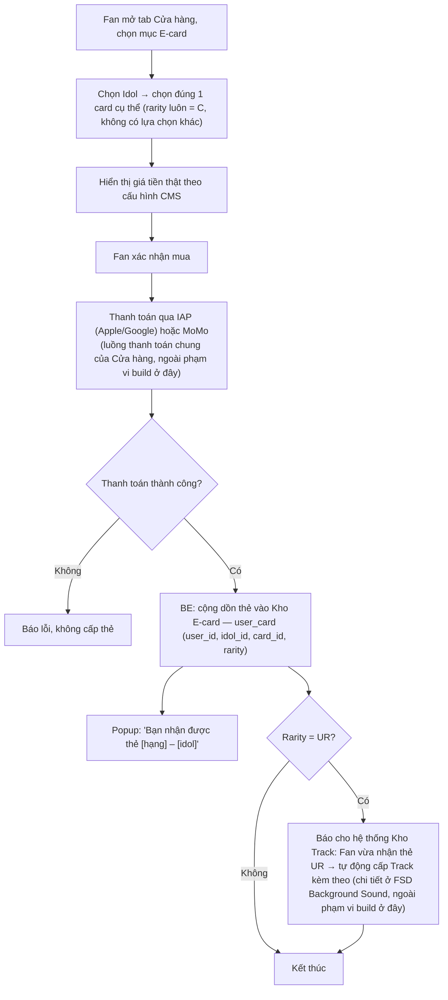
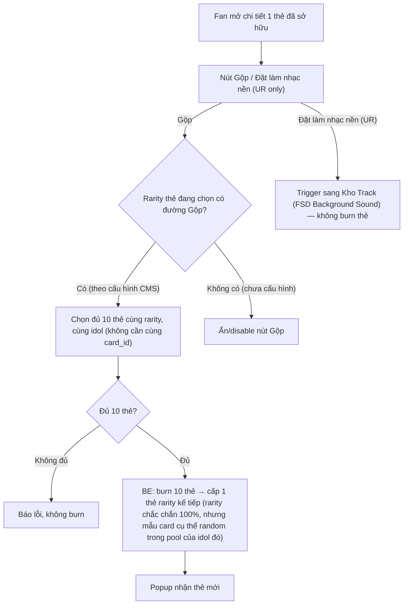

# FSD — MVP2: Sổ E-card (Collect & Burn)

---

## 1. Tổng quan

"Sổ E-card" là màn sưu tập thẻ Idol của Fan, lưu trữ tại **Kho "E-card"** — 1 Kho vật phẩm **riêng, mới**, trong My Space (cùng cấu trúc các Kho vật phẩm khác đã có như Kho Track/Loa/Stage/Skin). E-card được xem là **1 vật phẩm ảo (item)** như các vật phẩm khác bán trong Cửa hàng (Space Item, Sticker, Avatar Frame) — điểm khác biệt duy nhất là E-card có thêm cơ chế **Gộp** (mục 5.2-5.3). Mỗi thẻ gắn với đúng 1 Idol cụ thể, có 5 cấp độ hiếm (rarity) tương ứng 5 định dạng hiển thị khác nhau:

| Rarity | Định dạng hiển thị |
|---|---|
| **C** | Ảnh tĩnh |
| **R** | Ảnh tĩnh |
| **SR** | Motion (ảnh động) |
| **SSR** | Live photo 2 giây — **tạm deactive trong MVP2** (mục 6.1) |
| **UR** | Video 5-10 giây, có âm thanh — **tạm deactive trong MVP2** (mục 6.1) |

**Compliance giấy phép game (chốt 2026-08-17):** E-card có yếu tố gacha nên thuộc phạm vi giấy phép game (lý do chi tiết ở mục 5.3) — **và mọi vật phẩm khác bán trong My Space/Cửa hàng (Space Item, Sticker, Avatar Frame) cũng thuộc giấy phép game**, không còn tách riêng theo giấy phép TMĐT như trước.

Tính năng gồm 2 nhánh:

1. **COLLECT (sở hữu thẻ)** — **duy nhất 1 nguồn:** mua trực tiếp tại tab **"Cửa hàng"** (Shop chung với Space Item, Avatar Frame, Sticker) bằng **tiền thật (IAP Apple/Google hoặc MoMo)**. **Cửa hàng chỉ bán rarity C** — chọn đúng idol + card cụ thể, giá cố định, không random, không có lựa chọn rarity nào khác ở bước mua. **Mission KHÔNG còn là nguồn nhận thẻ** (khác với thiết kế trước đây).
2. **BURN (dùng thẻ đã có)** — **chỉ còn 1 cách dùng: Gộp** nâng hạng lên rarity cao hơn — burn 10 thẻ **cùng rarity, cùng idol** (không cần cùng 1 card cụ thể) → 1 thẻ rarity kế tiếp, **tỷ lệ thành công 100%** cho mọi cặp rarity đã có đường Gộp (không còn tỷ lệ 20% như thiết kế cũ). Nhánh "Đổi vật phẩm" (burn E-card lấy Space Item) đã **bị loại bỏ hoàn toàn**. Gộp chỉ có đường C→R→SR — **SSR và UR tạm deactive, không có đường sở hữu nào trong MVP2** (mục 6.1).

Thẻ rarity **UR** vẫn giữ hiệu ứng phụ (khi kích hoạt lại): tự động cấp kèm 1 Track âm thanh nền cho My Space khi Fan sở hữu (xem `FSD_mvp2_MySpace_Background_Sound.md` mục 5.2 — hook vào event "nhận thẻ", không thuộc phạm vi build của FSD này, chỉ cross-reference). **UR đang tạm deactive (mục 6.1) nên hiệu ứng này hiện chưa có ý nghĩa thực tế** — sẽ áp dụng khi UR được kích hoạt lại ở bản sau.

---

## 2. Phạm vi (Scope)

### Trong phạm vi
- Thẻ sở hữu theo `(user_id, idol_id, card_id, rarity)`, cộng dồn số lượng, **không giới hạn kho**
- Kho "E-card" trong My Space (Kho riêng, không nằm trong Bộ Sưu Tập): lưới thẻ theo level hoặc trạng thái mua, hiển thị số lượng mỗi thẻ
- Màn chi tiết thẻ: hiển thị đúng định dạng theo rarity (ảnh tĩnh/motion/live photo/video)
- **Mua trực tiếp thẻ rarity C tại tab Cửa hàng bằng tiền thật (IAP/MoMo)** — chọn đúng idol + card cụ thể, giá cố định (không random). Cửa hàng không bán R/SR/SSR/UR
- Popup thông báo khi nhận thẻ mới: "Bạn nhận được thẻ [hạng] – [idol]"
- Nút "Đặt làm nhạc nền" trên thẻ UR — chỉ **trigger** sang flow của Kho Track, không xử lý logic audio ở đây (thuộc FSD Background Sound)
- **Gộp:** burn 10 thẻ cùng rarity + cùng idol (không cần cùng card_id, đề xuất PD/BA) để đổi lấy 1 thẻ rarity kế tiếp — **tỷ lệ thành công 100%** cho mọi cặp rarity (mục 5.3)
- CMS: CRUD catalog thẻ (gán idol, rarity, giá tiền thật nếu bán, upload asset theo định dạng), cấu hình tỷ lệ quy đổi Gộp

### Ngoài phạm vi (thuộc FSD khác)
- Logic phát audio Track gắn kèm thẻ UR — thuộc `FSD_mvp2_MySpace_Background_Sound.md`
- Luồng thanh toán chung IAP/MoMo của tab "Cửa hàng" (áp dụng chung cho E-card/Space Item/Avatar Frame/Sticker) — thuộc 1 FSD riêng cho tab Cửa hàng (chưa viết, xem mục 8 OQ-1)

### Đã loại bỏ khỏi phạm vi (so với bản trước 2026-08-17)
- ~~Nhận thẻ qua Mission Service~~ — mission không còn rơi E-card
- ~~Mua trực tiếp bằng Star~~ — chuyển sang tiền thật qua Cửa hàng; Star giờ chỉ còn dùng để tặng quà Idol (Digital Gift), không còn dùng để mua bất kỳ vật phẩm nào
- ~~Đổi vật phẩm (burn E-card lấy Space Item)~~ — bỏ hẳn
- ~~Claim quà rank-up dạng E-card khi lên Level~~ — bỏ hẳn, quà rank-up giờ là Space Item / Sticker / Avatar Frame (đã chốt 2026-08-17) — **không còn thuộc phạm vi FSD này**, xem chi tiết ở `FSD_mvp2_Ranking_Point_System.md`

---

## 3. Actors

| Actor | Vai trò |
|---|---|
| **Fan** | Mua thẻ tại Cửa hàng bằng tiền thật, xem Kho E-card, gộp thẻ |
| **Admin (CMS)** | Tạo/sửa catalog thẻ: gán idol, rarity, giá tiền thật, upload asset theo định dạng; cấu hình số lượng thẻ + tỷ lệ thành công cho Gộp |
| **BE System (Card/Inventory Engine)** | Cộng dồn số lượng thẻ, xử lý giao dịch mua bằng IAP/MoMo (qua hệ thống thanh toán chung của Cửa hàng), báo cho các hệ thống liên quan (Kho Track) khi Fan vừa nhận thẻ |
| **Idol/Content team** | Cung cấp asset ảnh tĩnh/motion/live photo/video theo đúng rarity cho từng thẻ |

---

## 4. User Stories

**US-1 (Fan)**
> Là một Fan, tôi muốn xem toàn bộ thẻ tôi đã sở hữu của 1 Idol trong Kho E-card, kèm số lượng từng loại, để theo dõi tiến độ sưu tầm của mình.

**US-2 (Fan)**
> Là một Fan, khi nhận được thẻ mới (qua mua tại Cửa hàng hoặc Gộp), tôi muốn có popup thông báo rõ hạng và idol của thẻ đó, để biết ngay mình vừa nhận được gì.

**US-3 (Fan)**
> Là một Fan, tôi muốn mua trực tiếp thẻ rarity C của đúng idol/card tôi muốn bằng tiền thật (IAP/MoMo) tại tab Cửa hàng, để chủ động sở hữu thẻ mình thích thay vì chỉ chờ Gộp.

**US-4 (Fan)**
> Là một Fan, khi xem chi tiết 1 thẻ, tôi muốn thấy đúng định dạng tương ứng hạng của thẻ (ảnh tĩnh/motion/live photo/video có âm thanh), để cảm nhận được giá trị tăng dần theo độ hiếm.

**US-5 (Fan)**
> Là một Fan sở hữu thẻ UR, tôi muốn đặt thẻ đó làm nhạc nền My Space, để không gian riêng của tôi gắn liền với khoảnh khắc hiếm tôi sưu tầm được.

**US-6 (Fan)**
> Là một Fan, tôi muốn gộp 10 thẻ cùng rarity để đổi chắc chắn lấy 1 thẻ cấp cao hơn, để có động lực cày thẻ trùng thay vì chỉ tích trữ vô nghĩa.

**US-7 (Admin)**
> Là Admin, tôi muốn cấu hình catalog thẻ (idol, rarity, giá tiền thật, asset) VÀ tỷ lệ quy đổi Gộp ngay trên CMS, để cân bằng kinh tế E-card mà không cần Tech deploy lại code.

---

## 5. Sơ đồ luồng (Diagrams)

### 5.1 Luồng Fan — mua thẻ tại Cửa hàng bằng tiền thật

### 5.2 Luồng Fan — Gộp (burn thẻ nâng rarity)

**Gộp — công thức (cập nhật 2026-08-17):**

| Gộp | Số lượng cần | Tỷ lệ thành công | Ghi chú |
|---|---|---|---|
| C → R | 10 thẻ C cùng idol | **100%** | Rarity chắc chắn ra R — mẫu card R cụ thể random trong pool của idol đó |
| R → SR | 10 thẻ R cùng idol | **100%** | **Đổi từ 20%→100% (2026-08-17)** — chỉ còn random ở mẫu card cụ thể, không còn random ở việc có ra thẻ hay không |
| SR → SSR | **Tạm deactive** | — | SSR không nằm trong scope MVP2 — xem mục 6.1 |
| SSR → UR | **Tạm deactive** | — | UR không nằm trong scope MVP2 — xem mục 6.1 |

> **Vì sao đây vẫn là gacha (giấy phép Game):** rarity đầu ra Gộp chắc chắn 100%, nhưng **mẫu card cụ thể (card_id) ở rarity đó là ngẫu nhiên trong pool của idol** — Fan không được chọn trước, không biết trước kết quả. Đây là yếu tố ngẫu nhiên duy nhất còn lại trong toàn bộ cơ chế E-card, và là lý do E-card (cùng các vật phẩm khác trong Cửa hàng) thuộc phạm vi giấy phép game thay vì TMĐT (mục 1).

Số lượng cần (10) và tỷ lệ thành công (100%) nên lưu dạng **config trên CMS** (không hard-code), nhất quán với nguyên tắc "mọi hằng số đều cấu hình qua CMS" đã áp dụng xuyên suốt các FSD khác.

**Điểm nguồn chưa nói rõ, được PD/BA đề xuất làm giá trị mặc định (cần PO xác nhận chính thức trước go-live):**
1. **Phạm vi thẻ đầu vào:** 10 thẻ chỉ cần cùng rarity + cùng idol, **không cần cùng 1 card cụ thể (card_id)**. Nếu bắt buộc cùng card_id, Fan gần như không thể gom đủ 10 thẻ giống hệt nhau — đi ngược mục tiêu tạo động lực cày thẻ trùng (US-6).

---

## 6. Yêu cầu chức năng chi tiết

### 6.1 Bối cảnh — Rarity & định dạng hiển thị

| Rarity | Định dạng | Nguồn sở hữu |
|---|---|---|
| C | Ảnh tĩnh | **Mua trực tiếp tại Cửa hàng (tiền thật)** — nguồn duy nhất |
| R | Ảnh tĩnh | Gộp 10 thẻ C (100%) — không bán trực tiếp |
| SR | Motion | Gộp 10 thẻ R (100%) — không bán trực tiếp |
| SSR | Live photo 2s | **Tạm deactive trong MVP2** — không bán tại Cửa hàng, không có đường Gộp tới rarity này (theo `mvp2_revise_1.docx`, không có nguồn sở hữu nào được định nghĩa) |
| UR | Video 5-10s, có âm thanh | **Tạm deactive trong MVP2** — tương tự SSR; hiệu ứng tự động cấp Track (mục 1) chưa có ý nghĩa thực tế cho tới khi kích hoạt lại |

### 6.2 FE
- Kho "E-card" (nút mở riêng trong My Space, cùng nhóm UI với các Kho vật phẩm khác — Track/Loa/Stage/Skin, **không** nằm trong tab Bộ Sưu Tập): lưới thẻ theo level hoặc trạng thái mua, mỗi ô hiển thị ảnh đại diện + số lượng sở hữu; thẻ chưa sở hữu hiển thị mờ/khoá
- Màn chi tiết thẻ: render đúng định dạng theo rarity (ảnh tĩnh/motion/live photo/video có âm thanh) + nút Gộp / Đặt làm nhạc nền (UR only)
- Nút Gộp: chỉ hiện cho rarity có cấu hình đường Gộp trên CMS; màn chọn đủ 10 thẻ cùng rarity cùng idol (Fan có thể chọn lẫn nhiều card khác nhau, không cần cùng 1 card cụ thể), hiển thị tỷ lệ thành công 100% trước khi Fan xác nhận
- Popup nhận thẻ mới, hiển thị ngay sau khi hành động (mua thành công / gộp)
- Màn mua thẻ tại Cửa hàng: chọn idol → chọn card cụ thể (chỉ rarity C, không có lựa chọn rarity khác) → hiển thị giá tiền thật → xác nhận mua → thanh toán IAP/MoMo (thuộc luồng thanh toán chung của Cửa hàng)

### 6.3 Yêu cầu nghiệp vụ cần đảm bảo
- Thẻ trùng (cùng idol + card + rarity) phải cộng dồn số lượng, không tách thành nhiều bản ghi riêng cho cùng 1 loại thẻ
- Kho E-card **không giới hạn dung lượng** (đã chốt) — không cần thiết kế cơ chế cap hay xoá bớt khi đầy
- Mua thẻ bằng tiền thật: xác nhận thanh toán thành công (callback IAP/MoMo) và cấp thẻ phải là 1 thao tác trọn vẹn — không được để xảy ra trường hợp mất tiền mà không có thẻ, hoặc ngược lại
- Giá tiền thật của thẻ áp dụng đúng theo cấu hình tại thời điểm Fan xác nhận mua — nếu Admin vừa đổi giá, không dùng giá cũ đã hiển thị trước đó trên máy Fan
- Khi Fan nhận thẻ rarity UR: cần có cách báo cho hệ thống Kho Track (FSD Background Sound) biết để tự động cấp Track tương ứng — Sổ E-card không cần tự xử lý phần audio
- Gộp: input 10 thẻ chỉ cần cùng rarity + cùng idol, không yêu cầu cùng card_id cụ thể (đề xuất PD/BA)
- Gộp: card_id đầu ra (mẫu card cụ thể ở rarity kế tiếp) do BE random trong pool card của đúng idol đó — Fan không được chọn trước, không hiển thị trước kết quả cho tới khi Gộp xong
- Gộp: số lượng thẻ cần + tỷ lệ thành công luôn phải lấy từ cấu hình mới nhất trên CMS tại đúng thời điểm Fan thực hiện, không hard-code trong code hoặc dùng giá trị cũ đã lưu tạm
- Gộp không còn cần random ở tầng **rarity** đầu ra (tỷ lệ 100%) — nhưng BE vẫn cần random ở tầng **card_id cụ thể** (xem trên); toàn bộ thao tác burn input + random chọn card_id + cấp output phải nằm trong 1 atomic transaction

### 6.4 CMS — Quản lý catalog thẻ & quy đổi Gộp
- CRUD thẻ: gán idol, rarity, upload/gán asset đúng định dạng theo rarity — chỉ cần asset cho **C/R/SR** (rarity đang active trong MVP2); SSR/UR tạm deactive, chưa cần chuẩn bị asset ở bản này
- Cấu hình giá tiền thật (IAP/MoMo) cho từng thẻ rarity **C** bán tại Cửa hàng (R/SR/SSR/UR không có giá bán vì không bán trực tiếp)
- **Cấu hình Gộp:** số lượng thẻ cần + tỷ lệ thành công cho từng cặp rarity — mặc định C→R (10 thẻ, 100%), R→SR (10 thẻ, 100%); các cặp SR→SSR/SSR→UR tạm deactive (mục 6.1). Input chỉ cần đúng rarity + đúng idol (không cần cùng card_id)
- Màn quản lý Fan trong CMS nên hiển thị được số lượng thẻ sở hữu theo rarity

---

## 7. Edge Cases

| # | Tình huống | Xử lý đề xuất |
|---|---|---|
| 1 | Fan mua thẻ 2 lần liên tiếp gần như đồng thời (race condition) | BE xử lý atomic transaction khi xác nhận thanh toán + cấp thẻ |
| 2 | Fan nhận thẻ trùng (đã sở hữu ≥1 thẻ cùng idol/card/rarity) | Cộng dồn số lượng, không tạo dòng mới — Kho E-card không giới hạn dung lượng (đã chốt), không cần xử lý trường hợp đầy kho |
| 3 | Admin đổi giá giữa lúc Fan đang ở màn xác nhận mua | Giá áp dụng tại thời điểm Fan bấm xác nhận (đọc lại giá mới nhất từ CMS ngay lúc submit), không dùng giá đã cache trên FE |
| 4 | Thẻ được publish bán tại Cửa hàng nhưng asset của rarity đó chưa được Admin upload lên CMS | Chặn publish thẻ chưa đủ asset — validate ở bước Admin tạo thẻ |
| 5 | Fan bấm "Đặt làm nhạc nền" trên thẻ UR nhưng chưa có Track liên kết được cấu hình (thiếu đồng bộ CMS giữa Sổ E-card và Kho Track) | Disable nút, hiển thị trạng thái "Đang cập nhật" — nhất quán với edge case #4 của `FSD_mvp2_MySpace_Background_Sound.md` |
| 6 | Fan thao tác Gộp cho rarity mà Admin chưa cấu hình trên CMS | FE disable, hiển thị "Đang cập nhật"; BE cũng validate lại, chặn burn nếu thiếu config |
| 7 | Fan có ≥10 thẻ cùng rarity nhưng thuộc nhiều card khác nhau (card_id khác nhau) của cùng 1 idol | Vẫn gộp chung được — chỉ cần cùng rarity + cùng idol, không cần cùng card_id cụ thể (đề xuất PD/BA) |
| 8 | Thanh toán IAP/MoMo báo thành công nhưng BE chưa kịp cấp thẻ do lỗi hệ thống (mất kết nối, timeout...) | Cần cơ chế reconciliation/retry đọc lại trạng thái giao dịch từ IAP/MoMo, tránh Fan mất tiền mà không có thẻ — chi tiết thuộc FSD chung của Cửa hàng (OQ-1) |

---

## 8. Open Questions (chưa có câu trả lời từ stakeholder)

| # | Câu hỏi | Ảnh hưởng | Ghi chú |
|---|---|---|---|
| **OQ-1** | Luồng thanh toán chung của tab "Cửa hàng" (IAP/MoMo áp dụng cho nhiều loại vật phẩm: E-card, Space Item, Avatar Frame, Sticker) chưa có FSD riêng | Chặn triển khai thực tế mua thẻ, dù logic nghiệp vụ E-card đã rõ | Đã xác nhận 2026-08-17: sẽ có FSD riêng bổ sung sau cho tab Cửa hàng — bố cục, cách chọn vật phẩm, luồng thanh toán IAP/MoMo dùng chung, xử lý lỗi thanh toán |

**Lưu ý:** Các điểm nguồn chưa nói rõ (phạm vi cùng idol/card_id khi Gộp) đã được **PD/BA đề xuất giá trị làm việc (working default)** trực tiếp trong nội dung tài liệu — đều gắn nhãn **"đề xuất PD/BA"** và vẫn cần **PO/Content xác nhận chính thức trước go-live**.
