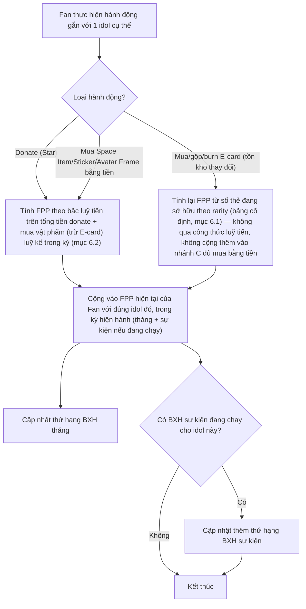
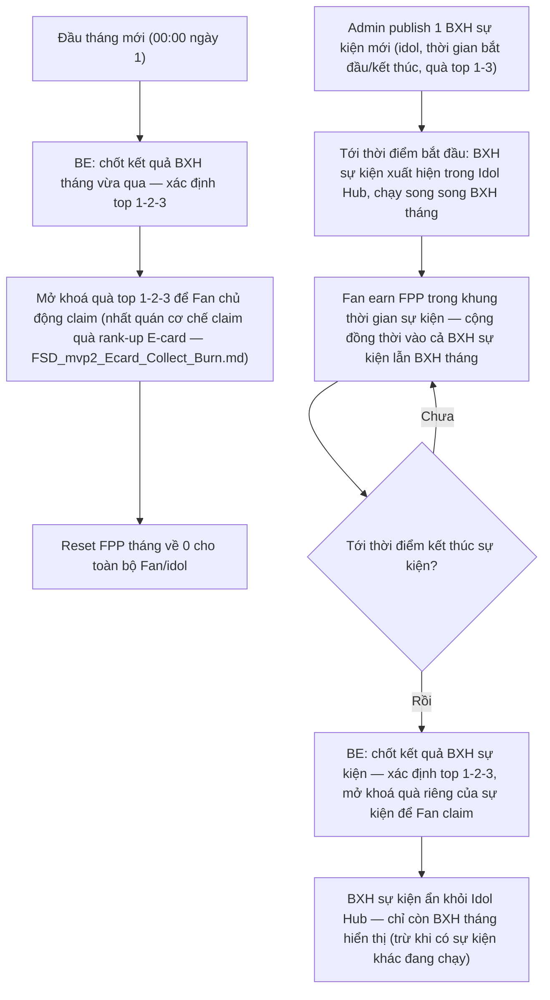

# FSD — MVP2: Fan Power Point (FPP) & Leaderboard theo Idol

## 1. Tổng quan

**Fan Power Point (FPP)** đo mức độ đầu tư (trả phí) của 1 Fan đối với **từng idol cụ thể** — khác hẳn `EXP` (`FSD_mvp2_Ranking_Point_System.md`), vốn là 1 con số duy nhất tính chung toàn app, earn cả qua engagement miễn phí lẫn trả phí. FPP:

- Tính **riêng theo từng idol** — 1 Fan follow nhiều idol thì có nhiều mức FPP khác nhau, không gộp chung.
- Chỉ earn qua **hành động trả phí gắn với đúng 1 idol** — donate, mua vật phẩm bằng tiền, sở hữu E-card. Không earn qua engagement miễn phí (check-in, comment...) như EXP.
- **Reset theo chu kỳ** (tháng hoặc sự kiện) — không phải thước đo Level/Rank vĩnh viễn, mà là điểm số cho **leaderboard cạnh tranh có thời hạn**.

FPP không gate bất kỳ nội dung cốt lõi nào — chỉ ảnh hưởng tới vị trí trên leaderboard và quà top 1-3. Đây là lớp cạnh tranh tuỳ chọn dành cho Fan sẵn sàng chi tiêu nhiều hơn, không thay thế hay cản trở tiến trình EXP/Level chính của Fan. Quà top 1-3 (BXH tháng và BXH sự kiện) tạm thời giới hạn trong nhóm vật phẩm ảo sẵn có trong app — Space Item, Avatar Frame, Sticker — Admin chọn cụ thể loại/mẫu nào cho từng đợt trên CMS (mục 6.5); phúc lợi thực tế ngoài app (vé soundcheck, vé VIP...) là hướng mở rộng có thể tính tới sau, chưa triển khai ở bản này.

**EXP không earn qua tiền/Star** — donate và mua vật phẩm bằng tiền chỉ cộng FPP, không cộng EXP (xem `FSD_mvp2_Ranking_Point_System.md` mục 6.1). Điểm giao nhau duy nhất giữa 2 hệ: hành động **Gộp E-card** vừa cộng EXP theo Tier T5 (thẻ đầu vào bị burn, 1đ/lần Gộp, không phân biệt idol), vừa khiến FPP của đúng idol đó thay đổi (vì tồn kho thẻ thay đổi — mục 6.1 bên dưới) — 2 hệ vẫn tính độc lập, chỉ cùng bị trigger bởi 1 hành động.

---

## 2. Phạm vi (Scope)

### Trong phạm vi
- Tính FPP theo `(Fan, Idol)` từ 3 nguồn: Donate, Mua vật phẩm bằng tiền, Sở hữu E-card (mục 6.1)
- **2 loại leaderboard**, cùng hiển thị trong Idol's Hub của đúng idol đó:
  - **BXH tháng (cố định):** chạy liên tục, reset đầu mỗi tháng, top 1-2-3 nhận quà
  - **BXH sự kiện:** Admin tạo theo khung thời gian tự chọn (vd trước 1 concert), top 1-2-3 nhận quà riêng của sự kiện đó; FPP earn trong lúc sự kiện diễn ra **vẫn được cộng song song** vào BXH tháng — BXH sự kiện dùng chung toàn bộ nguồn earn mục 6.1 (donate, mua vật phẩm, sở hữu E-card), không giới hạn riêng 1 loại hành động cho từng sự kiện
- Khi không có sự kiện nào đang chạy cho 1 idol: Idol Hub chỉ hiển thị BXH tháng. Khi có sự kiện đang chạy: hiển thị **cả 2** BXH cùng lúc.
- Reset FPP: BXH tháng reset đầu tháng (mất toàn bộ điểm tháng trước); BXH sự kiện reset khi hết khung thời gian sự kiện
- Quà top 1-2-3: Admin chọn vật phẩm cụ thể (Space Item, Avatar Frame, hoặc Sticker) cho từng đợt trên CMS (mẫu/số lượng cụ thể ngoài phạm vi FSD này — do Content quyết định theo từng đợt)

### Ngoài phạm vi
- Cơ chế Donate, mua E-card/Space Item/Sticker (thuộc FSD riêng từng tính năng — FSD này chỉ tiêu thụ event "có giao dịch trả phí" để tính FPP)
- EXP/Level — thuộc `FSD_mvp2_Ranking_Point_System.md`

---

## 3. Actors

| Actor | Vai trò |
|---|---|
| **Fan** | Thực hiện hành động trả phí (tích FPP tự động, không thao tác riêng), xem BXH, claim quà top 1-3 |
| **Admin (CMS)** | Cấu hình bậc luỹ tiến, tạo/sửa BXH sự kiện (idol, thời gian, quà top 1-3), cấu hình quà BXH tháng |
| **Idol/Content** | Đề xuất thời điểm/lý do tạo BXH sự kiện (vd trước concert) — thao tác tạo/cấu hình thực tế (kể cả chọn vật phẩm cụ thể làm quà top 1-3 từ pool Space Item/Avatar Frame/Sticker) do Admin thực hiện trên CMS |
| **BE System (FPP/Leaderboard Engine)** | Tính FPP theo giao dịch, tính lại theo tồn kho E-card khi có thay đổi (merge/burn), xếp hạng, reset theo lịch, emit event khi hết tháng/hết sự kiện |

---

## 4. User Stories

**US-1 (Fan)**
> Là một Fan, tôi muốn xem vị trí của mình trên BXH tháng của 1 idol tôi đang follow, để biết mình đang đứng đâu so với các Fan khác của idol đó.

**US-2 (Fan)**
> Là một Fan, khi tôi donate, mua vật phẩm bằng tiền, hoặc sở hữu thêm E-card của 1 idol, tôi muốn FPP của tôi với đúng idol đó tăng tương ứng ngay, để nỗ lực đầu tư của tôi phản ánh đúng trên BXH.

**US-3 (Fan)**
> Là một Fan, khi có sự kiện đua top FPP đang diễn ra cho idol tôi follow (vd trước concert), tôi muốn thấy rõ cả BXH tháng và BXH sự kiện trong Idol Hub, để biết mình cần làm gì để lọt top nhận quà.

**US-4 (Fan)**
> Là một Fan, khi lọt top 1-3 (BXH tháng hoặc sự kiện), tôi muốn nhận được quà tương ứng, để nỗ lực chi tiêu của tôi được ghi nhận cụ thể.

**US-5 (Admin)**
> Là Admin, tôi muốn tạo 1 BXH sự kiện mới cho 1 idol cụ thể — chọn thời gian bắt đầu/kết thúc + quà top 1-3 — trên CMS, để tổ chức các đợt đua top gắn với lịch hoạt động thực tế mà không cần Tech deploy.

**US-6 (Admin)**
> Là Admin, tôi muốn cấu hình các bậc luỹ tiến (ngưỡng chi tiêu + tỷ lệ FPP) trên CMS, để cân bằng độ chênh lệch giữa Fan chi nhiều và Fan chi ít theo từng giai đoạn kinh doanh.

---

## 5. Sơ đồ luồng (Diagrams)

### 5.1 Luồng tính FPP khi Fan phát sinh hành động trả phí

### 5.2 Luồng vòng đời BXH — reset tháng & sự kiện

---

## 6. Yêu cầu chức năng chi tiết

### 6.1 Nguồn earn FPP

| Nguồn | Cách tính | Ghi chú |
|---|---|---|
| Donate cho idol (tặng quà/Gift, donate Fan Project) | Theo bậc luỹ tiến trên tổng tiền quy đổi từ Star đã donate trong kỳ (mục 6.2) | Baseline 1.000đ = 1 FPP ở bậc thấp nhất |
| Mua vật phẩm bằng tiền (Space Item, Sticker, Avatar Frame) tại Cửa hàng — **không gồm E-card** | Theo bậc luỹ tiến, **cộng chung 1 tổng luỹ kế với Donate** (không tính 2 bảng bậc riêng) | Cùng công thức mục 6.2 |
| Sở hữu E-card (theo rarity, tính trên **số thẻ đang có tại thời điểm hiện tại**, không phải số thẻ hay số tiền từng bỏ ra) | Bảng cố định theo rarity — xem dưới | Tăng khi nhận thêm thẻ (mua tại Cửa hàng hoặc thưởng từ Milestone/rank-up), **giảm khi burn/gộp thẻ cấp thấp** (thẻ input mất khỏi tồn kho) |

**E-card không cộng thêm FPP theo bậc luỹ tiến (dòng 2) dù mua bằng tiền thật tại Cửa hàng** — toàn bộ giá trị FPP của E-card chỉ tính qua bảng rarity cố định dưới đây, để tránh 1 giao dịch mua thẻ vừa cộng theo tiền vừa cộng theo rarity.

**Bảng quy đổi FPP theo rarity E-card (cố định, theo nguồn):**

| Rarity | FPP / thẻ |
|---|---|
| C | 10 |
| R | 110 |
| SR | 1.200 |

> **SSR và UR không có trong bảng** — nhất quán với `FSD_mvp2_Ecard_Collect_Burn.md` mục 6.1: 2 rarity này **tạm deactive trong MVP2**, không có đường sở hữu nào (không bán tại Cửa hàng, không có đường Gộp tới). Nguồn gốc (`mvp2_revise_1.docx`) từng liệt kê SSR=10.000/UR=100.000 nhưng đã gạch bỏ 2 dòng này trong tài liệu — nếu SSR/UR được kích hoạt lại ở bản sau, cần RnD/PO xác nhận lại mức quy đổi trước khi thêm vào bảng.

FPP từ E-card **tính lại ngay mỗi khi tồn kho thay đổi** — nhận thêm thẻ cộng thêm, burn/gộp thẻ input trừ đi số FPP tương ứng số thẻ đã mất, cấp thẻ rarity cao hơn cộng thêm FPP của thẻ mới nhận. Không phải điểm cộng-một-lần-rồi-giữ-nguyên.

**Ví dụ minh hoạ (theo nguồn):** Fan đang sở hữu 10 thẻ C + 2 thẻ R + 1 thẻ SR = 10×10 + 2×110 + 1×1.200 = **1.520 FPP**. Fan gộp 10 thẻ C đang có → nhận 1 thẻ R (10 thẻ C biến mất theo cơ chế Gộp), tồn kho còn lại 3 thẻ R + 1 thẻ SR = 3×110 + 1×1.200 = **1.530 FPP** — FPP thay đổi đúng bằng chênh lệch giữa thẻ mất đi và thẻ mới nhận, không cộng thêm bất kỳ khoản nào khác (kể cả khi thẻ C gốc từng được mua bằng tiền).

### 6.2 Công thức luỹ tiến — số liệu khởi điểm để go-live, tinh chỉnh dần theo data thực tế

Nguồn xác nhận baseline "1.000đ = 1 FPP, tính luỹ tiến" nhưng không có bảng bậc cụ thể. PO xác nhận dùng bảng đề xuất PD/RnD dưới đây làm số liệu khởi điểm để go-live, **không cần chờ có dữ liệu chi tiêu thực tế mới chốt** — sẽ tinh chỉnh dần sau khi vận hành có data (dựa trên kinh nghiệm cân bằng game F2P: khuyến khích Fan chi nhiều hơn để "vượt bậc", không quá dốc để tránh cảm giác ép buộc):

| Bậc | Tổng Donate + mua vật phẩm (trừ E-card) luỹ kế trong kỳ, với 1 idol (VNĐ) | Tỷ lệ FPP / 1.000đ áp cho phần chi rơi vào bậc này |
|---|---|---|
| 1 | 0 – 2.000.000đ | 1,0 |
| 2 | 2.000.001 – 10.000.000đ | 1,2 |
| 3 | 10.000.001 – 50.000.000đ | 1,5 |
| 4 | Trên 50.000.000đ | 2,0 |

Tính theo kiểu **luỹ tiến từng bậc** (giống thuế luỹ tiến — mỗi đồng chi chỉ nhận đúng tỷ lệ của bậc nó rơi vào, không phải cả khoản chi nhận tỷ lệ của bậc cao nhất đã đạt). Ví dụ Fan chi 12.000.000đ trong tháng cho 1 idol:
- 2.000.000đ đầu (bậc 1) × 1,0 = 2.000 FPP
- 8.000.000đ tiếp theo (bậc 2) × 1,2 = 9.600 FPP
- 2.000.000đ còn lại (bậc 3) × 1,5 = 3.000 FPP
- **Tổng: 14.600 FPP** (so với tính phẳng 1,0 sẽ chỉ ra 12.000 FPP)

**Vì sao luỹ tiến theo bậc marginal, không phải "đạt ngưỡng thì nhân hết":** tránh hiệu ứng bậc thang (cliff) — nếu chi 9.999.999đ và 10.000.001đ chênh lệch FPP đột ngột thì tạo cảm giác bất công/ép chi thêm 1đ để "qua bậc". Tính marginal cũng dễ triển khai: mỗi giao dịch chỉ cần biết tổng luỹ kế hiện tại của Fan-idol đó trong kỳ, không cần tính lại các giao dịch cũ.

**Bậc/tỷ lệ phải là config trên CMS** (không hard-code), số liệu trên chỉ là điểm khởi đầu để RnD tinh chỉnh theo dữ liệu chi tiêu thực tế sau khi có vài tháng vận hành.

### 6.3 FE
- Idol's Hub: hiển thị BXH tháng (luôn có) — vị trí, tên, avatar, FPP của top Fan + vị trí của chính Fan đang xem (nếu không lọt top hiển thị)
- Khi có BXH sự kiện đang chạy: hiển thị thêm block BXH sự kiện, có đếm ngược thời gian còn lại
- Màn xem đầy đủ BXH (không chỉ top rút gọn) cho cả 2 loại
- Thông báo/popup khi Fan lọt vào top 1-3 (tháng hoặc sự kiện)
- Màn nhận quà top 1-3 — Fan chủ động claim (nhất quán cơ chế claim quà rank-up E-card, `FSD_mvp2_Ecard_Collect_Burn.md`)

### 6.4 BE
- Tính FPP theo `(user_id, idol_id)` cho từng kỳ đang mở (tháng hiện tại + sự kiện đang chạy nếu có), cộng dồn theo nguồn earn mục 6.1
- Với nguồn Donate/mua vật phẩm: xác định bậc luỹ tiến dựa trên tổng luỹ kế **tại thời điểm giao dịch phát sinh** — không hồi tố các giao dịch trước đó khi Fan bước sang bậc mới
- Với nguồn E-card: tính lại toàn bộ FPP phần E-card mỗi khi tồn kho thay đổi (nhận/burn/gộp) — không phải cộng dồn theo giao dịch
- Xếp hạng theo `(idol_id, kỳ)` — cập nhật ngay khi FPP của bất kỳ Fan nào trong idol đó thay đổi
- Reset: BXH tháng — đầu mỗi tháng dương lịch; BXH sự kiện — đúng thời điểm kết thúc Admin cấu hình
- Emit event xác định top 1-2-3 khi đóng kỳ (tháng hoặc sự kiện), trigger cấp/mở khoá quà tương ứng

### 6.5 CMS
- Cấu hình bảng bậc luỹ tiến (ngưỡng VNĐ + tỷ lệ FPP/1.000đ từng bậc) — **dùng chung 1 bảng cho toàn app** ở giai đoạn này; tách riêng theo từng idol (vd idol lớn cần ngưỡng cao hơn) là hướng phát triển dài hạn, chưa cần trong phạm vi FSD này
- Cấu hình bảng quy đổi FPP theo rarity E-card (mục 6.1) — mặc định C=10/R=110/SR=1.200 (SSR/UR tạm deactive, chưa có trong bảng — xem mục 6.1), Admin có thể sửa qua CMS thay vì hard-code
- Tạo/sửa BXH sự kiện: chọn idol, thời gian bắt đầu/kết thúc, quà top 1-2-3 (chọn vật phẩm cụ thể từ Space Item/Avatar Frame/Sticker) — chặn tạo 2 sự kiện trùng thời gian cho cùng 1 idol
- Cấu hình quà top 1-2-3 cho BXH tháng — chọn vật phẩm cụ thể từ Space Item/Avatar Frame/Sticker (áp dụng lặp lại mỗi tháng, có thể đổi giữa các tháng nếu Admin cập nhật)
- Màn quản lý Fan trong CMS nên hiển thị được FPP hiện tại theo từng idol Fan đang follow

---

## 7. Edge Cases

| # | Tình huống | Xử lý đề xuất |
|---|---|---|
| 1 | Fan unfollow 1 idol giữa kỳ (tháng hoặc sự kiện) đang có FPP tích luỹ | Giữ nguyên FPP đã tích (không xoá), nhưng **ẩn khỏi danh sách hiển thị công khai** của BXH idol đó cho tới khi follow lại — đề xuất PD/BA, cần confirm |
| 2 | Fan gộp/burn thẻ E-card làm giảm FPP ngay giữa lúc đang ở top BXH | Tính lại và cập nhật thứ hạng ngay lập tức — đây là hành vi chủ ý của cơ chế holding-based, không phải lỗi |
| 3 | Giao dịch trả phí xử lý đúng lúc biên thời gian đóng kỳ (tháng hoặc sự kiện) | Tính vào kỳ dựa theo thời điểm BE xác nhận giao dịch hoàn tất, không phải thời điểm Fan bấm xác nhận |
| 4 | Admin tạo 2 BXH sự kiện trùng thời gian cho cùng 1 idol | CMS chặn tạo, báo lỗi trùng lịch |
| 5 | Fan mới follow 1 idol giữa tháng hoặc giữa sự kiện đang chạy | Bắt đầu từ 0 FPP, không cộng dồn ngược, không cần prorate theo thời gian còn lại |
| 6 | Nhiều Fan cùng đạt FPP bằng nhau ở ranh giới top 3 | Fan đạt mốc điểm đó **sớm hơn** xếp hạng cao hơn (tie-break theo thời gian) — đề xuất PD/BA, cần confirm |

---

## 8. Open Questions (chưa có câu trả lời từ stakeholder)

| # | Câu hỏi | Ảnh hưởng | Ghi chú |
|---|---|---|---|
| 1 | Quy trình quyết định "idol nào, thời điểm nào" được mở BXH sự kiện — ai phê duyệt (PD/Content) trước khi Admin tạo trên CMS? | Ảnh hưởng quy trình vận hành, không ảnh hưởng thiết kế kỹ thuật | PO xác nhận tạm chưa cần quy trình chính thức ở giai đoạn này — Admin tạo trực tiếp trên CMS theo đề xuất ad-hoc từ Idol/Content, sẽ định hình quy trình sau nếu phát sinh nhu cầu |
