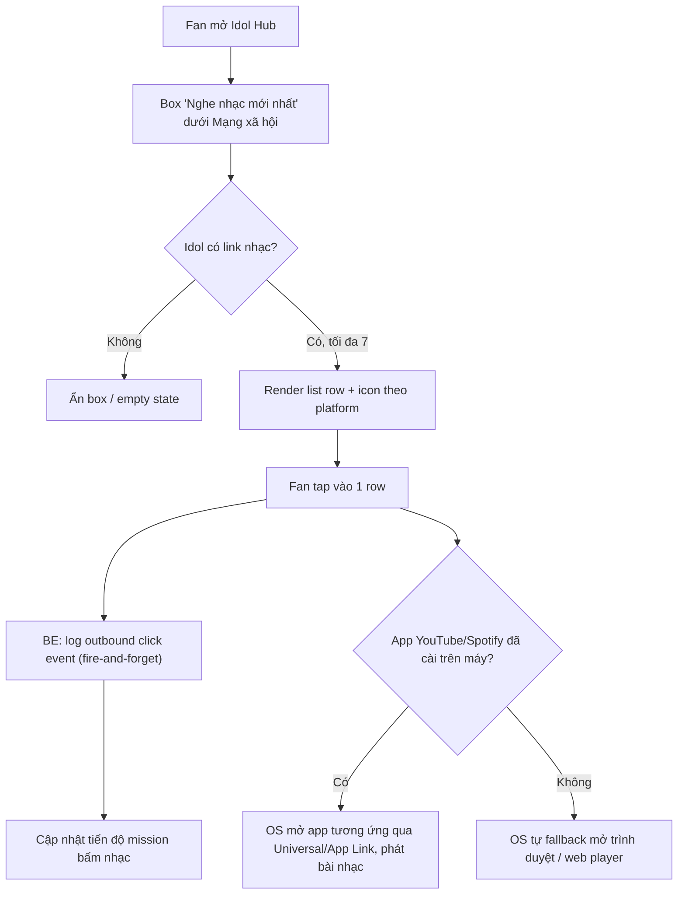
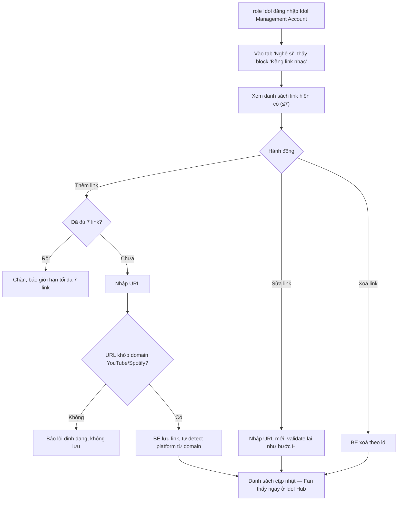

# FSD — MVP2: Idol Music Stream (Stream nhạc trong Profile Idol)

> **Loại tài liệu:** Functional Specification Document (FSD)
> **CR liên quan:** MVP2
> **Nguồn tham chiếu:** `mvp2_Feature_Breakdown.md` (mục 5), `context.md`, `ba.md` (tech stack)
> **Tech stack:** React Native (FE) · NestJS (BE) · PostgreSQL (DB)
> **Trạng thái:** Confirmed — chi tiết Mission (ngưỡng, điểm thưởng) sẽ cập nhật ở tài liệu Mission riêng

---

## 1. Tổng quan

Tính năng cho phép Fan xem danh sách bài nhạc mới nhất của Idol ngay trong Idol Hub, và tap vào để mở nghe trên **YouTube hoặc Spotify** (2 nền tảng duy nhất, không mở rộng thêm ở bản này).

**Điểm quan trọng nhất cần hiểu đúng phạm vi:** đây **không phải** tính năng phát nhạc trong app. Fanation không có music player nội bộ, không xử lý audio streaming. Toàn bộ việc phát nhạc diễn ra ở app YouTube/Spotify bên ngoài — Fanation chỉ đóng vai trò **danh bạ link** (mỗi bài nhạc = 1 link/row) và **tracking hành vi click** để phục vụ mission.

role Idol tự quản lý link nhạc qua block "Đăng link nhạc" trong tab "Nghệ sĩ" — Idol Management Account/Idol Dashboard, không qua Admin CMS chung.

---

## 2. Phạm vi (Scope)

### Trong phạm vi
- Hiển thị danh sách tối đa **7 link nhạc** trong Idol Hub (phía Fan)
- Tap vào link → mở app YouTube/Spotify tương ứng (deep link), fallback trình duyệt nếu chưa cài app
- Track sự kiện click để cập nhật tiến độ mission "bấm link nhạc"
- Block "Đăng link nhạc" (tab Nghệ sĩ) trong Idol Dashboard để role Idol thêm/sửa/xoá link (giới hạn cứng 7)
- Validate URL chỉ chấp nhận domain YouTube hoặc Spotify

### Ngoài phạm vi
- Phát nhạc trong app (in-app player, audio streaming)
- Nền tảng nhạc khác ngoài YouTube/Spotify
- Tự động phát hiện link chết (dead link detection) — hiện tại role Idol chịu trách nhiệm rà soát thủ công
- Xác nhận Fan có thực sự nghe hay không (chỉ tính click, không tính watch-time/listen-time)

---

## 3. Actors

| Actor | Vai trò |
|---|---|
| **Fan** | Xem danh sách nhạc trong Idol Hub, tap để nghe, nhận tiến độ mission |
| **role Idol (Idol Management)** | Thêm/sửa/xoá link nhạc qua Idol Dashboard |
| **RnD (Mission Config)** | Cấu hình ngưỡng số lần bấm cần thiết cho mission theo từng đợt |

---

## 4. User Stories

**US-1 (Fan)**
> Là một Fan, tôi muốn xem danh sách nhạc mới nhất của idol tôi theo dõi ngay trong Profile, để tôi có thể nghe nhanh trên YouTube/Spotify mà không cần tự tìm kiếm.

**US-2 (Fan)**
> Là một Fan, khi tap vào 1 bài nhạc, tôi muốn app tự mở đúng ứng dụng YouTube/Spotify (hoặc trình duyệt nếu chưa cài app), để trải nghiệm liền mạch không bị gián đoạn.

**US-3 (Fan)**
> Là một Fan, tôi muốn hành động bấm nhạc của mình được tính vào tiến độ mission hàng ngày, để tôi có động lực khám phá nhạc của idol.

**US-4 (role Idol)**
> Là role Idol, tôi muốn tự thêm/sửa/xoá link nhạc YouTube/Spotify cho idol mình quản lý ngay trong Idol Dashboard, để cập nhật nội dung mới mà không cần phụ thuộc Admin CMS.

**US-5 (role Idol)**
> Là role Idol, tôi muốn hệ thống chặn tôi nhập quá 7 link hoặc nhập sai định dạng URL, để tránh lỗi vận hành.

---

## 5. Sơ đồ luồng (Diagrams)

### 5.1 Luồng Fan — tap link nhạc

### 5.2 Luồng role Idol — cấu hình link nhạc (Idol Dashboard)

---

## 6. Yêu cầu chức năng chi tiết

### 6.1 FE — Fan side
- Box "Nghe nhạc mới nhất" hiển thị dưới section "Mạng xã hội" trong Idol Hub
- List tối đa 7 row, mỗi row: icon platform (YouTube/Spotify) + tiêu đề bài nhạc (nếu có) + tap area toàn row
- Cập nhật UI tiến độ mission theo response click (nếu BE trả về progress mới) — *detail trên mục mission gửi sau*

### 6.2 FE — Idol Dashboard (role Idol)
- Tab "Nghệ sĩ" trong Idol Management Account/Idol Dashboard, có 1 block riêng "Đăng link nhạc"
- List hiện tại (≤7), mỗi row có nút Sửa/Xoá
- Form thêm mới: input URL, validate client-side cơ bản (domain check) trước khi gọi API, nhưng validate thật sự là ở BE
- Disable nút "Thêm" khi đã đủ 7 link, kèm message rõ ràng
- Cho phép role Idol tự sắp xếp lại thứ tự hiển thị của 7 link (reorder)

### 6.3 Tích hợp Mission
- Detail trên mục mission gửi sau.

---

## 7. Edge Cases

| # | Tình huống | Xử lý đề xuất |
|---|---|---|
| 1 | Link dẫn tới video/track đã bị gỡ trên YouTube/Spotify | Fanation không tự phát hiện (đã chốt) — mở link vẫn chạy, lỗi hiển thị phía app ngoài. role Idol chịu trách nhiệm rà soát và cập nhật |
| 2 | Fan chưa cài cả 2 app YouTube/Spotify | OS tự fallback mở trình duyệt — không cần xử lý riêng ở FE |
| 3 | Fan bấm liên tục cùng 1 link nhiều lần trong thời gian ngắn (farm mission) | Nên set cooldown để tránh tap nhiều lần |
