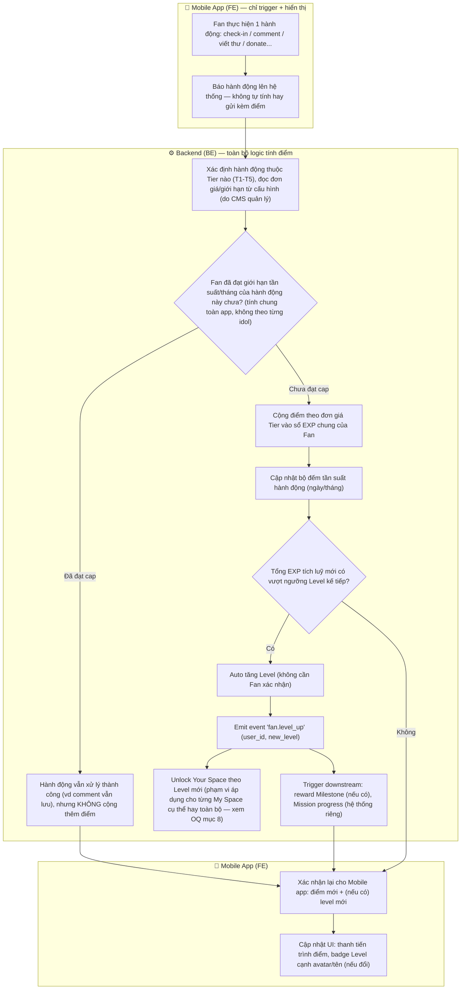
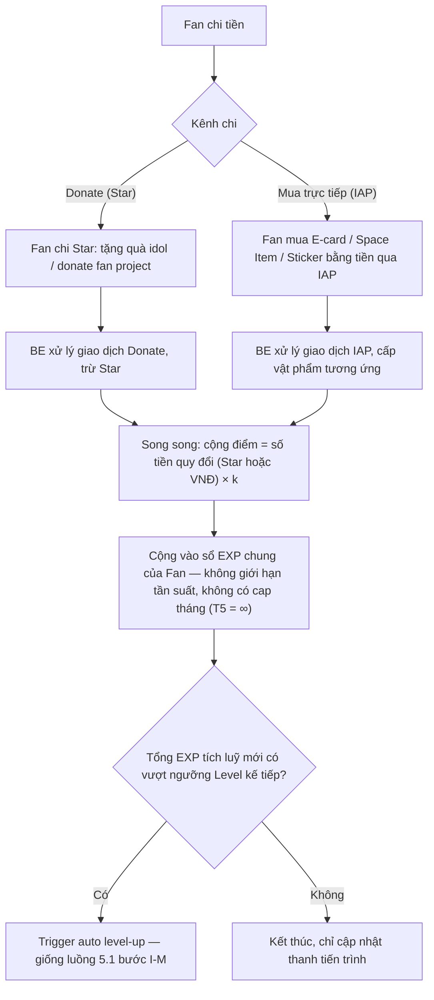

# FSD — MVP2: Cơ chế Xếp hạng và Tính điểm (Fan Rank/Level & EXP System)

## 1. Tổng quan

Tính năng định nghĩa cách Fan **tích điểm (EXP)** qua các hành động tương tác hàng ngày, và cách điểm tích luỹ đó **tự động nâng Rank/Level** của Fan (0 → 5). Level là thước đo tiến trình chính của Fan trong toàn app, hiển thị dưới dạng badge cạnh avatar/tên, và gate việc unlock Studio (Your Space) theo cấp độ cao hơn.

**EXP tính chung cho toàn app theo từng Fan — không tách riêng theo idol.** Một Fan chỉ có 1 mức EXP/Level duy nhất, dù đang follow bao nhiêu idol. Đây là hệ điểm khác với **FPP (Fan Power Point)** — hệ điểm mới, tính riêng theo từng idol, phục vụ leaderboard cạnh tranh hàng tháng (xem `FSD_mvp2_FPP_Leaderboard.md`, không thuộc phạm vi build của FSD này).

Cơ chế gồm 2 phần không tách rời:

1. **Bảng ngưỡng Rank** — Level 0-5, mỗi Level ứng với 1 ngưỡng điểm tích luỹ cố định (mục 6.2).
2. **Catalog Tier hành động (T1-T5)** — danh sách chuẩn hoá "hành động nào cho bao nhiêu điểm, giới hạn bao nhiêu lần" (mục 6.3). Đây chính là câu trả lời cho "tính điểm" — hiện tại các nhiệm vụ (mission) nên ánh xạ vào 1 trong 5 Tier này; việc có mở rộng thêm catalog hoặc phát sinh cách tính điểm mới trong tương lai hay không vẫn để ngỏ, chưa chốt.

**Phân chia trách nhiệm khi triển khai (đã chốt với PO):**
1. **CMS là nơi cấu hình catalog Tier** — hằng số `G`/`k`, ngưỡng Level, đơn giá + giới hạn từng dòng Tier T1-T4 đều sửa trên CMS, không hard-code trong Mobile app lẫn BE.
2. **Mobile app chỉ là nơi trigger hành động** — khi Fan thực hiện 1 hành động (check-in, comment, viết thư...), Mobile app gọi API tương ứng; **toàn bộ việc tính điểm, kiểm tra giới hạn, kiểm tra lên Level đều do BE xử lý** dựa trên config đọc từ CMS — Mobile app không tự tính điểm, chỉ hiển thị kết quả BE trả về (điểm mới, Level mới nếu có).

---

## 2. Phạm vi (Scope)

### Trong phạm vi
- 3 hằng số gốc: `1 Star = 1.000 VNĐ`, `G` (tốc độ tích điểm tối đa khi cày miễn phí), `k` (tỷ lệ điểm quy đổi khi chi tiền)
- Bảng 6 cấp Level (0→5): tên gọi + ngưỡng điểm tích luỹ tương ứng
- Cơ chế **auto level-up**: hệ thống tự kiểm tra và nâng Level khi điểm tích luỹ chạm ngưỡng, không cần Fan thao tác, nhưng có gửi thông báo (noti) cho Fan khi họ lên Level
- Catalog Tier T1-T5 (danh sách hành động & phân nhóm Tier) — cấu trúc catalog cố định, nhưng Admin có quyền thay đổi các tham số của từng hành động (điểm/lượt, giới hạn tần suất, tổng tối đa/tháng) qua CMS
- **EXP tích luỹ chung cho toàn app theo từng Fan** — hành động với bất kỳ idol nào Fan đang follow đều cộng vào cùng 1 sổ EXP duy nhất. Giới hạn tần suất/tháng của mỗi hành động (Tier T1-T4) cũng tính chung theo Fan, **không nhân theo số idol** Fan đang tương tác trong ngày/tháng đó — đề xuất PD, cần PO xác nhận chính thức trước khi RnD cân bằng lại `G` (xem OQ mục 8, vì đây là thay đổi so với model per-idol trước 2026-08-15)
- Quan hệ **Chi tiền → EXP** qua Tier T5: chi Star để donate (tặng quà idol, donate fan project), hoặc chi tiền trực tiếp qua IAP để mua E-card/Space Item/Sticker — cả 2 dòng đều quy đổi thêm điểm theo tỷ lệ `k`, không giới hạn tần suất

---

## 3. Actors

| Actor | Vai trò |
|---|---|
| **Fan** | Thực hiện hành động tương tác, tích EXP, tự động lên Level (tính chung toàn app) |
| **Idol/Content** | Hưởng lợi gián tiếp (Fan tương tác nhiều hơn với nội dung/idol) — không thao tác trực tiếp lên cơ chế điểm |
| **Admin** | Cấu hình hằng số `G`/`k`, ngưỡng Level, đơn giá + giới hạn từng dòng Tier qua CMS |
| **BE System (Point/Rank Engine)** | Cộng dồn điểm theo giới hạn Tier, kiểm tra ngưỡng, trigger sự kiện lên Level, emit event cho các hệ thống phụ thuộc (Studio unlock, Badge, Mission progress) |

---

## 4. User Stories

**US-1 (Fan)**
> Là một Fan, tôi muốn tích EXP mỗi khi thực hiện hành động tương tác với bất kỳ idol nào tôi theo dõi (check-in, comment, viết thư, thêm lịch...), để tiến trình EXP chung của tôi trong app tăng dần.

**US-2 (Fan)**
> Là một Fan, khi điểm tích luỹ chạm ngưỡng Level tiếp theo, tôi muốn Level của tôi tự động tăng và badge cạnh avatar/tên cập nhật ngay, mà không cần thao tác xác nhận.

**US-3 (Fan)**
> Là một Fan, tôi muốn biết rõ giới hạn điểm mỗi hành động (vd tối đa 5 lượt comment/ngày) để không bất ngờ khi thấy hành động không cộng thêm điểm nữa.

**US-4 (Fan)**
> Là một Fan, khi tôi chi tiền (donate bằng Star, hoặc mua E-card/Space Item/Sticker bằng tiền trực tiếp qua IAP), tôi muốn được cộng thêm EXP tương ứng, để việc trả phí cũng đóng góp vào tiến trình EXP, song song với cách cày miễn phí.

**US-5 (Admin)**
> Là Admin, tôi muốn chỉnh hằng số `G`, `k`, ngưỡng Level, hoặc đơn giá/giới hạn từng dòng Tier ngay trên CMS, để cân bằng lại tốc độ tích điểm mà không cần Tech deploy lại code.

---

## 5. Sơ đồ luồng (Diagrams)

### 5.1 Luồng Fan — thực hiện hành động, tích điểm, lên Level

> **Nguyên tắc bắt buộc (yêu cầu chức năng, không quy định cách triển khai):** Mobile app không được tự cộng điểm hay tự xác định Level — mọi con số hiển thị phải lấy từ xác nhận của hệ thống. Điểm/giới hạn/ngưỡng luôn dựa trên cấu hình do CMS quản lý (mục 6.3), không hard-code trong app.

### 5.2 Luồng chi tiền quy đổi thêm EXP (Tier T5)

---

## 6. Yêu cầu chức năng chi tiết

### 6.1 Bối cảnh — 3 loại "tiền tệ" liên quan (tham chiếu, không thuộc phạm vi build của FSD này)

| Tiền tệ | Chức năng chính | Liên quan tới cơ chế điểm |
|---|---|---|
| **EXP (điểm)** | Tích luỹ để tự động nâng Rank/Level, tính chung toàn app | Đối tượng chính của FSD này |
| **Star** | Chỉ dùng để Donate — tặng quà cho idol, donate Fan Project | Chi Star (donate) → cộng thêm EXP theo `k` (Tier T5) — xem mục 5.2 |
| **Idol E-card / Space Item / Sticker** | Mua trực tiếp bằng tiền qua IAP (không còn mua bằng Star) | Chi tiền mua → cộng thêm EXP theo `k` (Tier T5) — chi tiết ngoài phạm vi, xem FSD riêng từng tính năng |

### 6.2 Bảng ngưỡng Level (Rank)

| Level | Tên gọi | Ngưỡng điểm tích luỹ | Thời gian cày chay thuần (ước tính) |
|---|---|---|---|
| 0 | Fan Nhí | 0 | Ngay khi vào app |
| 1 | Fan Sôi Nổi | 500 | ~2 tuần |
| 2 | Fan Ưu Tú | 2.500 | ~2 tháng |
| 3 | Fan Cứng | 5.500 | ~4,4 tháng |
| 4 | Fan Đắm Đuối | 15.000 | ~12 tháng |
| 5 | Fan-tasic | 30.000 | ~24 tháng |

- Ngưỡng = số tháng cày chay thuần × `G`. Level 4 (12 tháng) và Level 5 (24 tháng) là 2 mốc cứng khoá thang đo, các mốc còn lại nội suy theo cấp số nhân.
- `G` (tốc độ tích điểm tối đa khi cày chay) = **1.250 điểm/tháng**.
- `k` (tỷ lệ điểm/tiền khi chi trả phí) = **1 điểm/1.000đ** (áp dụng cho cả Star chi donate và tiền chi trực tiếp qua IAP).
- Level, ngưỡng, `G`, `k` **phải lưu dạng config trên CMS**, không hard-code — đổi `G`/`k` chỉ cần chạy lại phép tính ngưỡng, không sửa từng dòng catalog Tier.

### 6.3 Catalog Tier hành động (T1-T5)

Nguyên tắc: hành động cùng độ phức tạp → cùng mức điểm, bất kể loại hành động hay đang tương tác với idol nào. Mọi nhiệm vụ tương lai phải ánh xạ vào đúng 1 trong 5 dòng dưới đây.

| Tier | Độ phức tạp | Hành động | Điểm | Giới hạn | Tổng tối đa/tháng |
|---|---|---|---|---|---|
| **T1 — Micro** (<5s) | Rất thấp | Check-in ngày | 5đ | 1 lần/ngày | 150 |
| | | Tương tác nhẹ (thả tim / bấm mở stream nhạc) | 2đ/lượt | Tối đa 3 lượt/ngày | 180 |
| | | Thay item trong My Space (skin/vật dụng trang trí) | 1đ/lượt | 1 lượt/ngày | 30 |
| **T2 — Light** (~30s) | Thấp | Comment bài đăng của idol | 3đ/lượt | Tối đa 5 lượt/ngày | 450 |
| | | Thêm sự kiện vào My Calendar | 2đ/sự kiện | Tối đa 2 lượt/ngày | 120 |
| **T3 — Medium** (2-5 phút) | Trung bình | Viết thư cho idol | 20đ/thư | Tối đa 4 thư/tháng | 80 |
| | | Donation (tặng Gift) | 5đ/lượt | 1 lần/ngày | 150 |
| **T4 — Milestone** (cột mốc) | Trung bình-cao | Giữ streak 7/14/30 ngày | 20/25/30đ (+item mốc 14, 30) | 1 lần/mốc/tháng | 75 |
| | | Thêm đủ 10 sự kiện/tháng | 20đ | 1 lần/tháng | 20 |
| | | Tương tác đủ 20 lượt/tháng | 25đ | 1 lần/tháng | 25 |
| | | Nạp mốc 100/200/**xxx** Star | 10/20/**xxx** điểm/mốc | 3 lần/tháng | **chưa xác định** |
| | | Lên hạng | 0đ | — | Quà: Idol E-card (idol nào cấp — xem OQ mục 8) |
| | | Thu thập đủ **xxx** thẻ C / **xxx** thẻ R / ... | 10đ / 100đ / **xxx**đ | Không giới hạn | ∞ |
| **T5 — Monetary** (chi trả phí) | Quy đổi tiền | Donate bằng Star, hoặc mua E-card/Space Item/Sticker bằng tiền qua IAP | 1đ/1.000đ (= `k`) | Không giới hạn | ∞ |

> **Lưu ý:** T5 **không** thuộc hệ thống Mission (Phần 5 tài liệu nguồn) — là hành động tự do, luôn sẵn có, không có trạng thái hoàn thành/re-new, không giới hạn tần suất.

**Cấu hình qua CMS:** mỗi dòng hành động trong catalog trên đều được cấu hình qua CMS — Admin có quyền chỉnh sửa điểm/lượt, giới hạn tần suất, và tổng tối đa/tháng của từng hành động. Thay đổi chỉ áp dụng cho giao dịch điểm phát sinh **sau** thời điểm lưu, **không hồi tố** điểm đã cộng trước đó (xem Edge case #6).

**CMS — module quản lý User:** màn quản lý Fan trong CMS cần hiển thị được Star, EXP, và Level hiện tại của từng Fan.

### 6.4 Mobile App (FE) — Trigger hành động & hiển thị kết quả cho Fan

Mobile app **không tự tính điểm hay tự xác định lên Level** — số liệu điểm/Level luôn do hệ thống xác nhận.

- Khi Fan thực hiện hành động (check-in, comment, viết thư, thêm lịch...) → hành động đó cần được báo lên hệ thống để tính điểm; cơ chế đồng bộ cụ thể (thời điểm gọi, cách cập nhật UI) do Dev quyết định, cân nhắc thêm bài toán performance của app
- Khi có xác nhận lên Level mới → nên có thông báo (notification) cho Fan, thống nhất với cách xử lý noti đã nêu ở mục 2 (Phạm vi)

---

## 7. Edge Cases

| # | Tình huống | Xử lý đề xuất |
|---|---|---|
| 1 | Nhiều hành động cộng điểm xảy ra gần như đồng thời cho cùng 1 Fan (race condition), có thể khiến kiểm tra ngưỡng Level bị lệch | Cộng điểm + kiểm tra ngưỡng Level phải nằm trong 1 transaction atomic, lock theo `user_id` |
| 2 | Fan thực hiện hành động đã đạt cap tần suất trong ngày/tháng (vd comment lần thứ 6/ngày, dù comment ở nhiều idol khác nhau) | Hành động vẫn thực hiện được bình thường (vẫn comment thành công), chỉ **không cộng thêm điểm** — không chặn hành động; cap tính chung theo Fan, không tính riêng theo từng idol |
| 3 | Đầu tháng mới, bộ đếm giới hạn tần suất reset | Chỉ reset bộ đếm tần suất (ngày/tháng), **giữ nguyên** điểm tích luỹ tổng và Level hiện tại — Level không bao giờ tự giảm |
| 4 | Fan donate bằng Star hoặc mua E-card/Space Item/Sticker bằng tiền (IAP) — vừa nhận vật phẩm vừa được cộng điểm T5 | 2 hiệu ứng phải xảy ra cùng lúc trong 1 transaction, không được chỉ thực hiện 1 trong 2 nếu giao dịch thất bại giữa chừng |
| 5 | Admin sửa ngưỡng Level hoặc đơn giá Tier khi Fan đang có điểm tích luỹ gần ngưỡng cũ | Không hồi tố — Fan giữ nguyên điểm đã tích, chỉ áp ngưỡng/đơn giá mới cho giao dịch phát sinh sau khi lưu cấu hình |
| 6 | Fan Letter bị Idol report vi phạm sau khi điểm "Viết thư cho idol" đã được cộng | Điểm của letter đó bị **huỷ bỏ** — trừ khỏi tổng điểm tích luỹ ngay khi report được xử lý. **Level giữ nguyên, không hạ cấp** kể cả khi tổng điểm sau khi trừ tụt dưới ngưỡng Level hiện tại — vì Level giảm ảnh hưởng lớn tới phạm vi mua Space Item đã unlock |

---

## 8. Open Questions (chưa có câu trả lời từ stakeholder)

| # | Câu hỏi | Ảnh hưởng | Ghi chú |
|---|---|---|---|
| 1 | EXP giờ tính global (2026-08-15) — quà rank-up khi lên Level (Idol E-card) cấp cho idol nào? Unlock Your Space theo Level mới áp dụng đồng loạt cho mọi My Space Fan đang có, hay cần logic riêng theo từng idol? | Chặn thiết kế chi tiết UX "lên Level" và CMS cấu hình quà rank-up ở `FSD_mvp2_Ecard_Collect_Burn.md` | User chủ động defer câu này (2026-08-15) — không tự default |
| 2 | Giới hạn tần suất Tier T1-T4 tính chung theo Fan (đề xuất trong mục 2/6.3) có đúng ý đồ cân bằng game không, hay cần cho phép nhân theo số idol Fan tương tác để khuyến khích multi-fandom engagement? | Ảnh hưởng trực tiếp tới việc `G` = 1.250 điểm/tháng còn đúng không, và thiết kế bộ đếm cap ở BE | Đề xuất PD: tính chung theo Fan (an toàn hơn cho cân bằng game) — cần PO xác nhận chính thức |
| 3 | 3 giá trị còn để **"xxx"** chưa điền: (a) điểm thưởng mốc nạp 100/200/...Star, (b) số lượng thẻ C/R cần thu thập cho từng mốc, (c) điểm thưởng tương ứng | Không ảnh hưởng phần còn lại của catalog | Không chặn tiến độ — bổ sung sau khi Content có số liệu |
| 4 | Quà đi kèm rank-up (Idol E-card) có cần Fan chủ động "claim" giống cơ chế Khung theo Rank đã chốt không? | Ảnh hưởng UX khi lên Level — auto vs. cần thao tác nhận quà | Tạm chưa cần xác nhận — cân nhắc sau khi phát triển xong tính năng cốt lõi |
