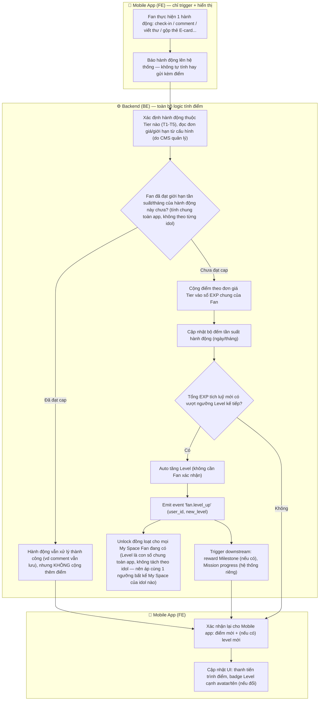
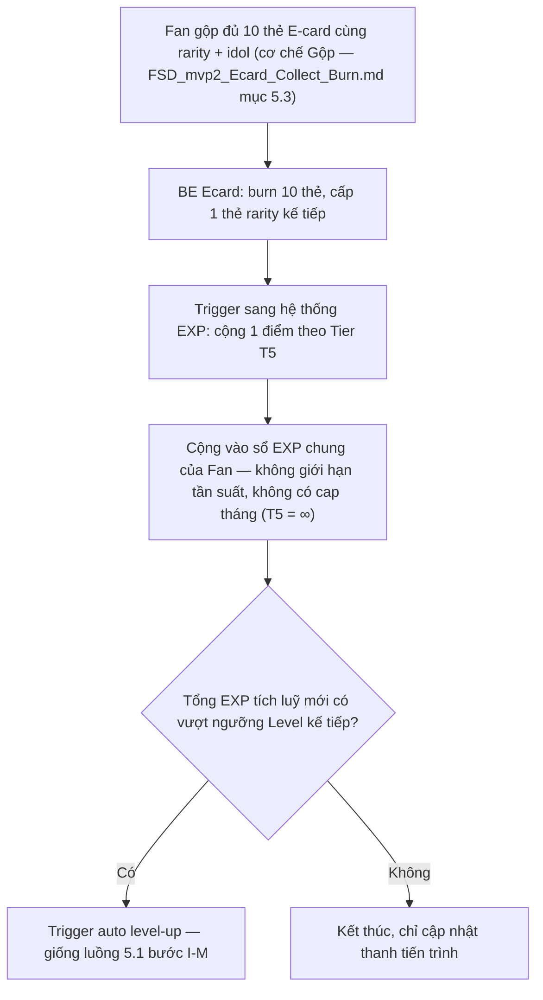

# FSD — MVP2: Cơ chế Xếp hạng và Tính điểm (Fan Rank/Level & EXP System)

## 1. Tổng quan

Tính năng định nghĩa cách Fan **tích điểm (EXP)** qua các hành động tương tác hàng ngày, và cách điểm tích luỹ đó **tự động nâng Rank/Level** của Fan (0 → 5). Level là thước đo tiến trình chính của Fan trong toàn app, hiển thị dưới dạng badge cạnh avatar/tên, và gate việc unlock Studio (Your Space) theo cấp độ cao hơn.

**EXP tính chung cho toàn app theo từng Fan — không tách riêng theo idol.** Một Fan chỉ có 1 mức EXP/Level duy nhất, dù đang follow bao nhiêu idol.

**EXP chỉ earn qua hành động cụ thể trong catalog Tier (mục 6.3) — không có đường quy đổi từ tiền/Star.** Đây là điểm khác biệt quan trọng với **FPP (Fan Power Point)** (`FSD_mvp2_FPP_Leaderboard.md`, không thuộc phạm vi build của FSD này): FPP mới là hệ điểm quy đổi từ tiền chi tiêu (donate, mua vật phẩm), tính riêng theo từng idol, phục vụ leaderboard. EXP và FPP là 2 hệ hoàn toàn tách biệt, không dùng chung công thức hay hồi tố lẫn nhau.

Cơ chế gồm 2 phần không tách rời:

1. **Bảng ngưỡng Rank** — Level 0-5, mỗi Level ứng với 1 ngưỡng điểm tích luỹ cố định (mục 6.2).
2. **Catalog Tier hành động (T1-T5)** — danh sách chuẩn hoá "hành động nào cho bao nhiêu điểm, giới hạn bao nhiêu lần" (mục 6.3), gồm cả hành động miễn phí (T1-T4) lẫn hành động Gộp E-card (T5). Mọi nhiệm vụ tương lai nên ánh xạ vào 1 trong 5 Tier này.

**Phân chia trách nhiệm khi triển khai (đã chốt với PO):**
1. **CMS là nơi cấu hình catalog Tier** — hằng số `G`, ngưỡng Level, đơn giá + giới hạn từng dòng Tier đều sửa trên CMS, không hard-code trong Mobile app lẫn BE.
2. **Mobile app chỉ là nơi trigger hành động** — khi Fan thực hiện 1 hành động (check-in, comment, viết thư, gộp thẻ...), Mobile app gọi API tương ứng; **toàn bộ việc tính điểm, kiểm tra giới hạn, kiểm tra lên Level đều do BE xử lý** dựa trên config đọc từ CMS — Mobile app không tự tính điểm, chỉ hiển thị kết quả BE trả về (điểm mới, Level mới nếu có).

---

## 2. Phạm vi (Scope)

### Trong phạm vi
- Hằng số gốc: `G` (tốc độ tích điểm tối đa khi cày catalog T1-T4 trong 1 tháng)
- Bảng 6 cấp Level (0→5): tên gọi + ngưỡng điểm tích luỹ tương ứng
- Cơ chế **auto level-up**: hệ thống tự kiểm tra và nâng Level khi điểm tích luỹ chạm ngưỡng, không cần Fan thao tác, nhưng có gửi thông báo (noti) cho Fan khi họ lên Level
- Catalog Tier T1-T5 (danh sách hành động & phân nhóm Tier) — cấu trúc catalog cố định, nhưng Admin có quyền thay đổi các tham số của từng hành động (điểm/lượt, giới hạn tần suất, tổng tối đa/tháng) qua CMS
- **EXP tích luỹ chung cho toàn app theo từng Fan** — hành động với bất kỳ idol nào Fan đang follow đều cộng vào cùng 1 sổ EXP duy nhất. Giới hạn tần suất/tháng của mỗi hành động (Tier T1-T4) cũng tính chung theo Fan, **không nhân theo số idol** Fan đang tương tác trong ngày/tháng đó
- Tier T5 — **Gộp E-card:** mỗi lần Fan gộp đủ 10 thẻ E-card cùng rarity/idol thành công (cơ chế Gộp thuộc `FSD_mvp2_Ecard_Collect_Burn.md`) cộng thêm 1 EXP, không giới hạn tần suất

### Ngoài phạm vi
- Quy đổi tiền/Star thành điểm — **không tồn tại cho EXP**; nếu cần đo mức chi tiêu, xem FPP (`FSD_mvp2_FPP_Leaderboard.md`)

---

## 3. Actors

| Actor | Vai trò |
|---|---|
| **Fan** | Thực hiện hành động tương tác (bao gồm Gộp E-card), tích EXP, tự động lên Level (tính chung toàn app) |
| **Idol/Content** | Hưởng lợi gián tiếp (Fan tương tác nhiều hơn với nội dung/idol) — không thao tác trực tiếp lên cơ chế điểm |
| **Admin** | Cấu hình hằng số `G`, ngưỡng Level, đơn giá + giới hạn từng dòng Tier qua CMS |
| **BE System (Point/Rank Engine)** | Cộng dồn điểm theo giới hạn Tier, kiểm tra ngưỡng, trigger sự kiện lên Level, emit event cho các hệ thống phụ thuộc (Studio unlock, Badge, Mission progress) |

---

## 4. User Stories

**US-1 (Fan)**
> Là một Fan, tôi muốn tích EXP mỗi khi thực hiện hành động tương tác với bất kỳ idol nào tôi theo dõi (check-in, comment, viết thư, thêm lịch...), để tiến trình EXP chung của tôi trong app tăng dần.

**US-2 (Fan)**
> Là một Fan, khi điểm tích luỹ chạm ngưỡng Level tiếp theo, tôi muốn Level của tôi tự động tăng và badge cạnh avatar/tên cập nhật ngay, mà không cần thao tác xác nhận.

**US-3 (Fan)**
> Là một Fan, tôi muốn biết rõ giới hạn điểm mỗi hành động (vd tối đa 3 lượt comment/ngày) để không bất ngờ khi thấy hành động không cộng thêm điểm nữa.

**US-4 (Fan)**
> Là một Fan, khi tôi gộp đủ 10 thẻ E-card thành công, tôi muốn được cộng thêm EXP, để hoạt động sưu tầm/gộp thẻ cũng đóng góp vào tiến trình EXP, không chỉ riêng các hành động tương tác thường ngày.

**US-5 (Admin)**
> Là Admin, tôi muốn chỉnh hằng số `G`, ngưỡng Level, hoặc đơn giá/giới hạn từng dòng Tier ngay trên CMS, để cân bằng lại tốc độ tích điểm mà không cần Tech deploy lại code.

---

## 5. Sơ đồ luồng (Diagrams)

### 5.1 Luồng Fan — thực hiện hành động, tích điểm, lên Level

> **Nguyên tắc bắt buộc (yêu cầu chức năng, không quy định cách triển khai):** Mobile app không được tự cộng điểm hay tự xác định Level — mọi con số hiển thị phải lấy từ xác nhận của hệ thống. Điểm/giới hạn/ngưỡng luôn dựa trên cấu hình do CMS quản lý (mục 6.3), không hard-code trong app.

### 5.2 Luồng Tier T5 — Gộp E-card cộng thêm EXP

---

## 6. Yêu cầu chức năng chi tiết

### 6.1 Bối cảnh — các "tiền tệ" liên quan (tham chiếu, không thuộc phạm vi build của FSD này)

| Tiền tệ | Chức năng chính | Liên quan tới cơ chế điểm |
|---|---|---|
| **EXP (điểm)** | Tích luỹ để tự động nâng Rank/Level, tính chung toàn app | Đối tượng chính của FSD này — chỉ earn qua catalog Tier T1-T5 |
| **Star** | Chỉ dùng để Donate — tặng quà cho idol, donate Fan Project | **Không cộng EXP** — donate chỉ cộng FPP theo idol, xem `FSD_mvp2_FPP_Leaderboard.md` |
| **Vật phẩm (E-card, Space Item, Sticker, Avatar Frame)** | Mua trực tiếp bằng tiền qua IAP tại Cửa hàng — cùng 1 nhóm tính chất, không còn phân biệt riêng E-card | **Không cộng EXP** khi mua — riêng hành động **Gộp E-card** cộng EXP theo Tier T5 (mục 6.3); mua/sở hữu vật phẩm cộng FPP, xem `FSD_mvp2_FPP_Leaderboard.md` |

### 6.2 Bảng ngưỡng Level (Rank)

| Level | Tên gọi | Ngưỡng điểm tích luỹ | Thời gian cày chay thuần (ước tính) |
|---|---|---|---|
| 0 | Fan Nhí | 0 | Ngay khi vào app |
| 1 | Fan Sôi Nổi | 500 | ~2 tuần |
| 2 | Fan Ưu Tú | 2.500 | ~2 tháng |
| 3 | Fan Cứng | 5.500 | ~4,4 tháng |
| 4 | Fan Đắm Đuối | 15.000 | ~12 tháng |
| 5 | Fan-tasic | 30.000 | ~24 tháng |

- Ngưỡng = số tháng cày chay thuần × `G`. Level 4 (12 tháng) và Level 5 (24 tháng) là 2 mốc cứng khoá thang đo, các mốc còn lại nội suy theo cấp số nhân.
- `G` (tốc độ tích điểm tối đa khi cày catalog T1-T4 trong 1 tháng) = **1.250 điểm/tháng**.
- Level, ngưỡng, `G` **phải lưu dạng config trên CMS**, không hard-code — đổi `G` chỉ cần chạy lại phép tính ngưỡng, không sửa từng dòng catalog Tier.

### 6.3 Catalog Tier hành động (T1-T5)

Nguyên tắc: hành động cùng độ phức tạp → cùng mức điểm, bất kể đang tương tác với idol nào. Mọi nhiệm vụ tương lai phải ánh xạ vào đúng 1 trong 5 dòng dưới đây.

| Tier | Độ phức tạp | Hành động | Điểm | Giới hạn | Tổng tối đa/tháng |
|---|---|---|---|---|---|
| **T1 — Micro** (<5s, 1 chạm) | Rất thấp | Check-in ngày | 5đ | 1 lần/ngày | 150 |
| | | Tương tác nhẹ (thả tim / bấm mở stream nghe nhạc) | 2đ/lượt | Tối đa 3 lượt/ngày | 180 |
| | | Thay item trong My Space (skin/vật dụng trang trí) | 1đ/lượt | 1 lượt/ngày | 30 |
| **T2 — Light** (~30s) | Thấp | Comment/thả tim bài đăng của idol | 5đ/lượt | Tối đa 3 lượt/ngày | 450 |
| | | Thêm sự kiện vào My Calendar | 2đ/sự kiện | Tối đa 2 lượt/ngày | 120 |
| **T3 — Medium** (2-5 phút) | Trung bình | Viết thư cho idol | 20đ/thư | Tối đa 4 thư/tháng | 80 |
| | | Hoàn thành đủ nhiệm vụ trong ngày (Daily Complete — `FSD_mvp2_Daily_Mission.md`) | 5đ/ngày | 1 lần/ngày | 150 |
| **T4 — Milestone** (cột mốc) | Trung bình-cao | Giữ streak 7/14/30 ngày | 20/25/30đ | 1 lần/mốc/tháng | 75 |
| | | Thêm đủ 10 sự kiện/tháng | 20đ | 1 lần/tháng | 20 |
| | | Tương tác đủ 20 lượt/tháng | 25đ | 1 lần/tháng | 25 |
| **T5 — Convert** (quy đổi) | Quy đổi | Gộp đủ 10 thẻ E-card (`FSD_mvp2_Ecard_Collect_Burn.md` mục 5.3) | 1đ/lần | Không giới hạn | ∞ |

> **Lưu ý:** T5 **không** thuộc hệ thống Mission — là hành động tự do, luôn sẵn có, không có trạng thái hoàn thành/re-new, không giới hạn tần suất. Tổng T1-T4 ở mức thiết kế xấp xỉ **1.250 điểm/tháng** (khớp `G`) khi Fan tận dụng hết mọi hành động — không cần khớp tuyệt đối, chỉ là mức tham chiếu khi RnD cân bằng.

> **"Thả tim" xuất hiện ở cả T1 (tương tác nhẹ, 2đ) và T2 (thả tim bài đăng của idol, 5đ)** — theo đúng nguồn, có thể là 2 bề mặt khác nhau (feed chung vs bài đăng idol cụ thể). Giữ nguyên như nguồn, chưa cần làm rõ thêm trừ khi Design phát hiện trùng UI.

**Quà rank-up khi lên Level:** Level tự động tăng không cộng thêm điểm (0đ, không phải dòng trong catalog Tier) — đi kèm quà là 1 **vật phẩm** (E-card, Space Item, Sticker, Avatar Frame — cùng 1 nhóm tính chất, không phân biệt riêng E-card). Admin cấu hình 1 pool vật phẩm khả dụng cho từng Level trên CMS, tự do chọn từ bất kỳ loại nào trong nhóm trên; khi Fan lên Level, hệ thống **random** 1 vật phẩm trong pool đó và cấp thẳng cho Fan (nhất quán với cơ chế auto level-up ở mục 2 — không cần Fan thao tác thêm).

**Cấu hình qua CMS:** mỗi dòng hành động trong catalog trên đều được cấu hình qua CMS — Admin có quyền chỉnh sửa điểm/lượt, giới hạn tần suất, và tổng tối đa/tháng của từng hành động. Thay đổi chỉ áp dụng cho giao dịch điểm phát sinh **sau** thời điểm lưu, **không hồi tố** điểm đã cộng trước đó (xem Edge case #5).

**CMS — module quản lý User:** màn quản lý Fan trong CMS cần hiển thị được Star, EXP, và Level hiện tại của từng Fan (FPP theo từng idol xem `FSD_mvp2_FPP_Leaderboard.md`).

### 6.4 Mobile App (FE) — Trigger hành động & hiển thị kết quả cho Fan

Mobile app **không tự tính điểm hay tự xác định lên Level** — số liệu điểm/Level luôn do hệ thống xác nhận.

- Khi Fan thực hiện hành động (check-in, comment, viết thư, thêm lịch, gộp thẻ E-card...) → hành động đó cần được báo lên hệ thống để tính điểm; cơ chế đồng bộ cụ thể (thời điểm gọi, cách cập nhật UI) do Dev quyết định, cân nhắc thêm bài toán performance của app
- Khi có xác nhận lên Level mới → nên có thông báo (notification) cho Fan, thống nhất với cách xử lý noti đã nêu ở mục 2 (Phạm vi)

---

## 7. Edge Cases

| # | Tình huống | Xử lý đề xuất |
|---|---|---|
| 1 | Nhiều hành động cộng điểm xảy ra gần như đồng thời cho cùng 1 Fan (race condition), có thể khiến kiểm tra ngưỡng Level bị lệch | Cộng điểm + kiểm tra ngưỡng Level phải nằm trong 1 transaction atomic, lock theo `user_id` |
| 2 | Fan thực hiện hành động đã đạt cap tần suất trong ngày/tháng (vd comment lần thứ 4/ngày, dù comment ở nhiều idol khác nhau) | Hành động vẫn thực hiện được bình thường (vẫn comment thành công), chỉ **không cộng thêm điểm** — không chặn hành động; cap tính chung theo Fan, không tính riêng theo từng idol |
| 3 | Đầu tháng mới, bộ đếm giới hạn tần suất reset | Chỉ reset bộ đếm tần suất (ngày/tháng), **giữ nguyên** điểm tích luỹ tổng và Level hiện tại — Level không bao giờ tự giảm |
| 4 | Fan gộp đủ 10 thẻ E-card (Tier T5) — vừa nhận thẻ rarity cao hơn (Ecard FSD) vừa được cộng EXP | 2 hiệu ứng phải xảy ra cùng lúc trong 1 transaction, không được chỉ thực hiện 1 trong 2 nếu giao dịch thất bại giữa chừng |
| 5 | Admin sửa ngưỡng Level hoặc đơn giá Tier khi Fan đang có điểm tích luỹ gần ngưỡng cũ | Không hồi tố — Fan giữ nguyên điểm đã tích, chỉ áp ngưỡng/đơn giá mới cho giao dịch phát sinh sau khi lưu cấu hình |
| 6 | Fan Letter bị Idol report vi phạm sau khi điểm "Viết thư cho idol" đã được cộng | Điểm của letter đó bị **huỷ bỏ** — trừ khỏi tổng điểm tích luỹ ngay khi report được xử lý. **Level giữ nguyên, không hạ cấp** kể cả khi tổng điểm sau khi trừ tụt dưới ngưỡng Level hiện tại — vì Level giảm ảnh hưởng lớn tới phạm vi mua Space Item đã unlock |
