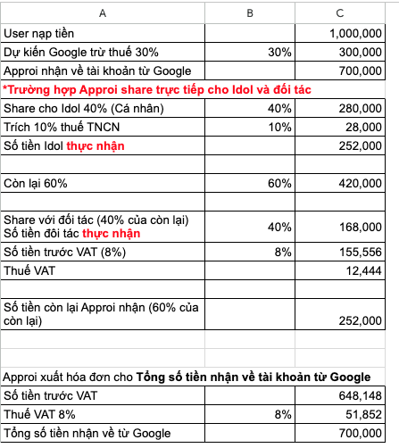
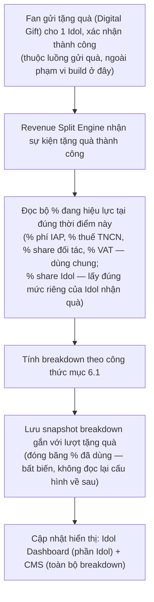
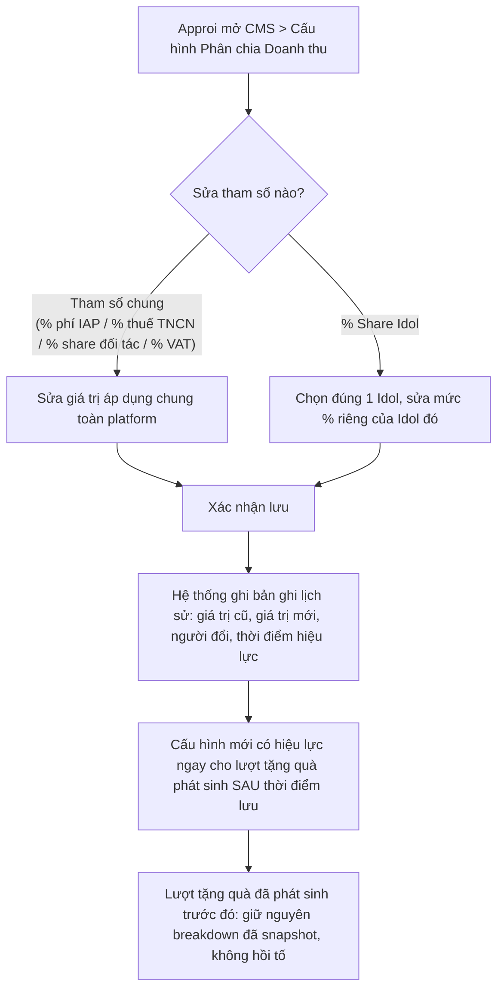
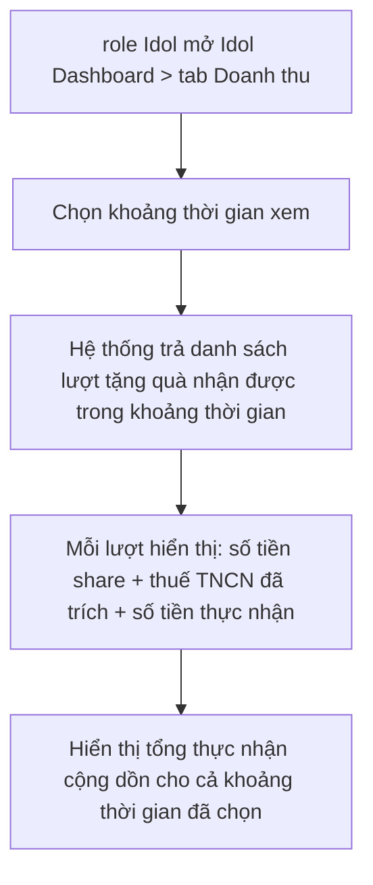
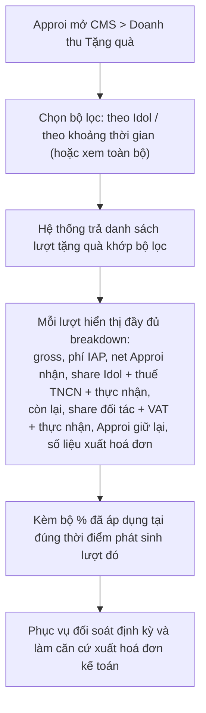

# FSD — MVP2: Phân Chia & Theo Dõi Doanh Thu Tặng Quà (Digital Gift Revenue Split)

---

## 1. Tổng quan

Khi Fan gửi **tặng quà (Digital Gift)** cho 1 Idol cụ thể — bằng Star đã nạp qua IAP (Apple/Google) — giá trị quy đổi tiền thật của lượt tặng quà đó phát sinh 1 chuỗi phân chia dòng tiền nhiều tầng trước khi xác định số tiền các bên thực sự nhận được: Apple/Google giữ lại phí IAP, phần còn lại Approi nhận về được chia cho Idol (trừ thuế TNCN) và đối tác (cộng VAT), phần dư lại Approi giữ, đồng thời Approi cần số liệu trước VAT/VAT để xuất hoá đơn cho tổng tiền nhận từ IAP.

**Lưu ý phạm vi:** việc Fan mua vật phẩm (E-card, Space Item, Sticker, Avatar Frame...) tại tab "Cửa hàng" **không** thuộc phạm vi phân chia doanh thu này — tiền mua vật phẩm là doanh thu Approi trọn vẹn, không chia cho Idol/đối tác. Phạm vi chia doanh thu chỉ áp dụng cho **sự kiện tặng quà (Digital Gift) gửi tới 1 Idol cụ thể**.

Tính năng này đảm bảo: ngay khi 1 sự kiện tặng quà được xác nhận thành công, hệ thống **tính và lưu lại toàn bộ breakdown dòng tiền** của lượt tặng quà đó, rồi hiển thị:
- **Idol Dashboard (role Idol):** phần liên quan trực tiếp đến Idol — số tiền share và số tiền thực nhận sau thuế TNCN của từng lượt tặng quà, cùng tổng thu nhập theo khoảng thời gian.
- **CMS (Approi — Admin/Kế toán vận hành CMS):** toàn bộ breakdown chi tiết mọi lượt tặng quà — phần IAP giữ, phần Idol, phần đối tác (kèm VAT), phần Approi giữ lại, số liệu xuất hoá đơn tổng — phục vụ đối soát và kế toán.

Các tỷ lệ % dùng để tính breakdown đều **cấu hình được trên CMS**, không hard-code — riêng **% share Idol cấu hình theo từng Idol** (mỗi Idol 1 mức đã thoả thuận riêng), các tham số còn lại dùng chung toàn platform (mục 6.1-6.2). Vì các lượt tặng quà phải giữ nguyên đúng % đã áp dụng tại thời điểm phát sinh — không bị ảnh hưởng khi Admin đổi cấu hình sau này — CMS bắt buộc **lưu lại lịch sử mỗi lần thay đổi** từng tham số %.

Công thức tham chiếu từ `mvp2/cashflow_iap.png` (case Approi share trực tiếp cho Idol và đối tác, ví dụ tính trên giá trị gốc 1.000.000đ):

---

## 2. Phạm vi (Scope)

### Trong phạm vi
- BE: khi 1 **sự kiện tặng quà (Digital Gift)** gửi tới 1 Idol cụ thể được xác nhận thành công, tính toán và lưu lại **snapshot breakdown** đầy đủ theo cấu trúc dòng tiền ở mục 6.1, dùng đúng bộ % đang hiệu lực tại thời điểm đó (gồm % share riêng của đúng Idol nhận quà)
- CMS: màn cấu hình các tham số % chung + % share riêng theo từng Idol (mục 6.2) — sửa được, bắt buộc lưu lịch sử thay đổi (giá trị cũ, giá trị mới, người đổi, thời điểm hiệu lực)
- CMS: màn xem danh sách lượt tặng quà + breakdown chi tiết (mục 6.3), lọc theo Idol/khoảng thời gian, phục vụ đối soát và xuất hoá đơn kế toán
- Idol Dashboard: tab hiển thị thu nhập — danh sách lượt tặng quà nhận được + số tiền thực nhận từng lượt + tổng theo khoảng thời gian (mục 6.4)

### Ngoài phạm vi (thuộc FSD khác, giai đoạn sau, hoặc ngoài hệ thống)
- **Luồng gửi Digital Gift** (chọn Idol, chọn quà, trừ Star, UI xác nhận gửi quà) — chưa có FSD riêng. FSD này **chỉ xử lý bước sau khi sự kiện tặng quà đã được xác nhận thành công**, không định nghĩa lại luồng gửi quà
- **Luồng mua vật phẩm tại Cửa hàng** (E-card, Space Item, Sticker, Avatar Frame) — không liên quan Idol, không thuộc phạm vi phân chia doanh thu của FSD này (xem ghi chú mục 1)
- **Payout/giải ngân thực tế** (chuyển tiền ra ngoài platform cho Idol/đối tác, đối soát ngân hàng, rút tiền) — chỉ track và hiển thị số liệu "thực nhận" mang tính kế toán, không xử lý ví/rút tiền. Cơ chế Disbursement hiện vẫn là hạng mục cần re-confirm ở cấp dự án
- **Phát hành hoá đơn điện tử thực tế** — chỉ tính và hiển thị số tiền trước VAT/VAT để phục vụ xuất hoá đơn, không tích hợp hệ thống hoá đơn điện tử
- Cấu hình đối tác cụ thể (tên, thông tin pháp lý...) và giao diện cho đối tác truy cập — đối tác không có tài khoản trên platform, chỉ được track nội bộ phục vụ đối soát của Approi
- **Kênh MoMo:** tạm thời loại bỏ khỏi phạm vi FSD này — chỉ xử lý lượt tặng quà có nguồn Star nạp qua IAP Apple/Google

---

## 3. Actors

| Actor | Vai trò |
|---|---|
| **Fan** | Gửi tặng quà (Digital Gift) cho 1 Idol bằng Star đã nạp — nguồn phát sinh sự kiện, không thao tác trực tiếp trong phạm vi FSD này |
| **role Idol (Idol Dashboard)** | Xem số tiền share và thực nhận (sau thuế TNCN) của từng lượt tặng quà nhận được, xem tổng thu nhập theo khoảng thời gian |
| **Approi (Admin/Kế toán, vận hành qua CMS)** | Chính là chủ platform — thao tác trên CMS để cấu hình các tham số % (chung + riêng theo Idol), xem lịch sử thay đổi cấu hình, xem toàn bộ breakdown mọi lượt tặng quà để đối soát |
| **Đối tác** | Bên nhận share theo case ở mục 1 — không có tài khoản/giao diện trên platform, chỉ xuất hiện trong breakdown nội bộ mà Approi xem được qua CMS |
| **BE System (Revenue Split Engine)** | Lắng nghe sự kiện tặng quà thành công, đọc cấu hình % hiệu lực tại thời điểm đó (gồm % riêng của đúng Idol), tính và lưu snapshot breakdown gắn với lượt tặng quà |

---

## 4. User Stories

**US-1 (role Idol)**
> Là role Idol, tôi muốn xem được số tiền tôi thực nhận (đã trừ thuế TNCN) từ mỗi lượt Fan tặng quà cho mình, để theo dõi thu nhập của mình trên platform.

**US-2 (role Idol)**
> Là role Idol, tôi muốn xem tổng thu nhập thực nhận trong 1 khoảng thời gian tôi chọn, để dễ dàng theo dõi và đối soát định kỳ.

**US-3 (Approi/Kế toán)**
> Là Approi, tôi muốn xem toàn bộ breakdown dòng tiền của từng lượt tặng quà — phần IAP giữ, phần Idol, phần đối tác kèm VAT, phần Approi giữ lại, số liệu xuất hoá đơn tổng — để phục vụ đối soát và kế toán.

**US-4 (Approi)**
> Là Approi, tôi muốn cấu hình mức % share riêng cho từng Idol (vì mỗi Idol có mức thoả thuận khác nhau), cùng các tham số % chung còn lại (phí IAP, thuế TNCN, share đối tác, VAT) ngay trên CMS, để điều chỉnh chính sách chia doanh thu mà không cần Tech deploy lại code.

**US-5 (Approi)**
> Là Approi, tôi muốn xem lại lịch sử thay đổi của từng tham số % (giá trị cũ, giá trị mới, người đổi, thời điểm hiệu lực), để biết chính sách đã thay đổi ra sao qua thời gian và giải trình khi cần.

**US-6 (Approi/Kế toán)**
> Là Approi, tôi muốn lượt tặng quà đã phát sinh giữ nguyên đúng % đã áp dụng tại thời điểm đó dù sau này tôi có đổi cấu hình, để số liệu đối soát các kỳ trước không bị thay đổi ngược.

---

## 5. Sơ đồ luồng (Diagrams)

### 5.1 Luồng BE — Tính & lưu breakdown khi sự kiện tặng quà thành công

### 5.2 Luồng CMS — Cấu hình % & lưu lịch sử thay đổi

### 5.3 Luồng role Idol — Xem thu nhập trên Idol Dashboard

### 5.4 Luồng CMS — Track & xem toàn bộ breakdown doanh thu

---

## 6. Yêu cầu chức năng chi tiết

### 6.1 Cấu trúc breakdown dòng tiền & công thức tính

Công thức gốc (xem ảnh đính kèm ở mục 1, `cashflow_iap.png`) — "User nạp tiền" trong ảnh tương ứng giá trị quy đổi tiền thật của 1 lượt tặng quà Fan gửi cho 1 Idol cụ thể.

Tham số % dùng trong công thức:

| Tham số % | Ý nghĩa | Phạm vi cấu hình | Giá trị trong ví dụ |
|---|---|---|---|
| % Phí IAP (Apple/Google) | Apple/Google giữ lại trên giá trị gốc lượt tặng quà | Chung toàn platform | 30% |
| % Share Idol | Phần Approi chia cho Idol nhận quà, tính trên số tiền Approi nhận về sau phí IAP | **Riêng theo từng Idol** (mục 6.2) | 40% (ví dụ) |
| % Thuế TNCN | Trích từ phần share Idol trước khi trả Idol | Chung toàn platform | 10% |
| % Share đối tác | Phần Approi chia cho đối tác, tính trên số tiền còn lại sau khi trừ phần Idol | Chung toàn platform | 40% |
| % VAT | Áp dụng khi tính hoá đơn đối tác xuất cho Approi, và khi Approi xuất hoá đơn tổng cho Apple/Google | Chung toàn platform | 8% |

Các bước tính (ví dụ minh hoạ trên giá trị gốc 1.000.000đ):

| # | Khoản mục | Cách tính | Ví dụ |
|---|---|---|---|
| 1 | Giá trị gốc lượt tặng quà | Giá trị quy đổi tiền thật | 1.000.000đ |
| 2 | Phí IAP | Gross × % phí IAP | 300.000đ |
| 3 | Approi nhận về (net) | Gross − phí IAP | 700.000đ |
| 4 | Share cho Idol | Net × % share Idol (riêng theo Idol) | 280.000đ |
| 5 | Thuế TNCN trích từ phần Idol | Share Idol × % thuế TNCN | 28.000đ |
| 6 | **Idol thực nhận** | Share Idol − thuế TNCN | **252.000đ** |
| 7 | Còn lại sau khi trừ phần Idol | Net − Share Idol | 420.000đ |
| 8 | **Đối tác thực nhận** (đã gồm VAT — đối tác xuất hoá đơn cho Approi) | Còn lại × % share đối tác | **168.000đ** |
| 8a | ↳ trong đó, trước VAT | Đối tác thực nhận ÷ (1 + % VAT) | 155.556đ |
| 8b | ↳ trong đó, VAT | Đối tác thực nhận − trước VAT | 12.444đ |
| 9 | **Approi giữ lại** | Còn lại − Đối tác thực nhận | **252.000đ** |
| 10 | Approi xuất hoá đơn cho tổng tiền nhận từ Apple/Google — trước VAT | Net ÷ (1 + % VAT) | 648.148đ |
| 10a | ↳ VAT | Net − trước VAT | 51.852đ |

Breakdown đầy đủ (mọi dòng #1–10a) được lưu lại nguyên vẹn cho từng lượt tặng quà — không chỉ lưu số cuối cùng — để phục vụ hiển thị khác nhau cho Idol Dashboard (chỉ dòng #4–6) và CMS (toàn bộ).

### 6.2 CMS — Cấu hình % & lịch sử thay đổi
- Màn "Cấu hình Phân chia Doanh thu" gồm 2 phần:
  - **Tham số chung** (áp dụng mọi Idol): % phí IAP, % thuế TNCN, % share đối tác, % VAT — Approi sửa được từng giá trị
  - **% Share Idol** — cấu hình riêng theo từng Idol (bảng danh sách Idol, mỗi dòng 1 mức % riêng), vì mỗi Idol có mức thoả thuận khác nhau
- Mỗi lần lưu thay đổi 1 tham số (chung hoặc riêng theo Idol): hệ thống ghi lại 1 bản ghi lịch sử gồm giá trị cũ, giá trị mới, người thực hiện, thời điểm hiệu lực — hiển thị được dạng nhật ký (audit log) ngay trên màn cấu hình
- Cấu hình mới chỉ áp dụng cho lượt tặng quà phát sinh **sau** thời điểm lưu — lượt đã snapshot breakdown trước đó giữ nguyên, không hồi tố (nhất quán với nguyên tắc "giá tại thời điểm xác nhận" đã áp dụng ở các FSD Cửa hàng khác, xem `FSD_mvp2_Ecard_Collect_Burn.md` mục 6.3, `FSD_mvp2_Sticker.md` mục 6.3)
- **Khuyến khích Approi cập nhật các tham số vào cuối ngày** (ngoài giờ cao điểm tặng quà), để hạn chế rủi ro race condition giữa lúc đổi cấu hình và lúc có lượt tặng quà đang được xử lý (đề xuất PD/BA)
- Luôn phải tồn tại đủ bộ tham số chung + % share riêng cho mọi Idol đang hoạt động, hiệu lực tại mọi thời điểm — không cho phép lưu trống hoặc thiếu tham số

### 6.3 CMS — Xem lượt tặng quà & đối soát doanh thu
- Danh sách lượt tặng quà, mỗi dòng hiển thị đầy đủ breakdown (mục 6.1: gross, phí IAP, net Approi nhận, share Idol + thuế TNCN + thực nhận, còn lại, share đối tác + VAT + thực nhận, Approi giữ lại, số liệu xuất hoá đơn)
- Lọc theo Idol, theo khoảng thời gian; phục vụ đối soát định kỳ và làm căn cứ xuất hoá đơn kế toán
- Mỗi lượt hiển thị rõ **bộ % đã áp dụng** tại thời điểm phát sinh (không chỉ số tiền cuối, để Approi đối chiếu được với lịch sử cấu hình ở mục 6.2 khi cần giải trình)

### 6.4 Idol Dashboard — Xem thu nhập (role Idol)
- Tab "Doanh thu" trong Idol Dashboard: danh sách lượt tặng quà nhận được, mỗi dòng hiển thị số tiền share và số tiền thực nhận (sau thuế TNCN)
- Chọn khoảng thời gian xem, hiển thị tổng thực nhận cộng dồn cho khoảng thời gian đã chọn
- **Không hiển thị** phần đối tác, phần Approi giữ lại, hay lượt tặng quà của Idol khác — Idol chỉ thấy đúng phần liên quan trực tiếp đến mình (đề xuất PD/BA, cần PO xác nhận mức độ minh bạch số liệu muốn cho Idol thấy)

### 6.5 Yêu cầu nghiệp vụ cần đảm bảo
- Tính và lưu snapshot breakdown phải xảy ra ngay khi sự kiện tặng quà được xác nhận thành công, cùng 1 atomic transaction với việc ghi nhận lượt tặng quà — không để xảy ra trường hợp tặng quà thành công nhưng không có breakdown, hoặc breakdown tính sai % (dùng nhầm cấu hình cũ/mới, hoặc nhầm % share của Idol khác)
- Breakdown đã lưu là **bất biến (immutable)** — Approi đổi cấu hình % sau đó không được phép làm thay đổi số liệu của lượt đã snapshot
- Sai số làm tròn khi chia VAT (VD 155.555,56 → 155.556) dồn về phần "Approi giữ lại", đảm bảo tổng các khoản trong breakdown luôn khớp đúng 100% giá trị gốc, không lệch dù vài đồng (đề xuất PD/BA, cần Kế toán xác nhận quy tắc làm tròn)
- Mỗi lượt tặng quà chỉ gắn với đúng 1 Idol (Fan chọn đúng 1 Idol khi gửi quà) — không có trường hợp 1 lượt tặng quà chia cho nhiều Idol

---

## 7. Edge Cases

| # | Tình huống | Xử lý đề xuất |
|---|---|---|
| 1 | Lượt tặng quà bị hoàn/huỷ sau khi đã tính và lưu breakdown | Cần bản ghi điều chỉnh/đảo ngược riêng (không xoá breakdown gốc), để lịch sử đối soát vẫn còn dấu vết đầy đủ |
| 2 | Approi sửa % đúng lúc có lượt tặng quà đang được Revenue Split Engine xử lý (race condition) | Dùng đúng bộ % đọc được tại thời điểm engine xử lý lượt đó, không dùng cấu hình đang được sửa dở. Khuyến khích Approi cập nhật thông số vào cuối ngày/ngoài giờ cao điểm để hạn chế rủi ro này (mục 6.2) |
| 3 | Hệ thống không xác định được Idol nhận quà tương ứng lượt tặng quà (lỗi liên kết dữ liệu) | Chặn/log lỗi rõ ràng, không để lượt tặng quà tồn tại mà thiếu breakdown |
| 4 | Approi muốn xoá 1 tham số % chung đang hiệu lực mà không nhập giá trị thay thế | Không cho phép — luôn phải có đủ tham số hiệu lực tại mọi thời điểm (mục 6.2) |
| 5 | Idol xem tab Doanh thu nhưng chưa từng nhận quà nào | Hiển thị trạng thái rỗng, tổng thực nhận = 0đ |
| 6 | Idol mới, chưa được Approi cấu hình % share riêng | Chặn nhận tặng quà (hoặc chặn hiển thị Idol đó ở luồng gửi quà) cho đến khi Approi cấu hình % share — không dùng giá trị mặc định ngầm định để tránh sai lệch thoả thuận với từng Idol |
