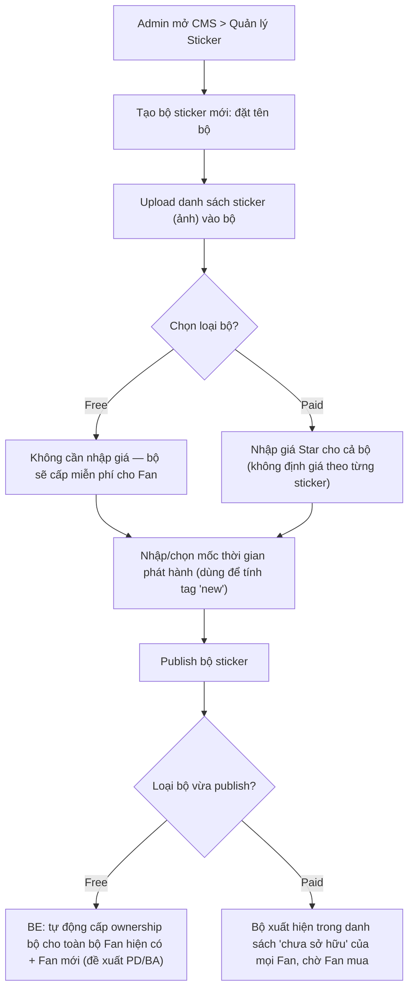
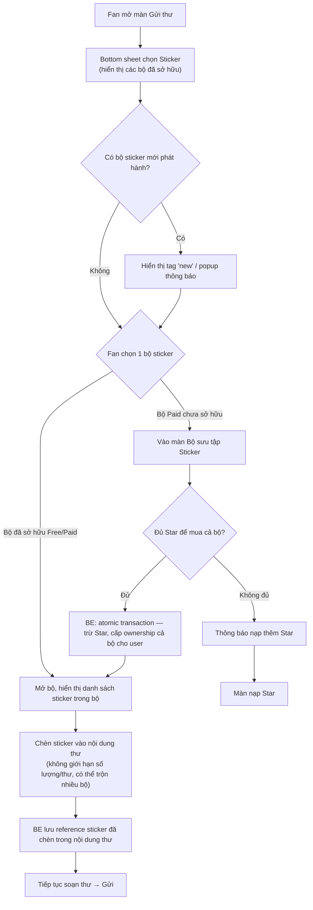

# FSD — MVP2: Sticker (Gửi thư)

---

## 1. Tổng quan

Sticker là tính năng bổ sung cho màn **Gửi thư** hiện có — chèn thêm sticker vào nội dung thư khi soạn, **song song** với Fan Letter hiện tại (không thay thế, không mâu thuẫn). Sticker được tổ chức và bán theo **bộ (set)**, không bán/mua lẻ từng sticker.

Mỗi bộ do Admin tạo trên CMS, gắn 1 trong 2 loại sở hữu:

| Loại bộ | Cách sở hữu | Giá |
|---|---|---|
| **Free** | Cấp miễn phí cho Fan | Không tốn Star |
| **Paid** | Fan phải mua | Trả bằng **Star**, mua nguyên cả bộ (không mua lẻ sticker trong bộ) |

Fan không giới hạn số lượng sticker chèn trong 1 lần soạn thư, và có thể trộn sticker từ nhiều bộ đã sở hữu khác nhau trong cùng 1 thư.

---

## 2. Phạm vi (Scope)

### Trong phạm vi
- CMS: Admin tạo/sửa/xoá **bộ sticker** — đặt tên bộ, upload danh sách sticker trong bộ, gán loại **Free/Paid**, nếu Paid thì nhập **giá Star** của cả bộ
- CMS: gán mốc thời gian phát hành để hệ thống tự tính tag "new"
- Fan xem danh sách bộ sticker đã sở hữu + bộ Paid chưa sở hữu (màn Bộ sưu tập Sticker)
- Fan mua nguyên 1 bộ Paid bằng Star (không mua lẻ sticker)
- Fan chèn sticker (từ bất kỳ bộ nào đã sở hữu) vào nội dung thư khi soạn, không giới hạn số lượng/thư
- Lưu reference sticker đã chèn vào nội dung thư (để hiển thị lại đúng khi xem thư)
- Tag "new" / popup thông báo khi có bộ sticker mới phát hành

---

## 3. Actors

| Actor | Vai trò |
|---|---|
| **Fan** | Xem bộ sticker sở hữu, mua bộ Paid bằng Star, chèn sticker vào thư |
| **Admin (CMS)** | Tạo/sửa bộ sticker (tên, danh sách sticker, loại Free/Paid, giá Star nếu Paid, mốc phát hành) |
| **BE System (Sticker/Inventory Engine)** | Quản lý ownership bộ theo user, xử lý giao dịch mua bằng Star, lưu reference sticker trong nội dung thư |

---

## 4. User Stories

**US-1 (Fan)**
> Là một Fan, khi mở màn Gửi thư, tôi muốn thấy các bộ sticker tôi đã sở hữu (Free và Paid đã mua), để chọn sticker chèn vào thư.

**US-2 (Fan)**
> Là một Fan, tôi muốn biết bộ sticker nào mới phát hành (qua tag "new"/popup), để không bỏ lỡ nội dung mới.

**US-3 (Fan)**
> Là một Fan, tôi muốn mua nguyên 1 bộ sticker Paid bằng Star khi thấy bộ đó hấp dẫn, để mở khoá dùng toàn bộ sticker trong bộ đó.

**US-4 (Fan)**
> Là một Fan, tôi muốn chèn không giới hạn số lượng sticker (từ nhiều bộ khác nhau) vào 1 thư đang soạn, để thư trông sinh động theo ý mình.

**US-5 (Admin)**
> Là Admin, tôi muốn tạo bộ sticker mới trên CMS — đặt tên, upload sticker, chọn Free hoặc Paid, nhập giá Star nếu Paid — để phát hành nội dung mới mà không cần Tech deploy lại code.

---

## 5. Sơ đồ luồng (Diagrams)

### 5.1 Luồng Admin — Tạo bộ sticker trên CMS

### 5.2 Luồng Fan — Chọn & mua sticker trong màn Gửi thư

---

## 6. Yêu cầu chức năng chi tiết

### 6.1 CMS
- CRUD **bộ sticker**: tên bộ, danh sách ảnh sticker trong bộ, loại **Free/Paid**
- Nếu Paid: bắt buộc nhập giá Star của cả bộ (1 giá duy nhất áp cho toàn bộ, không có giá riêng từng sticker)
- Gán mốc thời gian phát hành — dùng để hệ thống tự tính khoảng thời gian hiển thị tag "new" (độ dài khoảng thời gian "new" nên để cấu hình chung)
- Đổi 1 bộ từ Free sang Paid hoặc ngược lại sau khi đã publish: **cần chặn hoặc cảnh báo rõ ràng** vì ảnh hưởng trực tiếp Fan đã/chưa sở hữu

### 6.2 FE
- Bottom sheet chọn sticker trong màn Gửi thư — hiển thị các bộ đã sở hữu (Free đã cấp + Paid đã mua)
- Tag "new" hoặc popup khi có bộ sticker mới phát hành, theo mốc thời gian Admin cấu hình
- Màn Bộ sưu tập Sticker: tách rõ bộ đã sở hữu vs bộ Paid chưa sở hữu (hiển thị giá Star)
- Màn mua bộ Paid: hiển thị giá Star hiện hành, xác nhận mua, xử lý case không đủ Star → điều hướng màn nạp Star
- Chèn sticker trực tiếp vào nội dung thư khi soạn — không giới hạn số lượng, cho phép trộn sticker từ nhiều bộ khác nhau trong cùng 1 thư

### 6.3 BE
- API danh sách bộ sticker (Free/Paid) kèm trạng thái sở hữu theo user
- API mua cả bộ sticker Paid bằng Star — atomic transaction: trừ Star và cấp ownership bộ phải xảy ra trọn vẹn cùng lúc, không được để xảy ra trường hợp chỉ 1 trong 2 việc thành công
- Giá Star áp dụng đúng theo cấu hình tại thời điểm Fan xác nhận mua — nếu Admin vừa đổi giá, không dùng giá cũ đã hiển thị trước đó trên máy Fan
- Cơ chế cấp ownership bộ Free cho Fan: mặc định **tự động cấp cho mọi Fan** ngay khi bộ được publish, không cần Fan thao tác gì thêm (đề xuất PD/BA, nguồn "scheme mission để sở hữu free" chưa có nội dung cụ thể)
- Lưu reference sticker đã chèn trong nội dung thư (để render lại đúng khi Fan/người khác xem lại thư)
- CMS: CRUD bộ sticker, gán Free/Paid + giá Star, gán mốc thời gian phát hành
