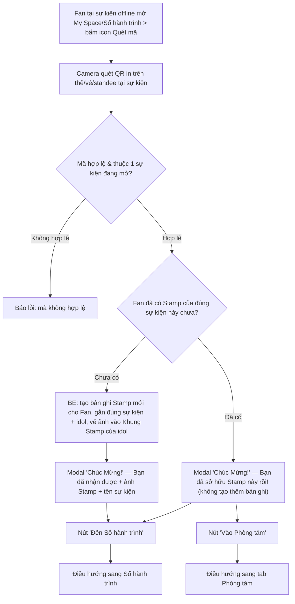
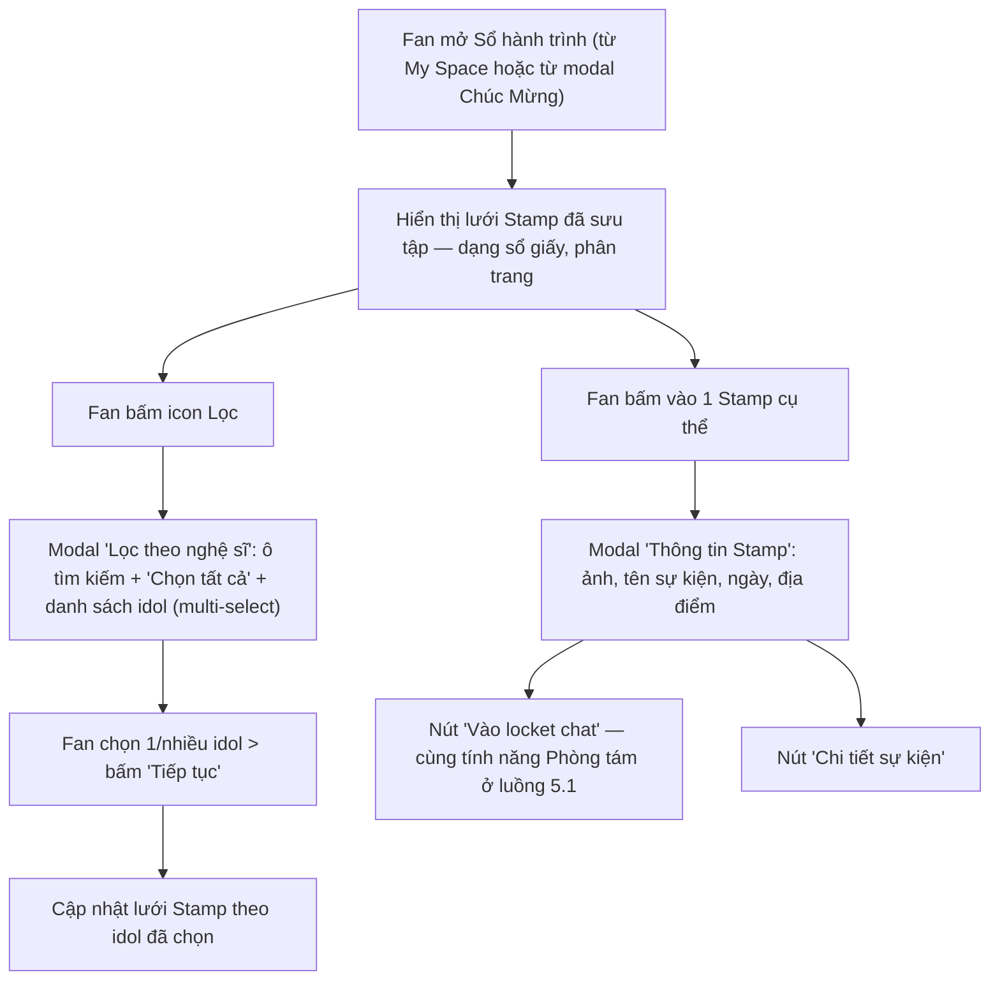
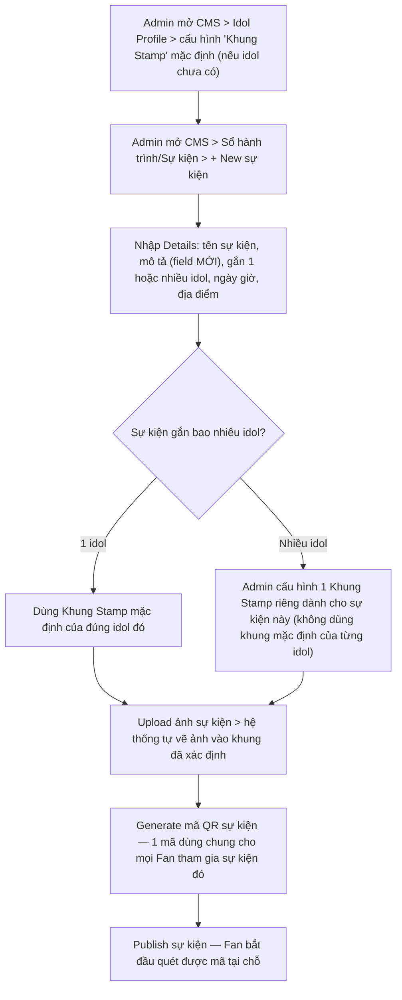

# FSD — MVP3: Sổ Hành Trình (Journey Book)

---

## 1. Tổng quan

**Sổ hành trình (Journey Book)** là 1 cuốn sổ dạng diary trong app, nơi Fan dán lại toàn bộ **Stamp** ghi nhận các hoạt động **offline** đã tham gia cùng idol (fan meeting, concert, fansign...). Mỗi Stamp là 1 "con dấu" hình hoa/ngôi sao chứa ảnh sự kiện + tên idol + ngày diễn ra, được cấp khi Fan **quét mã QR tại chính sự kiện đó**.

Mỗi Fan sở hữu 1 cuốn Sổ hành trình riêng, có thể chứa Stamp của nhiều idol khác nhau — không giới hạn theo 1 idol duy nhất.

**Nguyên tắc cốt lõi:** Stamp **chỉ earn được qua sự kiện offline** — không có đường quy đổi từ Star/Points/EXP, và Fan không tự thêm/import Stamp từ nguồn ngoài Fanation.

- **Short-term (phạm vi FSD này):** Sổ hành trình chỉ hỗ trợ dán Stamp lấy từ danh mục cố định do Fanation cấp qua các chương trình chính thức (danh mục hữu hạn, Admin quản lý qua CMS) — Fan **không** tự trang trí, không gắn được sticker/stamp bên ngoài vào sổ.
- **Long-term (ngoài phạm vi build hiện tại):** Fan có thể tự chọn 1 vài trang trong sổ để customize theo phong cách/thành tích cá nhân — chưa build ở giai đoạn này, chỉ ghi nhận làm định hướng tương lai.

**Bổ sung theo yêu cầu PD:**
- **CMS — Idol Profile** cần thêm 1 mục **"Khung Stamp"**: mỗi idol có 1 khung (hình hoa/ngôi sao, màu sắc riêng) để khi Admin upload ảnh sự kiện, hệ thống tự vẽ ảnh vào đúng khung đó, sinh ra hình Stamp hiển thị trong Sổ hành trình.
- **CMS — Sự kiện offline** cần thêm field **"Mô tả"** (description) để Admin ghi chú nội dung sự kiện, hiển thị lại cho Fan ở màn Thông tin Stamp/Chi tiết sự kiện.

---

## 2. Phạm vi (Scope)

### Trong phạm vi
- **CMS — Idol Profile:** thêm mục cấu hình "Khung Stamp" (khung hình hoa/ngôi sao riêng theo idol) dùng làm khung mặc định khi tạo Stamp cho sự kiện của idol đó
- **CMS — Quản lý sự kiện offline & Stamp:** tạo/sửa 1 sự kiện gồm tên, **mô tả (field mới)**, idol/nhóm idol gắn với sự kiện, ngày giờ, địa điểm, ảnh sự kiện (tự động vẽ vào Khung Stamp của idol), mã QR sự kiện, trạng thái (đang diễn ra/đã đóng)
- **Mobile — Quét mã nhận Stamp:** icon Quét mã (từ My Space và từ chính màn Sổ hành trình), camera quét QR, validate, cấp Stamp mới hoặc báo đã sở hữu
- **Mobile — Màn Sổ hành trình:** hiển thị dạng sổ giấy, lưới Stamp đã sưu tập, phân trang, lọc theo nghệ sĩ (tìm kiếm + multi-select)
- **Mobile — Modal Thông tin Stamp:** ảnh Stamp, tên sự kiện, ngày, địa điểm, số người tham gia, trạng thái sự kiện, điểm vào 2 hành động: "Vào locket chat" (theo trạng thái sự kiện) và "Chi tiết sự kiện"
- Cơ chế: 1 Fan có thể sở hữu nhiều Stamp theo nhiều idol khác nhau trong cùng 1 Sổ hành trình

### Ngoài phạm vi (thuộc giai đoạn sau, FSD khác, hoặc chưa đủ dữ kiện để build)
- **Customize trang cá nhân trong Sổ hành trình** (Long-term theo mục 1) — chưa build ở giai đoạn này
- **Chi tiết cơ chế bên trong "Phòng tám / Locket chat"** (đã xác nhận: nút "Vào Phòng tám" ở modal quét trùng và nút "Vào locket chat" ở modal Thông tin Stamp cùng dẫn tới **1 tính năng duy nhất**) — FSD này chỉ nêu điểm chạm điều hướng, **không** định nghĩa lại cơ chế nhắn tin/nội dung bên trong; xem Open Question OQ-2
- **Trạng thái sự kiện (Đang diễn ra/Đã đóng) và số liệu "số người tham gia"** — tạm bỏ khỏi phạm vi FSD này theo yêu cầu PD, sẽ bổ sung lại ở giai đoạn sau nếu cần
- **Màn "Chi tiết sự kiện"** (khi Fan bấm nút từ modal Thông tin Stamp) — nếu đã có FSD Event/Calendar riêng thì tham chiếu, FSD này không định nghĩa lại
- **Tích hợp EXP/FPP khi earn Stamp** — hiện **không** có dòng nào trong catalog Tier T1-T5 (`FSD_mvp2_Ranking_Point_System.md` mục 6.3) tương ứng với hành động quét Stamp offline; mặc định earn Stamp **không** cộng EXP/FPP cho tới khi có xác nhận bổ sung — xem Open Question OQ-6

---

## 3. Actors

| Actor | Vai trò |
|---|---|
| **Fan** | Quét mã QR tại sự kiện offline để nhận Stamp, xem/lọc Sổ hành trình, xem chi tiết từng Stamp |
| **Admin (CMS)** | Cấu hình Khung Stamp theo idol, tạo/sửa sự kiện offline (thông tin + mã QR + trạng thái) |
| **BE System (Stamp/QR Engine)** | Validate mã QR, kiểm tra Fan đã sở hữu Stamp của sự kiện đó chưa, cấp Stamp mới, tự vẽ ảnh vào Khung Stamp |
| **Idol/Content team** | Cung cấp ảnh sự kiện dùng làm Stamp, phối hợp thiết kế Khung Stamp riêng theo idol |

---

## 4. User Stories

**US-1 (Fan)**
> Là một Fan, tôi muốn quét mã QR tại sự kiện offline tôi đang tham gia cùng idol, để nhận 1 Stamp ghi lại kỷ niệm đó trong Sổ hành trình của tôi.

**US-2 (Fan)**
> Là một Fan, tôi muốn xem lại toàn bộ Stamp mình đã sưu tập được từ trước tới nay, để nhìn lại hành trình tham gia hoạt động cùng các idol tôi theo đuổi.

**US-3 (Fan)**
> Là một Fan, tôi muốn lọc Sổ hành trình theo 1 hoặc nhiều nghệ sĩ cụ thể, để nhanh chóng xem được Stamp liên quan tới idol tôi quan tâm.

**US-4 (Fan)**
> Là một Fan, tôi muốn bấm vào 1 Stamp để xem chi tiết sự kiện đó (ngày, địa điểm), để nhớ lại hoặc tìm hiểu thêm thông tin sự kiện.

**US-5 (Fan)**
> Là một Fan, khi quét lại mã QR của sự kiện tôi đã có Stamp rồi, tôi muốn được thông báo rõ ràng là đã sở hữu, thay vì tạo thêm 1 bản ghi trùng.

**US-6 (Admin)**
> Là Admin, tôi muốn cấu hình 1 sự kiện offline (tên, mô tả, idol, ngày giờ, địa điểm, ảnh, mã QR) ngay trên CMS, để hệ thống tự sinh ra Stamp tương ứng mà không cần Tech can thiệp.

**US-7 (Admin)**
> Là Admin, tôi muốn thiết lập sẵn Khung Stamp riêng cho từng idol trên Idol Profile, để mọi sự kiện của idol đó dùng chung 1 phong cách khung nhất quán khi tạo Stamp.

---

## 5. Sơ đồ luồng (Diagrams)

### 5.1 Luồng Fan — Quét mã QR nhận Stamp

### 5.2 Luồng Fan — Xem & lọc Sổ hành trình, xem chi tiết Stamp

### 5.3 Luồng Admin (CMS) — Cấu hình sự kiện offline & Stamp

> **Nguyên tắc bắt buộc:** Mobile app không tự xác định Fan đã sở hữu Stamp hay chưa — toàn bộ kiểm tra do BE xác nhận dựa trên dữ liệu mới nhất, tương tự nguyên tắc đã áp dụng ở `FSD_mvp2_Ranking_Point_System.md` và `FSD_mvp2_Digital_Merch_QR_Gift.md`.

---

## 6. Yêu cầu chức năng chi tiết

### 6.1 CMS — Idol Profile: Khung Stamp

- Thêm 1 mục cấu hình mới trong màn Idol Profile: **"Khung Stamp"** — Admin upload/thiết kế 1 khung (hình hoa/ngôi sao, màu sắc/gradient riêng) đại diện cho idol đó
- Khung Stamp là **bắt buộc** cấu hình trước khi tạo sự kiện chỉ gắn 1 idol đó (edge case #1) — không cho tạo Stamp nếu idol chưa có khung
- 1 idol có **1 Khung Stamp mặc định**, dùng cho mọi sự kiện **chỉ gắn riêng idol đó**. Với sự kiện gắn **nhiều idol**, Admin cấu hình 1 Khung Stamp riêng ngay tại sự kiện (không dùng khung mặc định của từng idol) — xem mục 6.2

### 6.2 CMS — Quản lý sự kiện offline & Stamp

- Tab tạo/sửa sự kiện offline gồm:
  - **Tên sự kiện** (vd "Fan meeting Chi Xê")
  - **Mô tả (field MỚI)** — nội dung tự do, hiển thị lại cho Fan ở modal Thông tin Stamp/Chi tiết sự kiện
  - **Idol/nhóm idol** gắn với sự kiện — hỗ trợ gắn **nhiều idol** cho 1 sự kiện (vd sự kiện nhóm dạng "Genfest")
  - **Ngày giờ, địa điểm**
  - **Khung Stamp của sự kiện** — nếu sự kiện chỉ gắn 1 idol, mặc định dùng Khung Stamp của idol đó (mục 6.1); nếu gắn **nhiều idol**, CMS yêu cầu Admin **cấu hình 1 Khung Stamp riêng cho chính sự kiện này** (đã chốt — xem edge case #5)
  - **Ảnh sự kiện** — upload 1 ảnh, hệ thống tự động vẽ vào khung đã xác định ở trên
  - **Mã QR sự kiện** — generate **1 mã dùng chung** cho toàn bộ Fan tham gia sự kiện đó (khác với Digital Merch — mỗi merch có nhiều mã unique riêng từng đơn vị, xem Open Question OQ-1 để xác nhận lại lựa chọn này)
- Bắt buộc chọn ít nhất 1 idol và đã xác định được Khung Stamp (mặc định hoặc riêng cho sự kiện) mới cho phép Publish sự kiện

### 6.3 Mobile (FE) — Quét mã QR nhận Stamp

- Icon "Quét mã" xuất hiện ở cả màn My Space và màn Sổ hành trình (floating button) — mở camera quét QR
- Kết quả quét:
  - **Lần đầu quét mã của 1 sự kiện:** modal "Chúc Mừng! Bạn đã nhận được" + ảnh Stamp + tên sự kiện, 1 nút "Đến Sổ hành trình"
  - **Đã có Stamp của đúng sự kiện đó (quét lại):** modal "Chúc Mừng! Bạn đã sở hữu Stamp này rồi!" + ảnh Stamp + tên sự kiện, 2 nút "Đến Sổ hành trình" và "Vào Phòng tám" — **không** tạo thêm bản ghi Stamp trùng
  - **Mã không hợp lệ:** báo lỗi, không tạo Stamp

### 6.4 Mobile (FE) — Màn Sổ hành trình & Lọc theo nghệ sĩ

- Layout dạng sổ giấy (diary), lưới 2 cột hiển thị từng Stamp (ảnh + tên Stamp + ngày), phân trang
- Icon Lọc mở modal "Lọc theo nghệ sĩ": ô tìm kiếm theo tên idol, tuỳ chọn "Chọn tất cả", danh sách idol dạng multi-select (checkbox)
- Bấm "Tiếp tục" áp dụng bộ lọc, cập nhật lại lưới Stamp theo idol đã chọn
- 1 sự kiện gắn nhiều idol hiển thị Stamp đó ở kết quả lọc của **từng idol liên quan**, không chỉ 1 idol duy nhất — ảnh Stamp hiển thị dùng đúng Khung Stamp riêng đã cấu hình cho sự kiện đó (mục 6.2), giống nhau ở mọi kết quả lọc

### 6.5 Mobile (FE) — Modal Thông tin Stamp

- Bấm vào 1 Stamp trong lưới mở modal "Thông tin Stamp": ảnh Stamp, tên sự kiện, ngày, địa điểm
- 2 nút hành động:
  - **"Vào locket chat"** — **cùng 1 tính năng** với "Vào Phòng tám" ở modal quét trùng (mục 6.3), chỉ khác nhãn hiển thị theo ngữ cảnh (từ modal Thông tin Stamp thì gắn theo tên sự kiện, vd "Orange Fanmeeting"); cơ chế bên trong ngoài phạm vi FSD này, xem OQ-2
  - **"Chi tiết sự kiện"** — điều hướng sang màn chi tiết sự kiện (ngoài phạm vi FSD này nếu đã có FSD Event riêng)

> Trạng thái sự kiện (Đang diễn ra/Đã đóng) và số liệu "số người tham gia" xuất hiện trong ảnh mockup gốc nhưng **tạm bỏ khỏi phạm vi FSD này** theo yêu cầu PD — 2 nút hành động trên luôn hiển thị active, không có logic khoá/disabled theo trạng thái sự kiện ở giai đoạn này.

### 6.6 Yêu cầu nghiệp vụ cần đảm bảo

- Kiểm tra "Fan đã có Stamp của sự kiện này chưa" + tạo bản ghi Stamp mới (nếu chưa có) phải nằm trong 1 transaction atomic, khoá theo cặp `user_id` + `event_id`, tránh race condition khi nhiều Fan quét gần như đồng thời
- Stamp **chỉ** earn qua quét mã QR tại sự kiện offline — không có đường earn nào khác (không mua bằng Star, không đổi từ EXP/FPP)
- Danh mục Stamp khả dụng là **hữu hạn**, do Admin cấu hình qua CMS — Fan không tự thêm/import Stamp ngoài (đúng nguyên tắc Short-term ở mục 1)
- Ảnh Stamp luôn được vẽ vào đúng khung đã xác định cho sự kiện đó (Khung Stamp mặc định của idol nếu sự kiện chỉ gắn 1 idol, hoặc Khung Stamp riêng do Admin cấu hình nếu sự kiện gắn nhiều idol) — không cho Fan tự chọn khung khác

---

## 7. Edge Cases

| # | Tình huống | Xử lý đề xuất |
|---|---|---|
| 1 | Admin tạo sự kiện **chỉ gắn 1 idol** nhưng idol đó chưa cấu hình Khung Stamp mặc định | Chặn Publish sự kiện — báo lỗi yêu cầu cấu hình Khung Stamp cho idol đó trước |
| 2 | Fan quét lại mã QR của sự kiện đã có Stamp (chính mình) | Không tạo thêm bản ghi Stamp — hiển thị modal "đã sở hữu" + shortcut vào Phòng tám (mục 6.3) |
| 3 | Fan quét mã QR không thuộc hệ thống Fanation hoặc mã lỗi | Báo lỗi rõ ràng, không tạo Stamp, không đổi trạng thái gì |
| 4 | Nhiều Fan quét cùng 1 mã QR sự kiện gần như đồng thời | BE xử lý atomic transaction riêng theo từng `user_id`, không ảnh hưởng lẫn nhau (khác Digital Merch — mã sự kiện không đổi trạng thái Available→Claimed vì dùng chung cho nhiều Fan) |
| 5 | Sự kiện gắn **nhiều idol** (vd sự kiện nhóm dạng Genfest) | **Đã chốt:** CMS bắt buộc Admin cấu hình 1 Khung Stamp riêng cho chính sự kiện đó (không dùng khung mặc định của từng idol) — Stamp hiển thị trong kết quả lọc của mọi idol được gắn, dùng chung 1 ảnh/1 khung duy nhất (mục 6.2) |
| 6 | Fan chưa quét Stamp nào — Sổ hành trình trống | Hiển thị empty state, hướng dẫn Fan quét mã tại sự kiện offline gần nhất |
| 7 | Admin sửa Mô tả/thông tin sự kiện sau khi nhiều Fan đã có Stamp | Cập nhật áp dụng ngay cho mọi Fan đã sở hữu Stamp đó (không phải dữ liệu snapshot tại thời điểm quét) — do đây là thông tin tham chiếu sự kiện dùng chung, không phải giao dịch điểm/thưởng |

---

## 8. Open Questions (chưa có câu trả lời từ stakeholder)

| # | Câu hỏi | Ảnh hưởng | Ghi chú |
|---|---|---|---|
| **OQ-1** | Mã QR sự kiện dùng **chung 1 mã cho mọi Fan** (như đề xuất ở mục 6.2) hay theo **từng vé/Fan riêng biệt** như QR Digital Merch (`FSD_mvp2_Digital_Merch_QR_Gift.md` — mỗi mã unique, đổi trạng thái Available→Claimed)? | Rất lớn — quyết định toàn bộ kiến trúc chống gian lận. Nếu dùng chung 1 mã: rủi ro mã bị chụp ảnh/chia sẻ ra ngoài sau khi rời sự kiện, Fan không có mặt thật vẫn claim được Stamp, phá vỡ nguyên tắc "chỉ earn qua offline" | **Điểm nghẽn (stuck) lớn nhất của luồng** — cần chốt trước khi build. Nếu giữ 1 mã dùng chung, cần thêm lớp xác thực khác (giới hạn thời gian hiệu lực theo khung giờ sự kiện, giới hạn GPS tại địa điểm, giới hạn số lần quét/thiết bị...) |
| **OQ-2** | "Phòng tám / Locket chat" (đã xác nhận là 1 tính năng duy nhất, mục 6.3/6.5) là hệ thống **chat thật (real-time, nhiều Fan tham gia)** hay chỉ là **nội dung kịch bản/preset** hiển thị theo idol/sự kiện (không phải chat sống)? | Effort rất khác nhau — chat thật cần hạ tầng riêng (moderation, real-time infra), nội dung kịch bản chỉ cần asset tĩnh | Nếu là chat thật, khả năng cao cần tách thành 1 FSD riêng, không gộp vào Sổ hành trình. FSD này hiện chỉ coi đây là 1 **điểm điều hướng**, không định nghĩa cơ chế bên trong |
| **OQ-3** | Earn Stamp có cộng EXP (`FSD_mvp2_Ranking_Point_System.md`) hay FPP (`FSD_mvp2_FPP_Leaderboard.md`) không? | Hiện catalog Tier T1-T5 không có dòng nào cho hành động này — nếu cần bổ sung, ảnh hưởng cả 2 FSD đó | FSD này tạm coi là **không** cộng EXP/FPP cho tới khi có xác nhận ngược lại |
