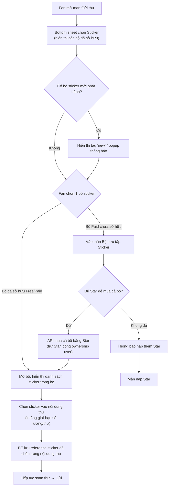

# Flow: Sticker (Gửi thư)

**Nguồn:** `mvp2_Feature_Breakdown.md` — mục 2. Sticker (Gửi thư)

## Overview
Sticker là tính năng bổ sung cho Gửi thư hiện có (song song Fan Letter, không thay thế). Sticker bán theo **cả bộ** (không mua lẻ), chèn không giới hạn số lượng trong 1 thư.

## Flow Diagram

