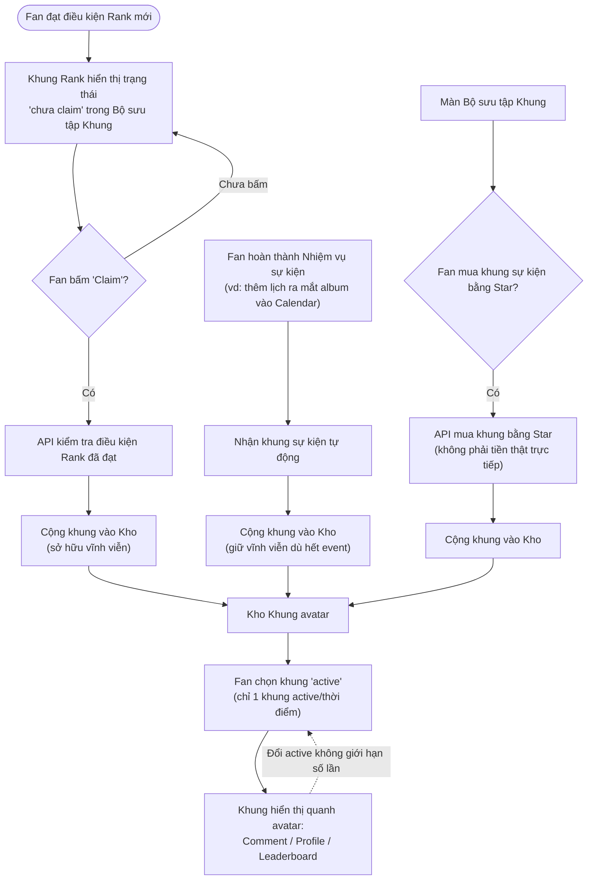

# Flow: Khung avatar

**Nguồn:** `mvp2_Feature_Breakdown.md` — mục 3. Khung avatar

## Overview
Khung avatar có 2 nguồn earn độc lập: theo **Rank** (phải chủ động claim) và theo **Event** (earn qua mission hoặc mua bằng Star — không phải tiền thật, để tránh cảm giác P2W). Khung sự kiện giữ vĩnh viễn kể cả sau khi hết event.

## Flow Diagram

