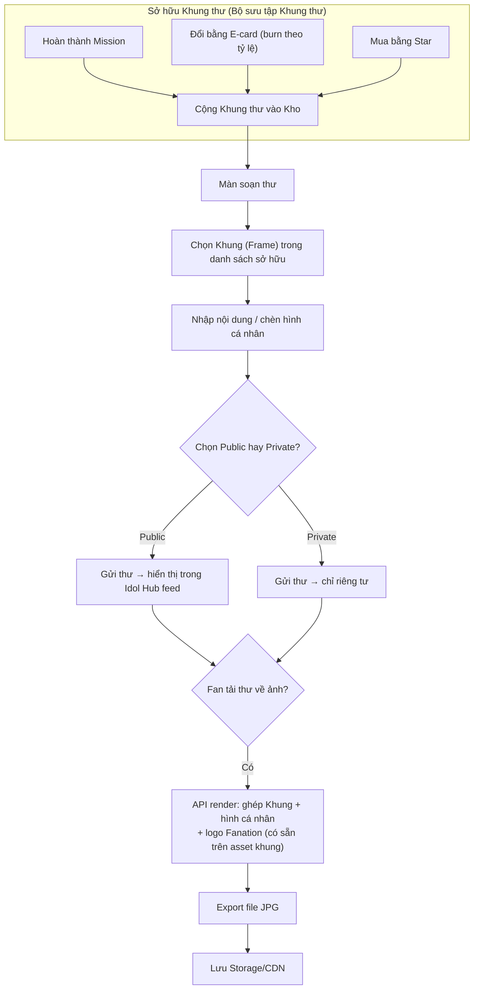

# Flow: Khung thư (Gửi thư)

**Nguồn:** `mvp2_Feature_Breakdown.md` — mục 4. Khung thư (Gửi thư)

## Overview
Khung thư liên kết trực tiếp với Sổ E-card (mục 6) — "thẻ" dùng để đổi khung thư chính là **E-card**. Thư có khung có thể chọn Public/Private, tải về JPG (logo Fanation đã in sẵn trên khung nên không cần watermark riêng).

## Flow Diagram

