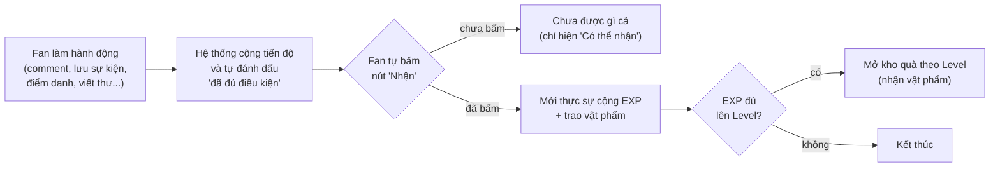

# Mission & Quest Chain

---

## 1. Ý tưởng

Daily / Streak / Milestone / Event / Quest Chain **không phải 5 cơ chế tính điểm
riêng**. Chúng là 5 _cách trình bày_ khác nhau trên cùng một kho điểm **EXP**:

| Bề mặt      | Cách trình bày cho fan                   |
| ----------- | ---------------------------------------- |
| Daily       | Checklist việc cần làm trong ngày        |
| Streak      | Chuỗi ngày điểm danh liên tục + các mốc  |
| Milestone   | Huy hiệu thành tựu tích luỹ trọn đời     |
| Event       | Nhiệm vụ của một đợt phát động có chủ đề |
| Quest Chain | Chuỗi "Bậc" tăng dần, tính theo tháng    |

Điểm EXP cộng vào **Level của fan**.

### Nguyên tắc "claim 2 bước" — áp dụng cho MỌI loại

- Hệ thống **không bao giờ tự trao thưởng**. Nó chỉ chuyển nhiệm vụ sang trạng  
  thái _"Có thể nhận"_. Fan phải bấm nút thì điểm/vật phẩm mới vào tài khoản.

### 2 "động cơ" chạy phía sau

| Động cơ                    | Cách hoạt động                                                                  | Dùng cho                                                               |
| -------------------------- | ------------------------------------------------------------------------------- | ---------------------------------------------------------------------- |
| **Kiểu thành tựu**         | "Làm đủ N lần → thưởng đúng 1 lần"                                              | Milestone, Event, các **mốc** của Streak                               |
| **Kiểu tích điểm có trần** | "Mỗi lượt hành động hợp lệ được +điểm ngay, chạm trần ngày/tháng thì dừng cộng" | Daily, điểm gốc của điểm danh, và tiến độ Quest Chain (đếm theo tháng) |

---

## 2. Bảng so sánh nhanh

| Loại            | Trả lời câu hỏi                    | Chu kỳ / Reset                                | Đo cái gì                                    | Loại thưởng                                      | Ví dụ thực (dữ liệu seed)                                              |
| --------------- | ---------------------------------- | --------------------------------------------- | -------------------------------------------- | ------------------------------------------------ | ---------------------------------------------------------------------- |
| **Daily**       | "Hôm nay nên làm gì?"              | Tiến độ reset **mỗi ngày** 00:00 giờ VN       | Số lần làm hành động **trong ngày**          | Chỉ EXP                                          | `daily-comment-post` — comment/thả tim bài đăng idol, 3 lần/ngày       |
| **Streak**      | "Điểm danh liên tục được bao lâu?" | Chuỗi **không reset**; tiến độ ngày thì reset | Số ngày điểm danh **liên tiếp**              | EXP; ở **mốc** thì thêm vật phẩm (tối đa 5 loại) | Mốc ngày 1 / 7 / 30 → +3 / +10 / +15 EXP                               |
| **Milestone**   | "Đã tích luỹ đủ chưa?"             | **Không bao giờ** reset                       | Tổng số lần **trọn đời**                     | EXP + 1 vật phẩm                                 | `reach-level-2/3/4` — "Lên Level 2/3/4"                                |
| **Event**       | "Đợt phát động này đạt chưa?"      | Không reset; admin **bật / tắt** thủ công     | Như Milestone                                | Như Milestone                                    | (chưa có Event nào được tạo)                                           |
| **Quest Chain** | "Trong tháng làm được bao nhiêu?"  | **Đếm lại từ 0 mỗi tháng**                    | Tổng số lần hành động **luỹ kế trong tháng** | **Chỉ EXP**                                      | `quest-save-calendar-events` — thêm sự kiện Calendar, Bậc 20 / 40 / 60 |

---

## 3. Chi tiết từng loại

### 3.1 Daily — Nhiệm vụ hằng ngày

- **Là gì:** danh sách việc nên làm trong ngày. Tiến độ tự về 0 lúc **00:00 giờ
  VN** mỗi ngày.
- **Điều gì làm tăng tiến độ:** fan làm đúng hành động được gắn cho nhiệm vụ
  (comment / thả tim bài đăng idol, lưu sự kiện vào Calendar, đổi vật phẩm trang
  trí My Space, tương tác nhẹ…). Mỗi lượt hợp lệ được cộng điểm **ngay lập tức**
  vào bộ đếm, nhưng có **trần số lần/ngày** — làm quá trần thì không cộng thêm.
- **Fan thấy & nhận thế nào:** thẻ nhiệm vụ hiện thanh tiến độ "x / mục tiêu".
  Khi đã làm trong ngày, fan bấm **"Nhận"** để chuyển số điểm tích được hôm nay
  vào EXP. **Điểm chưa Nhận hết trong ngày sẽ mất** khi sang ngày mới (không dồn
  sang hôm sau).
- **Ví dụ thực (seed):** `daily-comment-post` — "Comment / thả tim bài đăng
  idol", mục tiêu **3 lần/ngày**. Mỗi lần comment hợp lệ được **+5 EXP**, tối đa
  3 lần/ngày, trần **450 EXP/tháng** cho hành động này.
- **Cấu hình:** CMS → trang **Mission** → tab _Daily_.

### 3.2 Streak — Điểm danh chuỗi ngày

- **Là gì:** chỉ có **đúng 1** nhiệm vụ loại này (`daily-check-in`). Nó đo số ngày
  fan điểm danh **liên tục**.
- **Cách hoạt động:** gồm 2 thao tác tách rời:
  1. _Điểm danh_ — tăng chuỗi, **chưa** cộng điểm.
  2. _Nhận điểm_ — nhận điểm gốc của lần điểm danh (**+5 EXP/ngày**).
- **Quy tắc chuỗi:** điểm danh hôm nay liền kề hôm qua → chuỗi **+1**. **Bỏ lỡ 1
  ngày → chuỗi tụt về 1.** Riêng "chuỗi cao nhất từng đạt" thì được giữ lại vĩnh
  viễn.
- **Mốc chuỗi (ladder):** admin đặt các mốc kiểu _"khi chuỗi chạm ngày X"_. Mỗi
  mốc gồm:
  - **Bonus điểm** — tự động cộng ngay khi chuỗi đạt đúng ngày đó.
  - **Danh sách vật phẩm** — chọn từ tối đa 5 loại (Space Item / Sticker / Avatar
    Frame / E-card / Digital Gift). Khi fan bấm claim mốc, **toàn bộ** vật phẩm
    trong danh sách được trao cùng lúc (không phải rút ngẫu nhiên).
  - Fan vẫn claim được mốc **kể cả khi chuỗi hiện tại đã đứt**, miễn là "chuỗi cao
    nhất từng đạt" đã vượt ngày của mốc.
- **Ví dụ thực (seed):** mốc **ngày 1 → +3 EXP**, **ngày 7 → +10 EXP**, **ngày 30
  → +15 EXP** (vật phẩm do admin bổ sung sau).
- **Cấu hình:** CMS → tab _Streak_ → khối _Streak ladder_.

### 3.3 Milestone — Cột mốc / Thành tựu

- **Là gì:** huy hiệu tích luỹ **trọn đời**, không bao giờ reset.
- **Điều gì làm tăng tiến độ:** mỗi lần fan làm hành động được gắn, tiến độ +1
  (hoặc set thẳng theo cấp Level đạt được, với mốc kiểu "Lên Level N"). Đủ số mục
  tiêu → nhiệm vụ chuyển sang _"Có thể nhận"_.
- **Fan thấy & nhận thế nào:** bấm claim → cộng EXP + trao **1 vật phẩm** (Space
  Item / Avatar Frame / Sticker pack).
- **Ví dụ thực (seed):**
  - `reach-level-2` / `reach-level-3` / `reach-level-4` — "Lên Level 2/3/4", mỗi
    mốc trao 1 Space Item.
  - `calendar-10-events` — "Thêm 10 sự kiện vào lịch", +20 EXP. Hiện **đã tắt**,
    được thay bằng badge theo tháng ở Quest Chain (xem 3.5).
- **Cấu hình:** CMS → tab _Milestone_.

### 3.4 Event — Sự kiện

- **Là gì:** **cơ chế y hệt Milestone** (tích luỹ + claim đúng 1 lần). Khác biệt
  nằm ở _mục đích sử dụng_: dành cho các đợt phát động có chủ đề, thời hạn.
- **Vòng đời "mở / đóng sự kiện":** hiện điều khiển hoàn toàn bằng **công tắc
  Active** của admin. Hệ thống **chưa có ô ngày bắt đầu / ngày kết thúc, không có
  đếm ngược**. Khi admin tắt Active, nhiệm vụ **biến mất khỏi danh sách** của fan
  (không hiện trạng thái "đã hết hạn").
- **Hiện trạng:** chưa có Event nào được tạo trong hệ thống.
- **Cấu hình:** CMS → tab _Event_.

### 3.5 Quest Chain — Chuỗi thử thách

- **Là gì:** một hạng mục **riêng**, không nằm trong 4 loại Mission trên. Mỗi chuỗi
  gắn với **1 hành động** và có nhiều **"Bậc"** với ngưỡng tăng dần.
- **Đo cái gì:** **tổng số lần làm hành động đó trong THÁNG** (dùng chung bộ đếm
  với Daily — không có bảng tiến độ riêng). Ví dụ đã làm 45 lần trong tháng thì
  mọi bậc có ngưỡng ≤ 45 đều "đạt".
- **Phần thưởng:** mỗi bậc **chỉ trao EXP** — không vật phẩm, không Sao.
- **Quy tắc:**
  - Không bắt buộc claim theo thứ tự; mỗi bậc là một lần nhận riêng.
  - Bậc cuối có thể để **trống ngưỡng** → hệ thống tự lấy bằng **trần-tháng** của
    hành động (bậc khó nhất luôn khớp trần thật, không lệch).
  - **Sang tháng mới → bộ đếm về 0, tất cả các bậc claim lại được** từ đầu.
- **Gắn với 1 "Action":** khi tạo chuỗi, admin chọn 1 Action (CHECK_IN,
  SAVE_EVENTS, COMMENT_POST…). Đó chính là **một dòng trong Tier Config** (xem mục
  1. — chuỗi _mượn_ **bộ đếm số lần trong tháng** và **trần lượt/tháng** của dòng
     đó, không tự đếm riêng.
- **"Bậc" (Tiers) là bảng cấu hình RIÊNG của từng chuỗi** — đừng nhầm với nhãn
  T1–T5 của Tier Config. Mỗi Bậc gồm: số thứ tự (1, 2, 3…), **ngưỡng số lần luỹ kế
  trong tháng** để mở Bậc, và **số EXP** trao khi fan claim Bậc đó. Ngưỡng phải
  tăng dần. Để trống ngưỡng ở Bậc cuối → hệ thống tự lấy bằng trần-lượt/tháng của
  Action.
- **Nhãn** `category` **(QUEST_CHAIN / MILESTONE):** chỉ là gợi ý app xếp chuỗi vào
  tab nào — cơ chế hai loại **hoàn toàn giống nhau**. `MILESTONE` dùng cho "badge
  theo tháng" (thường chỉ 1 Bậc), ví dụ _"Thêm đủ 10 sự kiện/tháng → +20 EXP"_,
  _"Tương tác đủ 20 lượt/tháng → +25 EXP"_. Quest Chain **không có** khái niệm
  T1–T5 riêng.
- **Ví dụ thực (seed):** `quest-save-calendar-events` — Action = `SAVE_EVENTS`;
  **Bậc 1 = 20 lần/tháng**, **Bậc 2 = 40 lần/tháng**, **Bậc 3 = bỏ trống → tự lấy
  60** (bằng trần-lượt/tháng của `SAVE_EVENTS` trong Tier Config).
- **Cấu hình:** CMS → menu **Quest Chain** (chỉ tài khoản quyền MANAGEMENT); mỗi
  dòng chuỗi bấm nút **Tiers** để sửa các Bậc.

---

## 4. Tier Config — "bảng giá điểm" cho từng hành động

### 4.1 Là gì

Đây là bảng danh mục quy định: mỗi hành động của fan đáng bao nhiêu EXP, và tối đa được **cộng bao nhiêu mỗi ngày / mỗi tháng.** Mỗi hành động có **đúng 1 dòng** (ô `Action` không sửa được sau khi tạo).

| Ô trong 1 dòng             | Ý nghĩa                                                                                                                                     |
| -------------------------- | ------------------------------------------------------------------------------------------------------------------------------------------- |
| **Action**                 | Khoá hành động: `CHECK_IN`, `COMMENT_POST`, `SAVE_EVENTS`, `LIGHT_INTERACTION`, `CHANGE_SPACE_ITEM`, `WRITE_LETTER`… (1 hành động = 1 dòng) |
| **Tier**                   | Nhãn phân nhóm `T1`–`T5` theo FSD (T1 = tương tác nhẹ … T5 = gộp E-card). Chỉ để phân loại / hiển thị, **không** ảnh hưởng cách tính        |
| **Points / action**        | Số EXP cộng cho **mỗi lượt** hành động hợp lệ                                                                                               |
| **Daily limit**            | Tối đa bao nhiêu **lượt/ngày** được tính điểm (bỏ trống = không giới hạn)                                                                   |
| **Monthly point cap**      | Tối đa bao nhiêu **EXP/tháng** kiếm được từ hành động này                                                                                   |
| **Monthly action cap**     | Tối đa bao nhiêu **lượt/tháng** được tính. **Quest Chain đọc số này** cho Bậc cuối khi Bậc đó bỏ trống ngưỡng                               |
| **Aggregate across idols** | Bật = đếm chung 1 lần/fan. Tắt = đếm riêng theo từng idol fan đang follow                                                                   |

**Cách chạy:** fan làm hành động → hệ thống cộng điểm vào **bộ đếm** ngay (nếu chưa
chạm trần) → điểm này **chưa vào EXP**, fan phải bấm "Nhận" mới chuyển vào EXP/Level. Điểm chưa nhận hết trong ngày sẽ mất khi sang ngày mới.

### 4.2 Bảng giá hiện tại (dữ liệu seed thực tế)

| Action                                      | Tier | EXP/lần | Trần lượt/ngày | Trần EXP/tháng | Trần lượt/tháng  |
| ------------------------------------------- | ---- | ------- | -------------- | -------------- | ---------------- |
| `CHECK_IN` — điểm danh                      | T1   | 5       | 1              | 150            | 30               |
| `LIGHT_INTERACTION` — thả tim / nghe nhạc   | T1   | 2       | 3              | 180            | 90               |
| `CHANGE_SPACE_ITEM` — đổi item My Space     | T1   | 1       | 1              | 30             | 30               |
| `COMMENT_POST` — comment / thả tim bài đăng | T2   | 5       | 3              | 450            | 90               |
| `SAVE_EVENTS` — thêm sự kiện Calendar       | T2   | 2       | 2              | 120            | 60               |
| `WRITE_LETTER` — viết thư cho idol          | T3   | 20      | không giới hạn | 80             | 4 (gộp mọi idol) |

### 4.3 Tier Config dính tới từng bề mặt như thế nào

| Bề mặt                              | Có dùng Tier Config không?                                                                                                                                                       | Điểm đến từ đâu                        |
| ----------------------------------- | -------------------------------------------------------------------------------------------------------------------------------------------------------------------------------- | -------------------------------------- |
| **Daily**                           | **Có — Tier Config là nguồn điểm thật.** Mission Daily chỉ là "vỏ hiển thị" (ô Points để 0). Mục tiêu (`target`) của mission nên đặt bằng "trần lượt/ngày" để thanh tiến độ khớp | Dòng Tier Config của Action tương ứng  |
| **Streak — điểm gốc điểm danh**     | **Có.** +5 EXP/ngày chính là dòng `CHECK_IN`                                                                                                                                     | Tier Config `CHECK_IN`                 |
| **Streak — bonus + vật phẩm ở mốc** | Không                                                                                                                                                                            | Đặt trực tiếp trên từng mốc của ladder |
| **Milestone / Event**               | **Không.** Đây là "kiểu thành tựu" — cộng thẳng số EXP ghi trên **chính mission** khi fan claim                                                                                  | Ô "Points" của mission                 |
| **Quest Chain — tiến độ**           | **Có — dùng chung bộ đếm.** Chuỗi không có bảng tiến độ riêng; đọc "số lần trong tháng" từ đúng bộ đếm của Tier Config. Trần lượt/tháng = ngưỡng Bậc cuối khi Bậc đó bỏ trống    | —                                      |
| **Quest Chain — thưởng mỗi Bậc**    | Không                                                                                                                                                                            | Ô "Points (EXP)" của từng Bậc          |

### 4.4 Ví dụ xâu chuỗi — hành động "thêm sự kiện vào Calendar" (`SAVE_EVENTS`)

1. **Tier Config** dòng `SAVE_EVENTS`: `2 EXP/lần`, tối đa `2 lần/ngày`, `120 EXP/tháng`, `60 lần/tháng`.
2. **Daily mission** `daily-save-events`: mục tiêu 2 lần/ngày (khớp trần ngày). Fan thêm 2 sự kiện hôm nay → bộ đếm +4 EXP → bấm "Nhận" → +4 EXP vào Level.
3. **Milestone** kiểu "Thêm 10 sự kiện" (nếu bật): tích luỹ **trọn đời**, đủ 10 lần thì claim **+20 EXP** — con số 20 ghi thẳng trên mission, **không liên quan Tier Config**.
4. **Quest Chain** `quest-save-calendar-events`: Bậc 1 = 20 lần/tháng, Bậc 2 = 40 lần/tháng, **Bậc 3 bỏ trống → tự lấy 60** (bằng "trần lượt/tháng" ở bước 1). Fan thêm 45 sự kiện trong tháng → đạt Bậc 1 + Bậc 2 → claim từng Bậc để nhận EXP ghi trên mỗi Bậc. Sang tháng mới, bộ đếm về 0, làm lại từ đầu.
